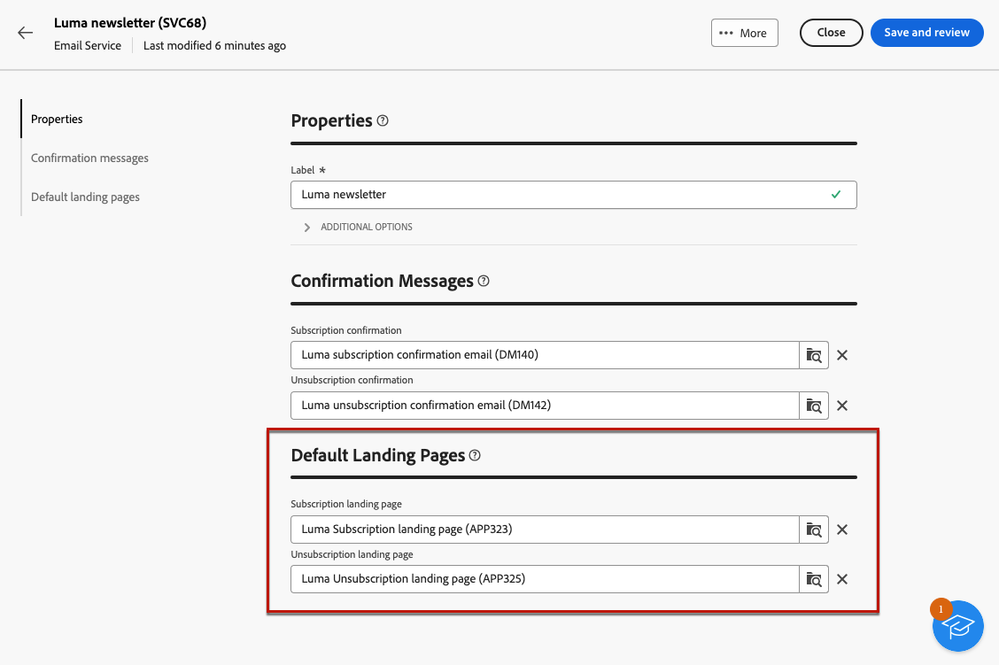
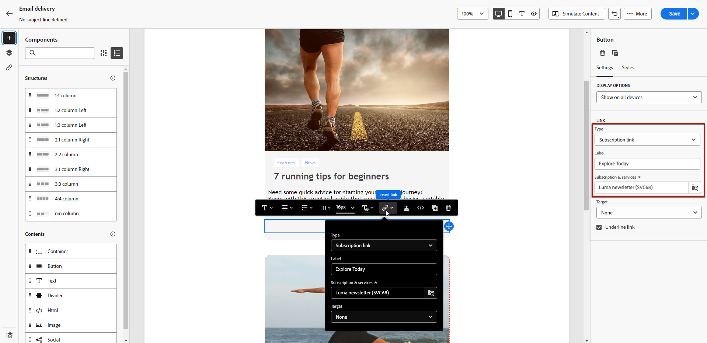
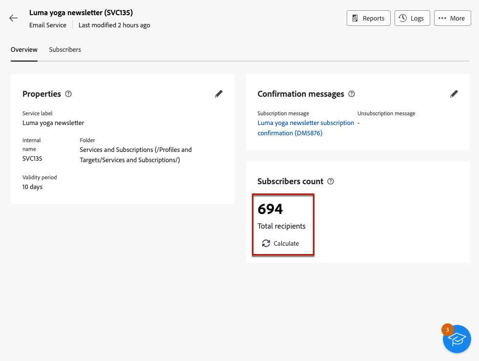

# 建立和管理您的訂閱服務 {#manage-services}

>[!CONTEXTUALHELP]
>id="acw_subscriptions_list"
>title="建立和管理服務"
>abstract="使用 Adobe Campaign 建立和監視您的服務 (例如電子報)，並檢查這些服務的訂閱或取消訂閱。訂閱僅適用於電子郵件和簡訊傳遞。"

使用Adobe Campaign網頁管理及建立您的服務（例如電子報），以及檢查這些服務的訂閱或取消訂閱。

數個服務可並行定義，例如：特定產品類別、網站主題或區域的電子報、各種警報訊息型別的訂閱以及即時通知。

>[!NOTE]
>
>訂閱僅適用於電子郵件和簡訊傳遞。

## 存取訂閱服務 {#access-services}

若要存取您的平台所提供的訂閱服務，請遵循下列步驟。

1. 瀏覽至 **[!UICONTROL 訂閱服務]** 功能表位於左側導覽邊欄中。

   {zoomable=&quot;yes&quot;}

1. 此時會顯示所有現有訂閱服務的清單。 您可以搜尋服務，並在頻道、資料夾上篩選，或使用 [查詢模型工具](../query/query-modeler-overview.md).

   {zoomable=&quot;yes&quot;}

1. 若要編輯現有服務，請按一下其名稱。

1. 您可以使用服務名稱旁邊的三個點圖示來刪除或複製任何服務。<!--so all subscribers are unsubscribed - need to mention?-->

## 建立您的第一個訂閱服務 {#create-service}

>[!CONTEXTUALHELP]
>id="acw_subscriptions_list_properties"
>title="定義服務屬性"
>abstract="輸入訂閱服務的標籤並定義其他選項，例如服務的有效期限。"

>[!CONTEXTUALHELP]
>id="acw_subscriptions_list_confirm"
>title="選取一個確認訊息"
>abstract="當使用者訂閱服務或取消訂閱時，您可以傳送確認訊息。選取要用於該訊息的範本。"

>[!CONTEXTUALHELP]
>id="acw_subscriptions_defaultlp"
>title="預設登陸頁面"
>abstract="選取與此訂閱服務相關聯的預設登陸頁面。"

若要建立訂閱服務，請遵循下列步驟。

1. 選取 **[!UICONTROL 建立訂閱服務]** 按鈕。

   {zoomable=&quot;yes&quot;}

1. 選取頻道： **[!UICONTROL 電子郵件]** 或 **[!UICONTROL 簡訊]**.

1. 在服務屬性中，輸入標籤並定義 **[!UICONTROL 其他選項]** 視需要而定。

   {zoomable=&quot;yes&quot;}

1. 依預設，服務會儲存在 **[!UICONTROL 服務與訂閱]** 資料夾。 您可以瀏覽至所需的位置來變更它。 [瞭解如何使用資料夾](../get-started/permissions.md#folders)

1. 依預設，訂閱沒有限制。

   您可以停用 **[!UICONTROL 有效期無限制]** 定義服務有效持續時間的選項。 有效期間結束後：
   * 沒有設定檔可以再訂閱此服務
   * 此服務的所有訂閱者都會自動取消訂閱

   {zoomable=&quot;yes&quot;}

1. 當使用者訂閱服務或取消訂閱時，您可以傳送確認訊息。根據您的使用案例，選取要用於該訊息的範本。 這些範本必須設定為 **[!UICONTROL 訂閱]** 目標對應。 [了解更多](#create-confirmation-message)

   {zoomable=&quot;yes&quot;}

1. 按一下 **[!UICONTROL 儲存並檢閱]**. 新服務將新增至 **[!UICONTROL 訂閱服務]** 清單。

1. 您也可以選取與此服務關聯的預設訂閱和取消訂閱登入頁面。

   >[!AVAILABILITY]
   >
   >此功能在有限可用性(LA)中提供。 僅限&#x200B;**從 Adobe Campaign Standard 移轉至 Adobe Campaign v8** 的客戶，且無法部署於任何其他環境。

   {zoomable=&quot;yes&quot;}

   完成後，當 [插入連結](../email/message-tracking.md) 在電子郵件中，選取 **[!UICONTROL 訂閱連結]** 或 **[!UICONTROL 取消訂閱連結]**. 按一下該連結後，系統會將使用者導向至服務中參照的訂閱或取消訂閱登陸頁面。 <!--After submitting the form, they will be subscribed to / unsubscribed from the service.-->

   {zoomable=&quot;yes&quot;}

1. 儲存並檢閱您的變更。

您現在可以：

* 手動將訂閱者新增至此服務，並取消訂閱設定檔。 [了解更多](../audience/manage-subscribers.md)

* 透過登入頁面邀請您的客戶訂閱此服務。 [了解更多](../landing-pages/lp-use-cases.md#lp-subscription)

* 傳送訊息給此服務的訂閱者。 [了解做法](../msg/send-to-subscribers.md)

## 建立確認訊息 {#create-confirmation-message}

>[!CONTEXTUALHELP]
>id="acw_subscriptions_delivery_template"
>title="選取訂閱傳遞範本"
>abstract="若要向訂閱您服務的使用者傳送確認訊息，您必須根據&#x200B;**[!UICONTROL 訂閱]**&#x200B;目標對應選取特定的傳遞範本，而無需定義目標。"

>[!CONTEXTUALHELP]
>id="acw_unsubscriptions_delivery_template"
>title="選取取消訂閱傳遞範本"
>abstract="若要向取消訂閱您服務的使用者傳送確認訊息，您必須根據&#x200B;**[!UICONTROL 訂閱]**&#x200B;目標對應選取特定的傳遞範本，而無需定義目標。"

若要傳送確認訊息給訂閱或取消訂閱服務的使用者，您必須使用建立傳遞範本 **[!UICONTROL 訂閱]** 目標對應，無已定義目標。 要執行此操作，請遵循下列步驟：

1. 建立訂閱確認的傳遞範本。 [瞭解如何建立範本](../msg/delivery-template.md)

1. 請勿選取此傳遞的對象。 請改為存取傳遞 **[!UICONTROL 設定]**，前往 [對象](../advanced-settings/delivery-settings.md#audience) 標籤並選取 **[!UICONTROL 訂閱]** 清單中的目標對應。

   {zoomable=&quot;yes&quot;}

   >[!NOTE]
   >
   >如果您未選取  **[!UICONTROL 訂閱]** 目標對應，您的訂閱者將不會收到確認訊息。 進一步瞭解中的目標對應 [本節](../audience/targeting-dimensions.md) .

1. 編輯傳遞範本的內容，儲存並關閉。

   {zoomable=&quot;yes&quot;}

   >[!NOTE]
   >
   >瞭解更多關於傳遞頻道，以及如何在中定義傳遞內容 [電子郵件頻道](../email/create-email.md) 和 [簡訊頻道](../sms/create-sms.md) 區段。

1. 重複上述步驟，建立取消訂閱確認的傳遞範本。

您現在可以在以下情況下選取這些訊息： [建立訂閱服務](#create-service). 訂閱或取消訂閱該服務的使用者將收到所選的確認訊息。

## 監視您的訂閱服務 {#logs-and-reports}

>[!CONTEXTUALHELP]
>id="acw_subscriptions_totalnumber_subscribers"
>title="訂閱者計數"
>abstract="按一下「**計算**」，取得此服務的訂閱者總數。"

>[!CONTEXTUALHELP]
>id="acw_subscriptions_totalnumber_subscribers_report"
>title="訂閱者總數"
>abstract="關鍵績效指標 (KPI) 旨在提供訂閱者人數的全面視圖，顯示訂閱此服&#x200B;&#x200B;務的個人總數。"

>[!CONTEXTUALHELP]
>id="acw_subscriptions_overtheperiod_subscribers"
>title="該期間的訂閱數量"
>abstract="使用下拉清單變更時間範圍並檢視所選取期間內的訂閱和取消訂閱數量。"

>[!CONTEXTUALHELP]
>id="acw_subscriptions_overallevolution_subscribers"
>title="訂閱整體演變"
>abstract="此圖顯示按期間劃分的詳細資料，包括訂閱、取消訂閱、數量變化和忠誠度百分比。"

若要衡量簡訊和電子郵件通道訂閱服務的成效，您可以存取特定服務的記錄檔和報告。

1. 從中選擇現有服務 **[!UICONTROL 訂閱服務]** 清單。 按一下 **[!UICONTROL 計算]** 會取得訂閱者總數。

   {zoomable=&quot;yes&quot;}

1. 在服務儀表板中，選取 **[!UICONTROL 記錄檔]** 檢視此服務的訂閱者清單。

   您可以檢查訂閱者總數、每個收件者的姓名和地址，以及他們訂閱或取消訂閱的時間。 您也可以對其進行篩選。

   {zoomable=&quot;yes&quot;}

1. 在服務儀表板中，選取 **[!UICONTROL 報表]**. 檢查下列指標：

   * 此 **[!UICONTROL 訂閱者總數]** 隨即顯示。

   * 您可以檢視選定期間內的訂閱和取消訂閱數目。 使用下拉式清單來變更時間範圍。

     {zoomable=&quot;yes&quot;}

   * 此 **[!UICONTROL 訂閱的整體演化]** 圖表會依期間顯示劃分，包括訂閱、取消訂閱、人數的演化以及忠誠度百分比。<!--what is Registered?-->

1. 使用 **[!UICONTROL 重新載入]** 按鈕以擷取追蹤工作流程執行和排程的最後值。

<!--## Best practices {#best-practices}

It is recommended to send a confirmation message to the new subscribers of a service. To do so, create a delivery template and select it when creating a subscription service. [Learn more](#create-confirmation-message).

Send communications targeting your subscribers only. [Learn how](../msg/send-to-subscribers.md)

Always provide your subscribers the capability to unsubscribe from your services. [Learn how](consent.md#email-opt-out)

* When creating a confirmation message:

    * Do not select an audience for this delivery.

    * Select the **[!UICONTROL Subscriptions]** target mapping. Otherwise, your subscribers will not receive the confirmation message.
-->