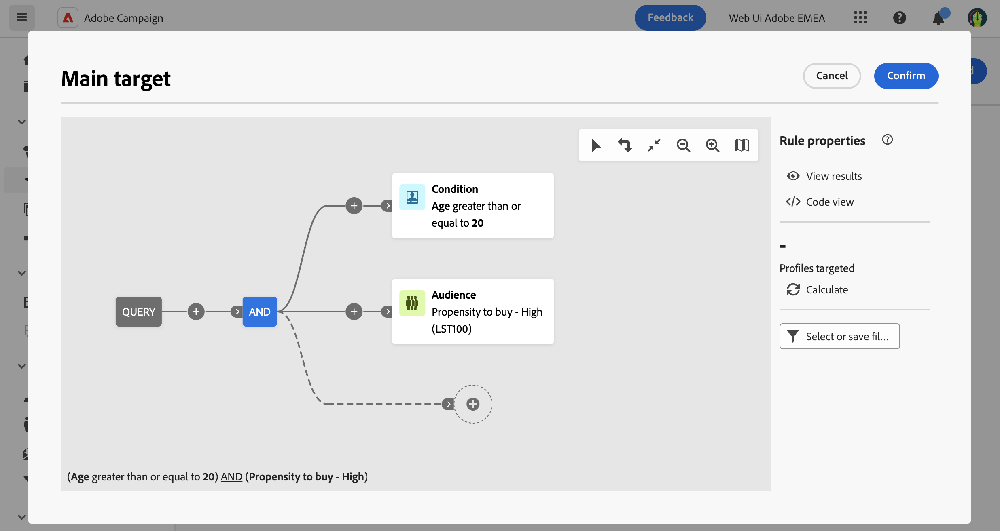

# 建立一次性客群 {#one-time}

本節說明如何在建立新傳送時建立對象。 在此情況下，透過使用查詢模組化工具查詢資料庫，會定位要包含在傳送對象中的設定檔。 產生的對象只會用於此傳送一次。 它不會儲存在對象清單中。

定義傳送的主要目標時，您也可以：
* [從&#x200B;**[!UICONTROL 對象]**&#x200B;清單中選取現有的對象](add-audience.md)。
* [從外部檔案載入對象](file-audience.md) （僅適用於電子郵件）。

若要建立傳送的一次性新對象，請遵循下列步驟：

1. 從傳遞建立助理的「**客群**」區段，按一下「**[!UICONTROL 選取客群]**」按鈕。

   {zoomable="yes"}

1. 選取&#x200B;**建立您自己的**&#x200B;以開啟查詢模型工具，可讓您透過篩選資料庫中包含的資料來定義目標母體。 [瞭解如何使用查詢模型工具](../query/query-modeler-overview.md)

   {zoomable="yes"}

1. 查詢準備就緒後，請按一下&#x200B;**確認**，使用產生的對象作為傳遞的主要目標。

   您也可以設定控制組來測量行銷活動的影響。控制組不會收到訊息。可讓您將收到訊息之群體的行為與未收到訊息之聯絡人的行為進行比較。[了解更多](control-group.md)
