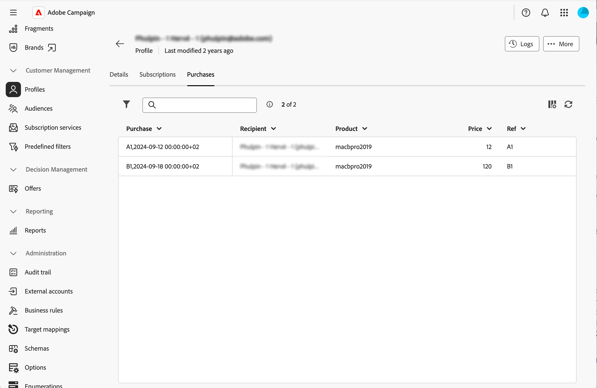

# 探索輪廓的詳細資料 {#profile-view}

>[!CONTEXTUALHELP]
>id="acw_recipients_subscription_list"
>title="訂閱清單"
>abstract="此標籤列出設定檔訂閱的所有服務。"

若要存取設定檔的詳細資料，請瀏覽至&#x200B;**[!UICONTROL 客戶管理]** > **[!UICONTROL 設定檔]**，然後按一下您要存取的設定檔。

設定檔的資訊組織如下：

* **[!UICONTROL 詳細資料]**&#x200B;索引標籤可讓您瀏覽設定檔的內建和自訂屬性。 若要編輯屬性，請在所需的欄位中進行變更，然後按一下&#x200B;**[!UICONTROL 儲存]**&#x200B;按鈕。 有關設定檔屬性的詳細資訊可在[建立設定檔](create-profile.md)區段中取得。

  {zoomable="yes"}

* **[!UICONTROL 訂閱]**&#x200B;索引標籤可讓insight使用設定檔訂閱的服務。 [進一步瞭解訂閱服務](manage-services.md)

  {zoomable="yes"}

* 您可以在收件者綱要的畫面定義中定義集合連結，以顯示自訂標籤，例如購買。 [進一步瞭解集合連結](../administration/schemas-collection-lists.md)

  {zoomable="yes"}

* 此外，位於畫面右上角的&#x200B;**[!UICONTROL 記錄]**&#x200B;按鈕可讓您透過傳送、排除和追蹤記錄來檢視設定檔互動的歷史記錄。 [進一步瞭解傳遞記錄](../monitor/delivery-logs.md)

  您還可以從這些記錄中檢閱在&#x200B;**[!UICONTROL 主張]**&#x200B;索引標籤中呈現給所選設定檔的優惠。 [進一步瞭解優惠方案](../msg/offers.md)

  {zoomable="yes"}