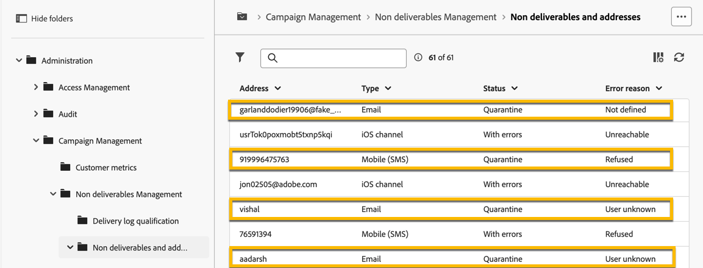
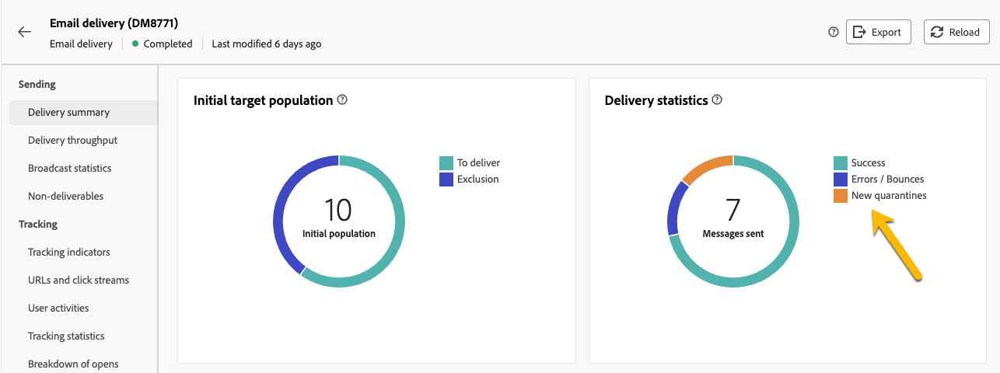

# 隔離

Adobe Campaign管理隔離地址（電子郵件、簡訊、推播通知）。

隔離僅適用於 **電子郵件地址**， a **電話號碼**，或 **裝置Token**，但不適用於設定檔本身。 例如，被隔離的電子郵件地址的設定檔可以更新其設定檔並輸入新地址，然後再次被傳送動作設為目標。 同樣地，如果兩個設定檔碰巧擁有相同的電話號碼，則兩個設定檔在隔離該號碼時都會受到影響。

>[!CAUTION]
>
>Adobe Campaign中的隔離區會區分大小寫。

## 什麼是隔離？

隔離是執行下列作業的方式 **管理傳遞中的無效地址**.

如果傳送的無效位址比率很高，則可能會視為垃圾訊息。 使用隔離管理這些地址，可避免您被網際網路提供者列入封鎖清單。 這對您的信譽很重要。

在Adobe Campaign中隔離地址時，設定檔會在傳送分析期間自動從目標中排除。

隔離可協助您將錯誤的電話號碼排除在遞送服務之外，以降低簡訊傳送成本。

## 為何將地址傳送至隔離區

有許多原因可能會將地址傳送至隔離區：

- 針對簡訊，錯誤的電話號碼
- 針對簡訊，當設定檔回覆具有關鍵字（例如「STOP」）的簡訊時
- 針對電子郵件，在您的郵件回報為垃圾郵件時。 郵件會自動重新導向至由Adobe管理的技術信箱。 之後，系統會自動將使用者的電子郵件地址傳送到狀態為「已加入封鎖清單」的隔離區。
- 舉例來說，信箱已滿、地址不存在或電子郵件伺服器無法使用時，可以隔離電子郵件地址。

[深入瞭解傳送失敗](https://experienceleague.adobe.com/en/docs/campaign-classic/using/sending-messages/monitoring-deliveries/understanding-delivery-failures)

## 在何處尋找隔離地址

您可在以下位置檢視執行個體的所有隔離地址： **[!UICONTROL 瀏覽器]** > **[!UICONTROL 管理]** > **[!UICONTROL Campaign Management]** > **[!UICONTROL 無法傳遞的專案管理]** > **[!UICONTROL 無法傳遞的專案和地址]**. 本節列出電子郵件、簡訊和推播通知通道的隔離元素。

{zoomable="yes"}

您也可以在執行個體中取得隔離的相關報告：

{zoomable="yes"}

您還可以針對每次傳送，檢查傳送摘要報表：其顯示傳送目標中隔離的地址數量：

{zoomable="yes"}

您可以在Adobe Campaign主控台中管理隔離位址。 [了解更多](https://experienceleague.adobe.com/en/docs/campaign/campaign-v8/send/failures/quarantines#access-quarantined-addresses)
