# Define an audience with the rule builder {#segment-builder}

This section describes how to create an audience when designing a new email. The created audience can only be used in this email. 

The rule builder allows you to define the population targeted by your message by filtering data contained in the database. If you want to select an existing audience, refer to this [section](add-audience.md). 

For more information on the rule builder, refer to the [Segmentation Service documentation](https://experienceleague.adobe.com/docs/experience-platform/segmentation/ui/segment-builder.html).

To create a new audience when designing an email, follow these steps: 

1. From the **Audience** section of the delivery creation assistant, click the **[!UICONTROL Select audience]** button.

    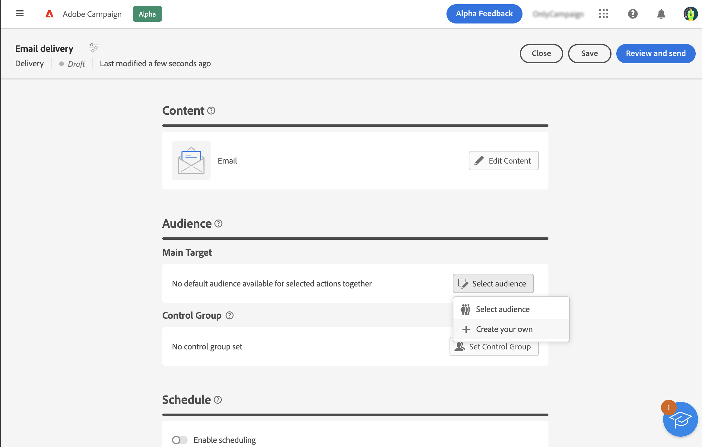

1. Select **Create your own**. The rule builder is displayed.

    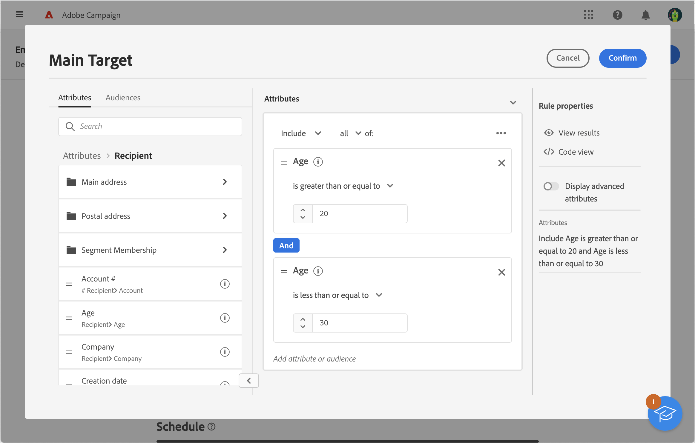

## The palette

The palette, located on the left side contains all the elements that you can filter on to create your audience. The tiles contained in the palette must be moved into the center canvas in order to be configured and taken into account. The palette is divided into two tabs:

* **Attributes**: this tab allows you to access all available fields from the schema. The list of fields depends on the targeting schema defined in the email template.

    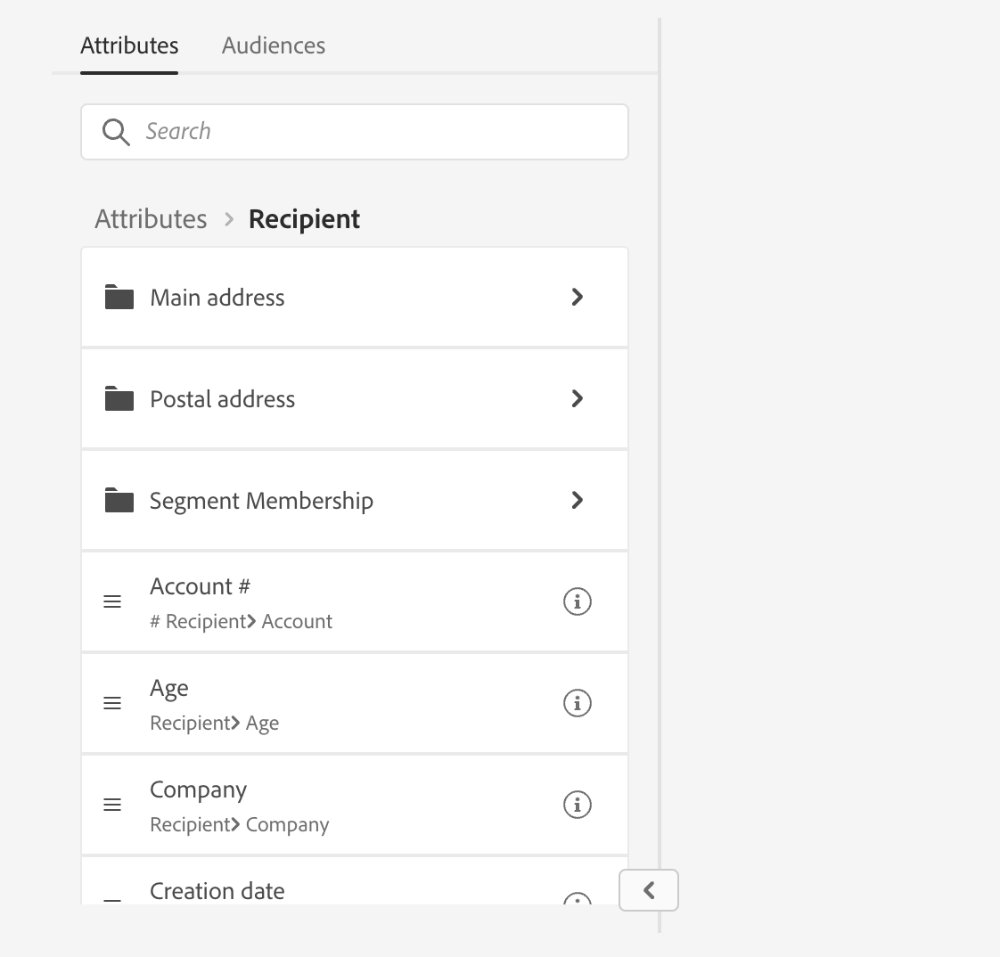{width="70%" align="left"}

* **Audiences**: this tab allows you to filter using one of the existing audiences defined in the Campaign Classic console or from Adobe Experience Platform.

    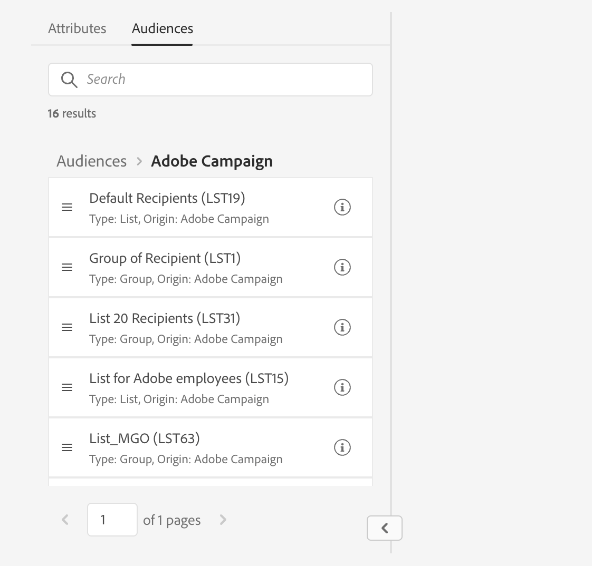{width="70%" align="left"}

    >[!NOTE]
    >
    >To leverage Adobe Experience Platform audiences, you need to configure the integration with Destinations. Refer to the [Destinations documentation](https://experienceleague.adobe.com/docs/experience-platform/destinations/home.html){target="_blank"}.

You can use the search bar to find elements quickly.

## The canvas

The canvas is the central zone in which you can configure and combine rules based on the elements added from the palette. To add a new rule, drag a tile from the palette and drop it onto the canvas. You can then be presented with context-specific options according to the type of data being added. 

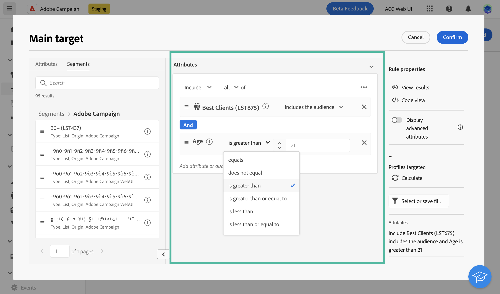{width="70%" align="left"}

## The rule properties pane

On the right side, the **Rule properties** pane allows you to perform the following actions:

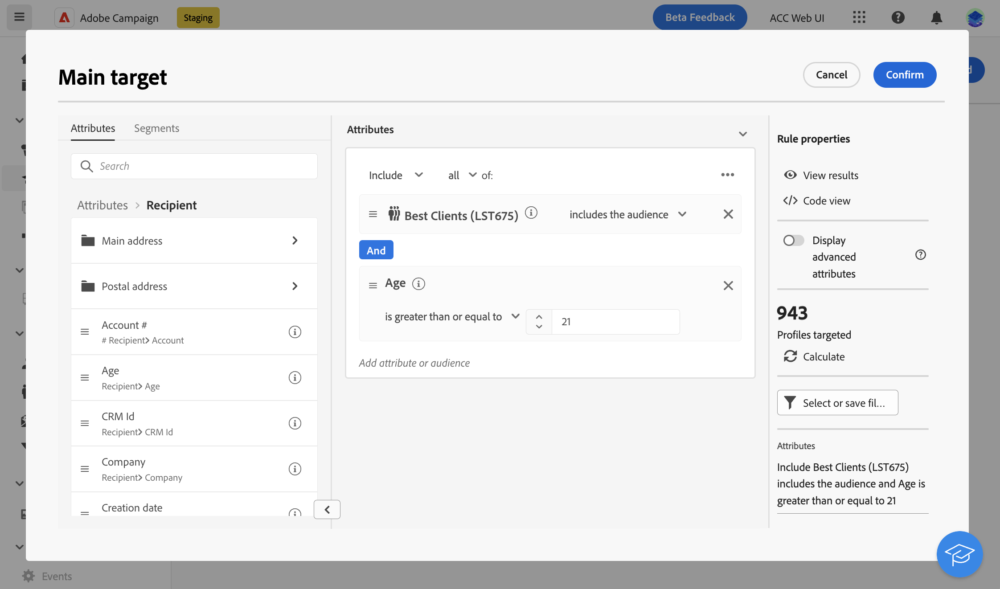{width="70%" align="left"}

* **View results:** displays the list of recipients targeted by the audience.
* **Code view**: displays a code-based version of the audience in SQL.
* **Display advanced attributes**: check this option if you want to view the complete list of attributes in the left palette: nodes, groupings, 1-1 links, 1-N links.
* **Attributes**: displays a description of the created audience.

## Example

In this example, we build an audience to target all customers living in Atlanta or Seattle and born after 1980. 

1. In the **Attributes** tab of the palette, search for the **Date of birth** field. Drag the tile and drop it onto the canvas. 

    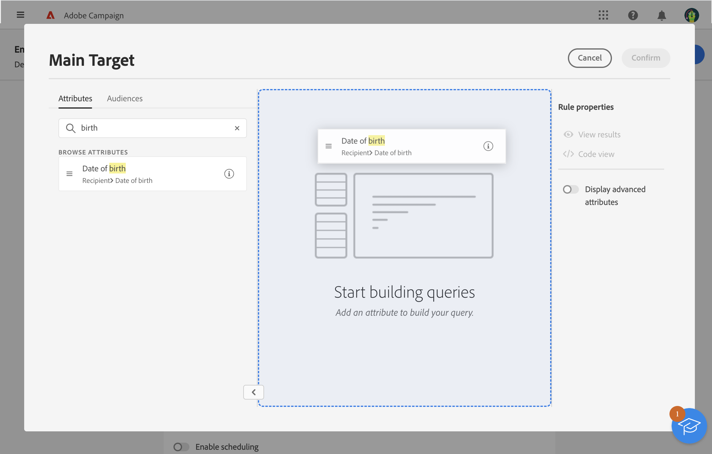

1. In the canvas, choose the **After** operator and enter the desired date.

    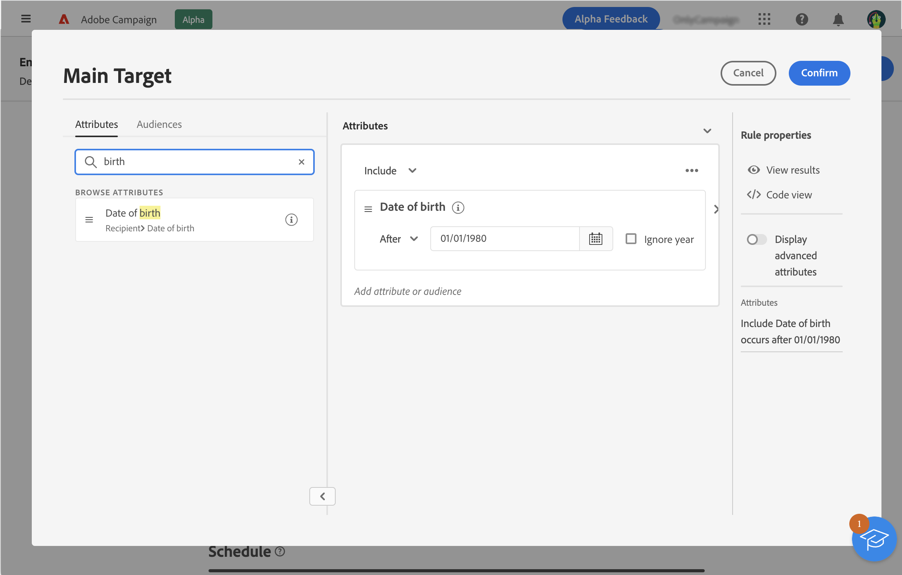

1. In the palette, search for the **City** field and add it to the canvas below the first rule. 

    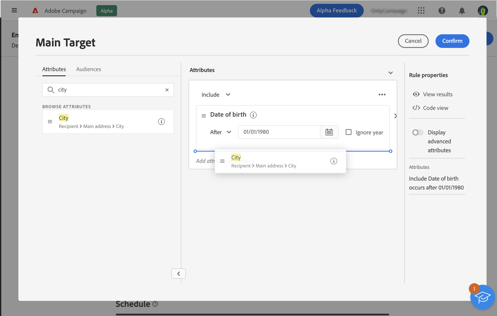

1. In the text field, enter the first city name, then press enter. 

    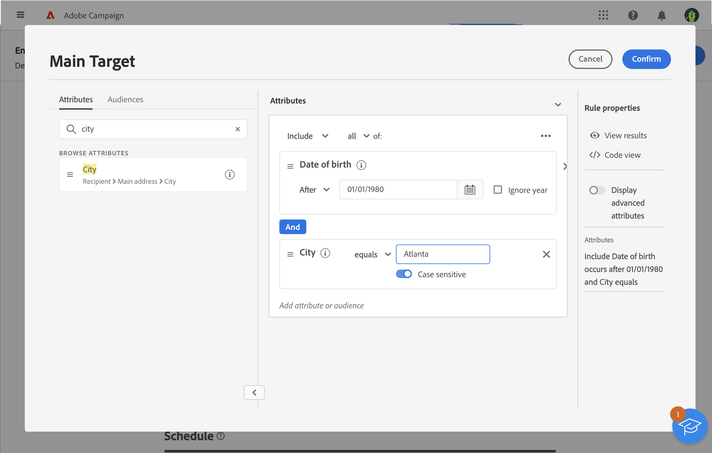

1. Repeat this action for the second city name.

    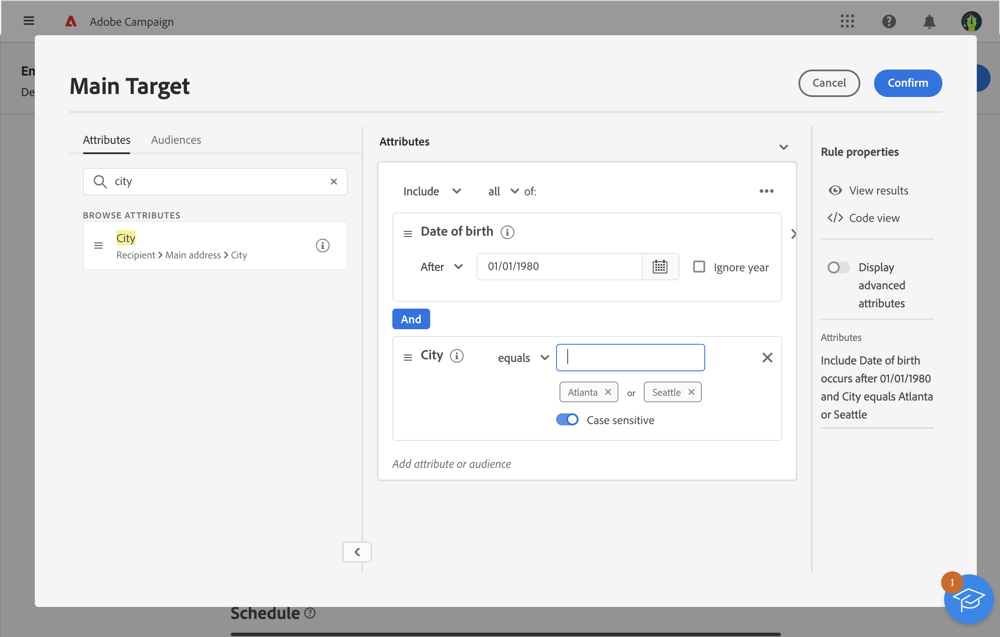

1. Click **View results** to display the list and number of recipients matching the query. You can also add columns to visualize and check the data. In our example, add the **City** column and should see Atlanta and Seattle.

    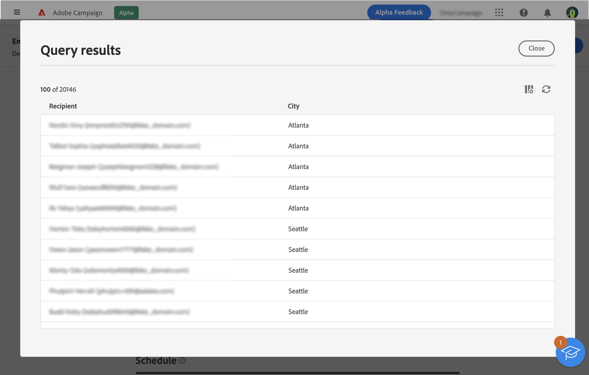

1. Click **Confirm**.

Your audience is defined and ready to be used in your email.