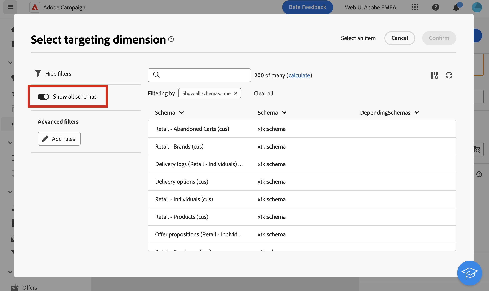

# 目標定位維度 {#targeting-dimensions}

>[!CONTEXTUALHELP]
>id="acw_orchestration_build_audience_dimension"
>title="選取目標定位維度"
>abstract="目標定位維度可讓您定義作業的目標母體：收件者、合約受益人、操作者、訂閱者等。對於電子郵件和簡訊，依預設，目標是從收件者內建表格中選取。對於推播通知，預設目標維度是訂閱者應用程式。"

目標維度，亦稱為。 目標對應，是作業正在處理的資料型別。 它可讓您定義目標母體：設定檔、合約受益人、操作員、訂閱者等。

## 工作流程的目標維度 {#workflow}

工作流程的目標維度是由第一個維度定義 **[!UICONTROL 建立對象]** 活動，並用於所有後續活動，直到工作流程結束為止。 例如，如果對來自資料庫的設定檔執行查詢，出站轉變將包含「recipient」型別的資料，並將傳輸至下一個活動。

請注意，您可以使用在工作流程中切換目標維度 [變更維度活動](../workflows/activities/change-dimension.md). 舉例來說，這可讓您查詢特定表格（例如購買或訂閱）上的資料庫，然後將目標維度變更為收件者，以便將傳送內容傳送至相對應的設定檔。

選取目標維度時(在工作流程設定中或活動中，例如 **建立對象**， **調解** 或 **變更維度**)，則清單中預設會顯示一組常用的結構描述。 若要顯示所有可用的結構描述，請開啟 **[!UICONTROL 顯示所有結構描述]** 按鈕。 系統會為每個使用者儲存選項選取範圍。

{zoomable=&quot;yes&quot;}

## 目標定位維度 {#list}

依預設，電子郵件和簡訊傳遞範本會定位設定檔。 因此，其目標維度會使用 **nms：recipient** 表格。 對於推播通知，預設目標維度為 **訂閱者應用程式nms：appSubscriptionRcp**，此資訊會連結至收件者表格。

您也可以在工作流程及下列傳遞中使用其他內建目標對應：

| 名稱 | 使用至 | 結構描述 |
|---|---|---|
| 收件者 | 傳遞至設定檔/收件者（內建收件者表格） | nms：recipient |
| 訪客 | 傳遞給已透過轉介（病毒式行銷）針對例如收集設定檔的訪客。 | mns：visitor |
| 訂閱 | 傳送給訂閱資訊服務（例如電子報）的設定檔 | nms：subscription |
| 訪客訂閱 | 傳遞給訂閱資訊服務的訪客 | nms：visitorSub |
| 運算子 | 傳遞給Adobe Campaign操作者 | nms：operator |
| 外部檔案 | 透過包含傳遞所需所有資訊的檔案傳遞 | 沒有連結的結構描述，沒有輸入目標 |
| 訂閱者應用程式 | 傳遞給已訂閱應用程式的設定檔 | nms：appSubscriptionRcp |

此外，您可以根據需求建立新的目標對應。 這項作業只能從使用者端主控台執行。 進一步瞭解 [Campaign v8 （使用者端主控台）檔案](https://experienceleague.adobe.com/docs/campaign/campaign-v8/audience/add-profiles/target-mappings.html#new-mapping){target="_blank"}.
