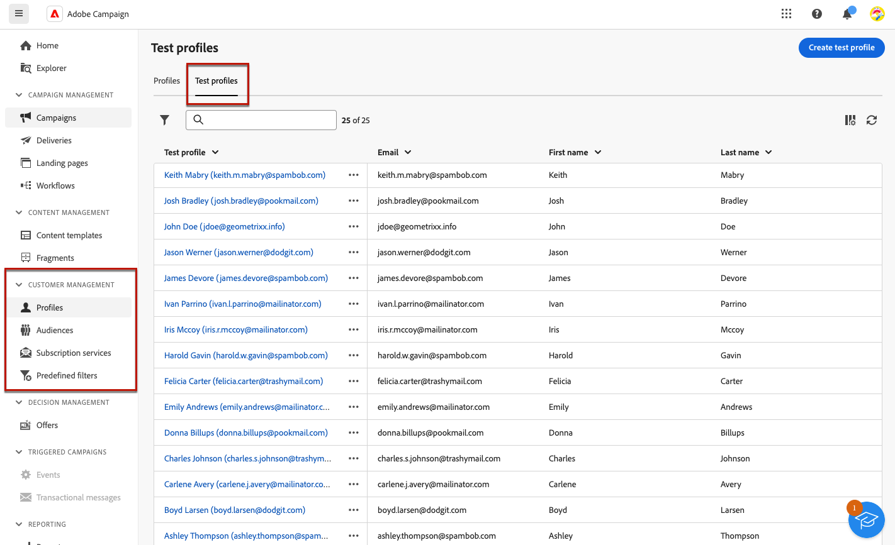
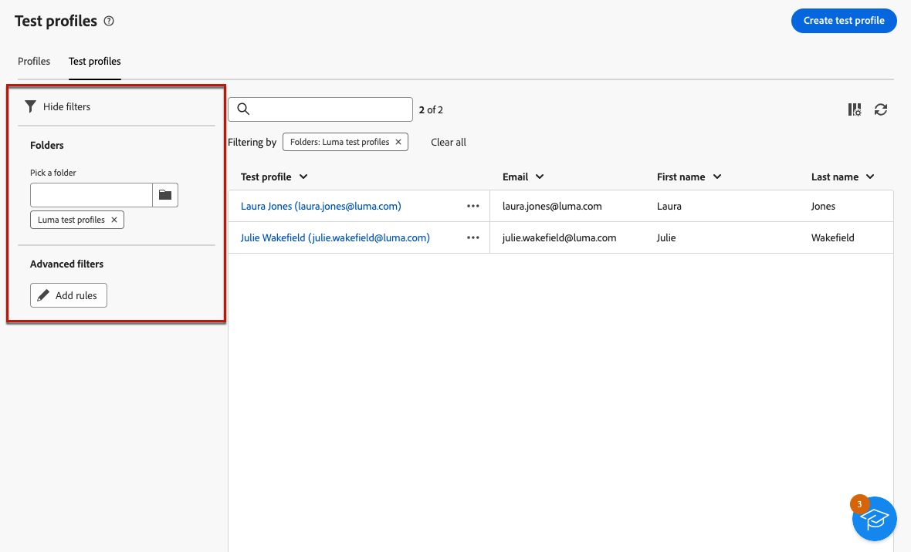
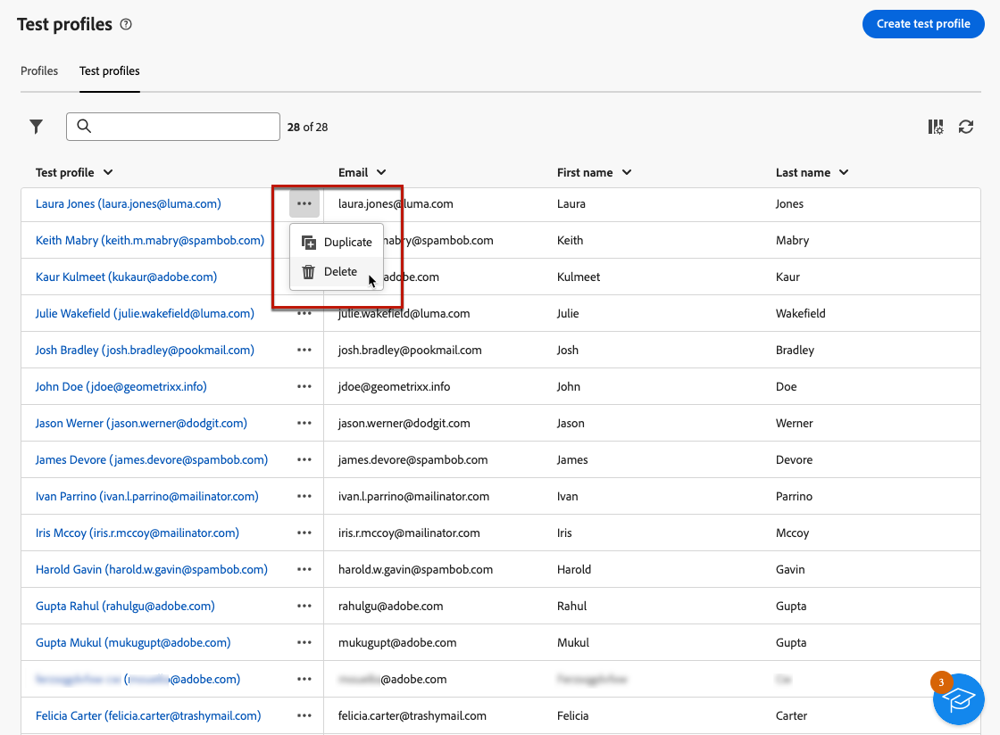
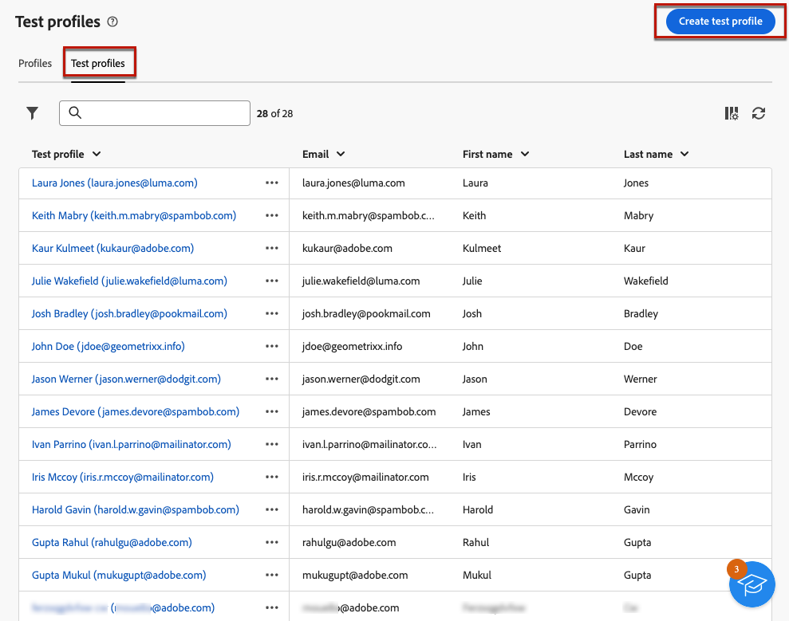
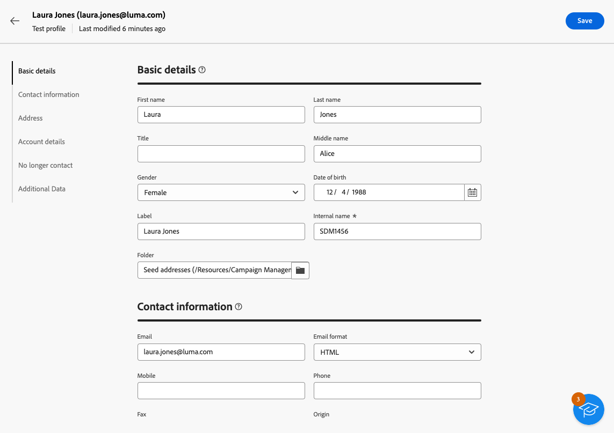
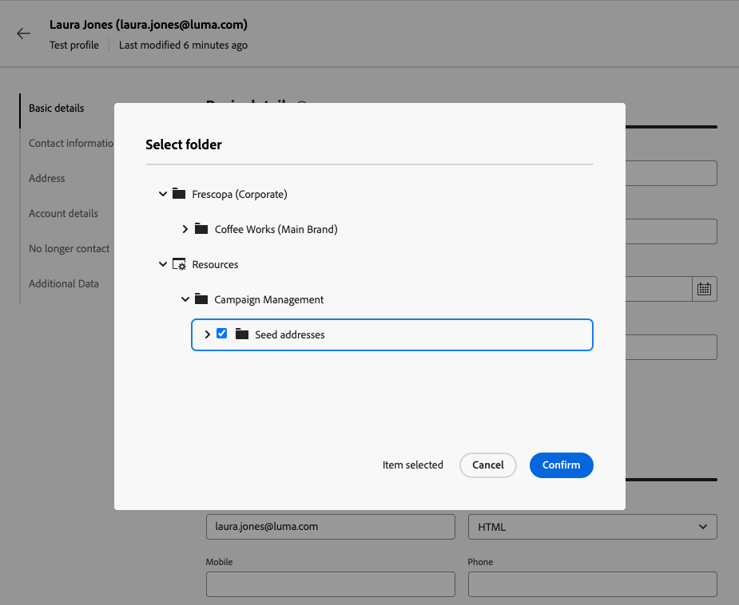
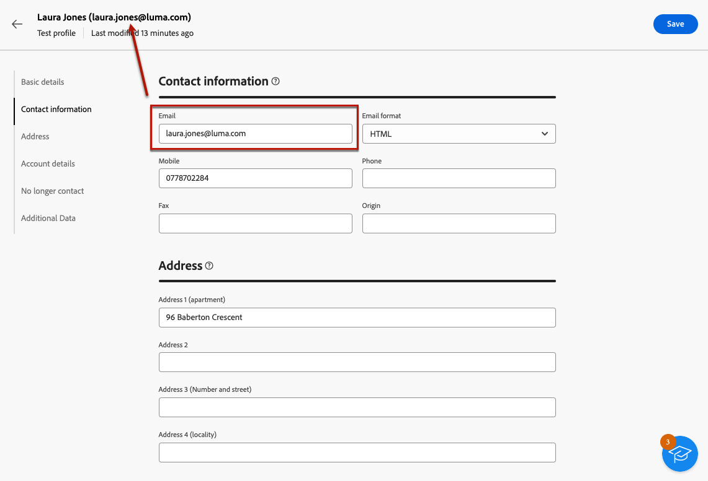
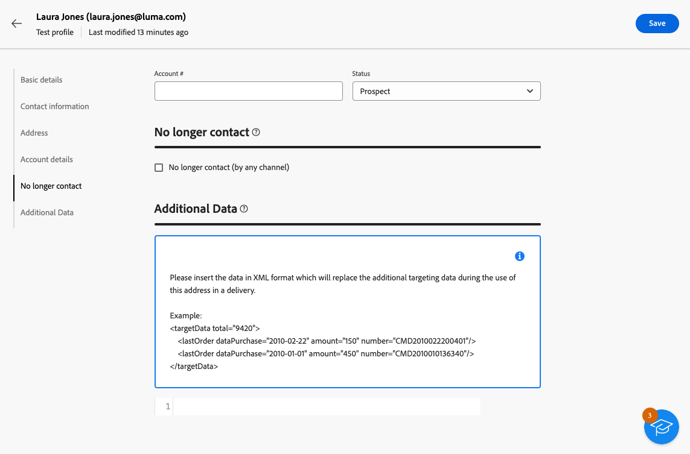

# 建立和管理測試輪廓 {#create-test-profiles}

>[!CONTEXTUALHELP]
>id="acw_recipients_testprofiles_menu"
>title="建立測試輪廓"
>abstract="測試設定檔是額外收件者，可讓您在傳送訊息之前預覽和測試個人化和呈現方式。您可以在預覽訊息內容時選取測試設定檔，並將校樣傳送至測試設定檔以控制和驗證您的訊息內容和設定。"

測試設定檔用於傳送校樣及驗證訊息內容和設定。 這些設定檔是額外的收件者，可讓您在傳送訊息之前，預覽及測試個人化與轉譯。 您可以在預覽訊息內容時選取測試設定檔，並將校樣傳送至測試設定檔，以控制和驗證訊息內容和設定。

➡️ [在影片中探索此功能](#video)

<!--Learn more about test profiles in the [Campaign v8 (client console) documentation](https://experienceleague.adobe.com/docs/campaign/campaign-v8/audience/add-profiles/test-profiles.html){target="_blank"}.-->

傳送校樣到測試設定檔的步驟在[本節](../preview-test/test-deliveries.md#test-profiles)中有詳細說明。

>[!NOTE]
>
>* 測試設定檔會在使用者端主控台中建立為種子地址。
>
>* 測試設定檔會自動從下列傳遞統計資料的報告中排除： **[!UICONTROL 點按次數]**、**[!UICONTROL 開啟次數]**、**[!UICONTROL 取消訂閱]**。

## 存取及管理測試設定檔 {#access-test-profiles}

若要存取測試設定檔清單，請從左側功能表選取&#x200B;**[!UICONTROL 客戶管理]** > **[!UICONTROL 設定檔]**，然後按一下&#x200B;**[!UICONTROL 測試設定檔]**&#x200B;索引標籤。

{zoomable="yes"}

* 您可以使用下拉式清單篩選特定[資料夾](../get-started/permissions.md#folders)，或使用[查詢模型工具](../query/query-modeler-overview.md)新增規則。

  {zoomable="yes"}

* 您可以複製任何測試設定檔，並視需要更新。 編輯測試設定檔的步驟與[建立測試設定檔](#create-test-profile)時的步驟相同。

* 若要刪除測試設定檔，請從&#x200B;**[!UICONTROL 更多動作]**&#x200B;功能表中選取對應的選項。

  {zoomable="yes"}

* 若要編輯測試設定檔，請從清單中按一下所需的專案。 編輯測試設定檔的步驟與[建立測試設定檔](#create-test-profile)時的步驟相同。

您也可以透過&#x200B;**[!UICONTROL 總管]**&#x200B;檢視，從&#x200B;**[!UICONTROL 資源]** > **[!UICONTROL 促銷活動管理]** > **[!UICONTROL 種子地址]**&#x200B;節點存取測試設定檔。

從那裡，您可以瀏覽、建立和管理資料夾或子資料夾，以及檢查關聯的許可權。 [瞭解如何建立資料夾](../get-started/permissions.md#folders)

{zoomable="yes"}

從&#x200B;**[!UICONTROL 總管]**&#x200B;檢視，您也可以篩選、刪除、編輯和[建立](#create-test-profile)測試設定檔。

## 建立測試輪廓 {#create-test-profile}

>[!CONTEXTUALHELP]
>id="acw_recipients_testprofiles_additionaldata"
>title="測試設定檔的附加資料"
>abstract="輸入個人化資料，此個人化資料用於資料管理工作流程中建立的傳遞，並且您要為其指派特定值。"

若要建立測試設定檔，請遵循下列步驟：

1. 瀏覽至&#x200B;**[!UICONTROL 客戶管理]** > **[!UICONTROL 設定檔]**，並選取&#x200B;**[!UICONTROL 測試設定檔]**&#x200B;標籤。

1. 按一下&#x200B;**[!UICONTROL 建立測試設定檔]**&#x200B;按鈕。

   {zoomable="yes"}

1. 視需要填寫測試設定檔的詳細資料。<!--Most of the fields are the same as when creating profiles. [Learn more]-->

   {zoomable="yes"}

   >[!NOTE]
   >
   >**[!UICONTROL 標籤]**&#x200B;欄位會自動填入您定義的名字和姓氏。

1. 依預設，測試設定檔儲存在&#x200B;**[!UICONTROL 種子地址]**&#x200B;資料夾中。 您可以瀏覽至所需的位置來變更它。 [瞭解如何使用資料夾](../get-started/permissions.md#folders)

   <!--{zoomable="yes"}-->

<!--
You do not need to enter all fields of each tab when creating a seed address. Missing personalization elements are entered randomly during delivery analysis. (Not valid?)
-->

1. 在&#x200B;**[!UICONTROL 連絡資訊]**&#x200B;區段中，輸入電子郵件地址與其他相關資料。 電子郵件地址會顯示在測試設定檔標籤後的方括弧之間。

   {zoomable="yes"}

1. 如果您選取&#x200B;**[!UICONTROL 不再連絡（透過任何管道）]**&#x200B;核取方塊，則測試設定檔會列入封鎖清單。 任何頻道（電子郵件、簡訊等）不再以這類收件者為目標。

1. 在&#x200B;**[!UICONTROL 其他資料]**&#x200B;索引標籤中，輸入用於資料管理工作流程中所建立傳遞且您想要指派特定值的個人化資料。 [進一步瞭解工作流程](../workflows/gs-workflows.md)

   {zoomable="yes"}

   請確定已在&#x200B;**[!UICONTROL 擴充]**&#x200B;工作流程活動中定義其他目標資料，其別名的開頭為&#39;@&#39;。 否則，您就無法在傳遞活動中正確搭配種子地址使用。 [進一步瞭解擴充活動](../workflows/activities/enrichment.md)

1. 按一下&#x200B;**[!UICONTROL 儲存]**&#x200B;按鈕。

您剛建立的測試設定檔現已準備就緒，可用來傳送校樣。 [了解更多](../preview-test/test-deliveries.md#test-profiles)

<!--Use test profiles in Direct mail? cf v7/v8-->

## 操作說明影片 {#video}

瞭解如何使用Campaign網頁使用者介面建立和管理測試設定檔。

>[!VIDEO](https://video.tv.adobe.com/v/3442844?quality=12)