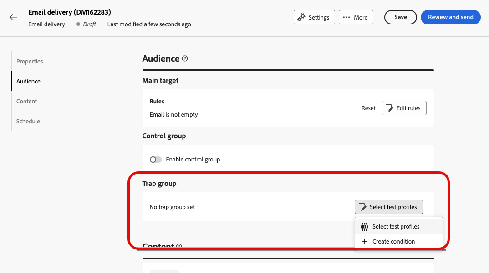
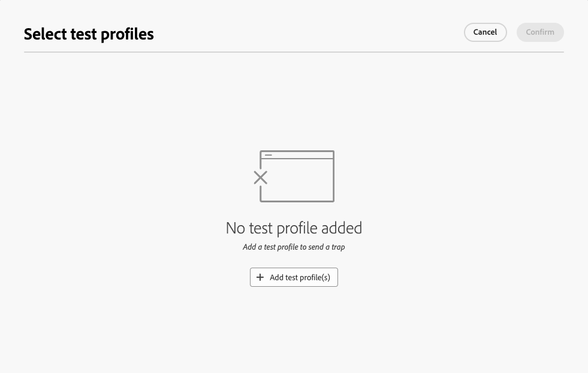
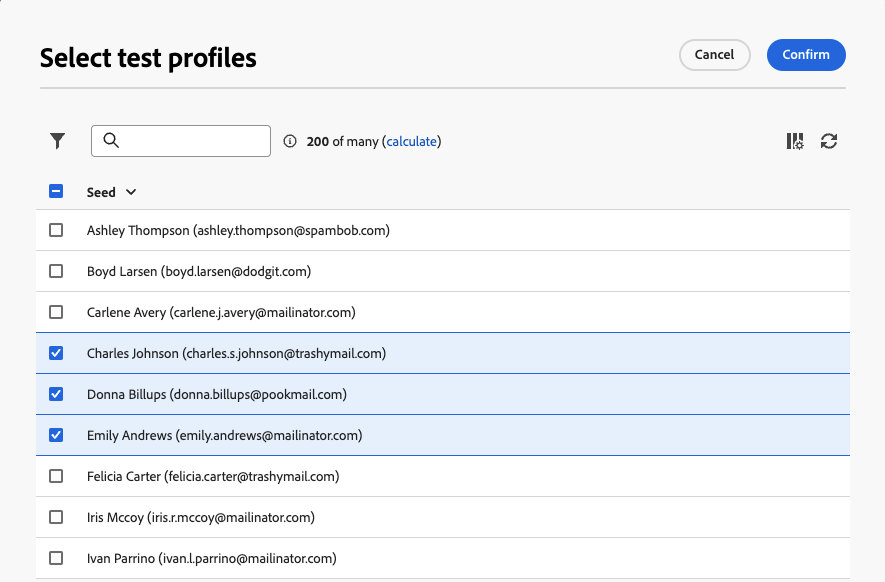
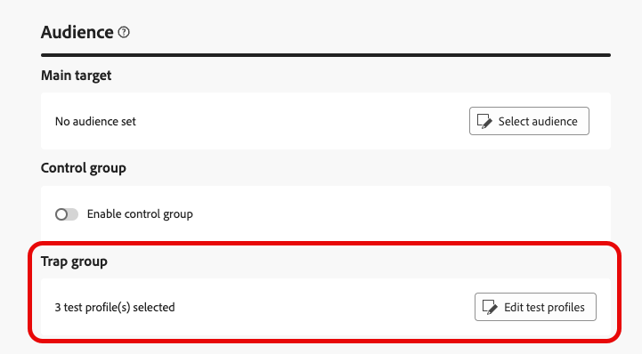
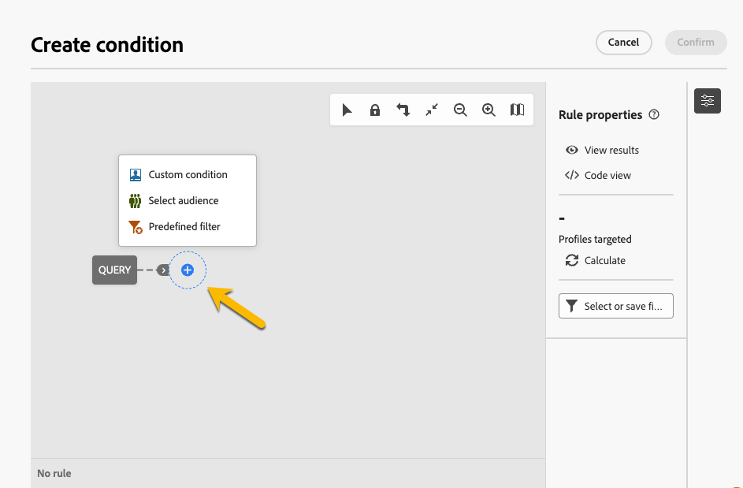
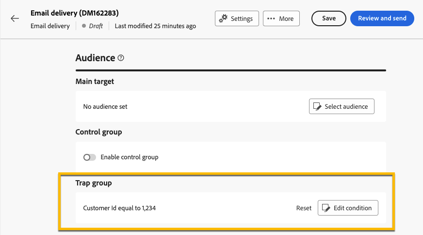
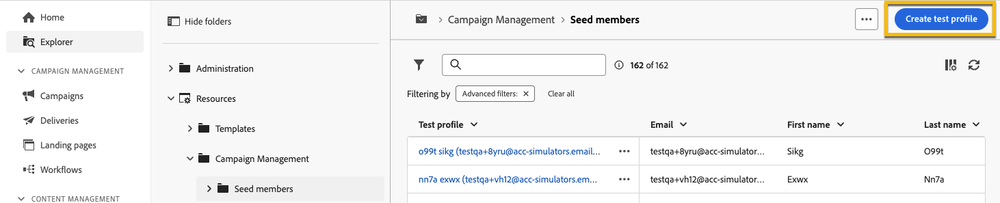
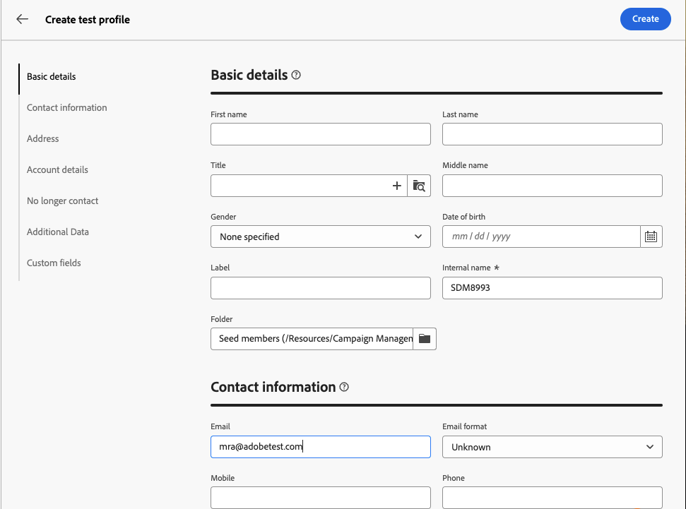

# 使用捕捉器群組 {#trap-group}

>[!CONTEXTUALHELP]
>id="acw_homepage_welcome_rn3"
>title="捕捉器群組"
>abstract="您可以使用捕捉器群組在傳遞中包含特定位址，以透過針對不符合定義目標條件的輪廓，來監視和驗證分發程序。"
>additional-url="https://experienceleague.adobe.com/docs/campaign-web/v8/release-notes/release-notes.html?lang=zh-Hant" text="請參閱版本注意事項"

**[!UICONTROL 陷阱群組]** （也稱為&#x200B;**[!UICONTROL 種子清單]**）可用來在您的傳遞中包含特定地址，以透過鎖定不符合定義的目標條件的設定檔來監控和驗證發佈程式。 如此一來，不在傳遞範圍的收件者可以像任何其他目標收件者一樣接收傳遞。

**[!UICONTROL 陷阱群組]**&#x200B;是&#x200B;**[!UICONTROL 種子地址]**&#x200B;的群組，名為Campaign網頁使用者介面上的&#x200B;**[!UICONTROL 測試設定檔]**。

## 為何使用補漏白群組 {#why-trap-group}

您可以使用&#x200B;**[!UICONTROL 設陷群組]**：

1. **作為證明**： **[!UICONTROL Trap群組]**&#x200B;的每個成員都會收到傳遞，就像他們屬於對象一樣。

1. **為了保護您的郵寄清單**：如果第三方使用郵寄清單，則透過接收對象將收到的內容，將會注意到&#x200B;**[!UICONTROL Trap群組]**&#x200B;的每個&#x200B;**[!UICONTROL 測試設定檔]**。

>[!NOTE]
>
>除了[在建立傳遞](../email/create-email.md#preview-test)期間和從[控制群組](control-group.md)傳送校樣之外，新增設陷群組也是測試對象的一種好方法。

## 關於陷阱群組 {#about-trap-group}

測試設定檔會自動從下列傳遞統計資料的報告中排除： **點按次數**、**開啟次數**、**取消訂閱**。 報表只說明真實受眾。

對於電子郵件傳遞，**[!UICONTROL 陷阱群組]**&#x200B;只需要電子郵件地址，其他欄位的個人化將由Campaign隨機填入。

## 在傳遞中新增補漏白群組 {#trap-group-in-delivery}

若要設定&#x200B;**[!UICONTROL 補漏白群組]**，請移至傳遞的&#x200B;**[!UICONTROL 對象]**&#x200B;設定。 您有2個選項：

* [選取測試設定檔](#select-test-profile)
* [建立條件](#create-condition)

{zoomable="yes"}

### 選取測試設定檔 {#select-test-profiles}

當您選擇&#x200B;**選取測試設定檔**&#x200B;時，可以使用&#x200B;**新增測試設定檔**&#x200B;按鈕，如下所示：

{zoomable="yes"}

當您按一下按鈕時，您就可以存取可新增&#x200B;**[!UICONTROL 補漏白群組]**&#x200B;的測試設定檔。 選取您要使用的專案。

您也可以建立新的測試設定檔。 [了解更多](#create-seed)

{zoomable="yes"}

當您確認測試設定檔時，請檢查您在&#x200B;**[!UICONTROL 補漏白群組]**&#x200B;下是否有正確的號碼。

{zoomable="yes"}

### 建立條件 {#create-condition}

使用&#x200B;**[!UICONTROL 建立條件]**&#x200B;選項，您可以建立查詢來定義您要使用的測試設定檔：

{zoomable="yes"}

您的查詢會顯示在&#x200B;**[!UICONTROL 陷阱群組]**&#x200B;下。

{zoomable="yes"}

## 建立新的測試設定檔 {#create-seed}

您可以從&#x200B;**[!UICONTROL 總管]** > **[!UICONTROL 資源]** > **[!UICONTROL Campaign Management]** > **[!UICONTROL 種子成員]**&#x200B;資料夾建立新的&#x200B;**[!UICONTROL 測試設定檔]**。

{zoomable="yes"}

針對任何設定檔，設定&#x200B;**[!UICONTROL 測試設定檔]**&#x200B;的所有相關設定：

{zoomable="yes"}
