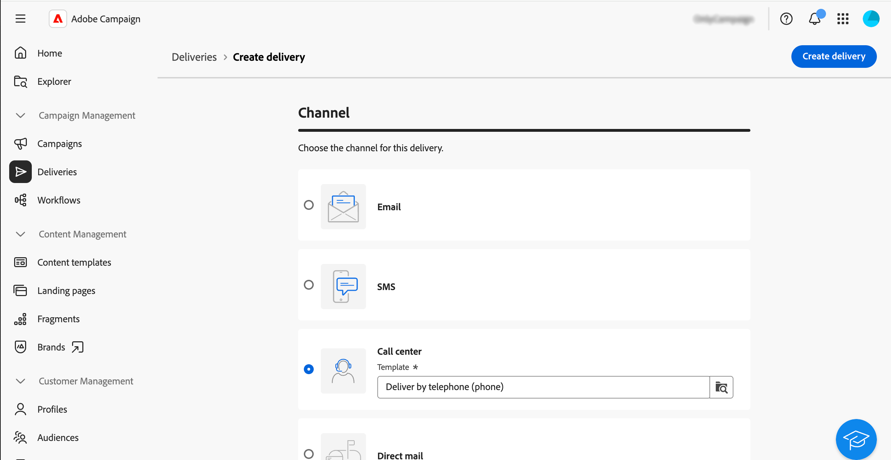
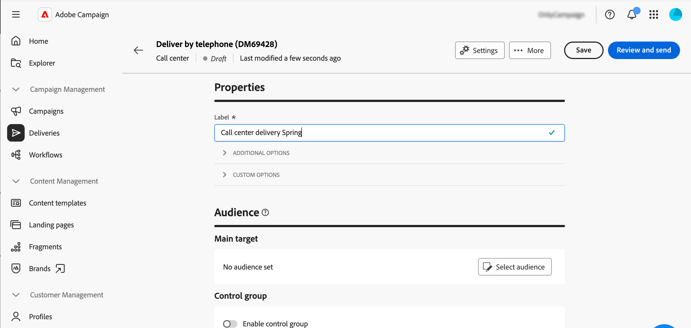
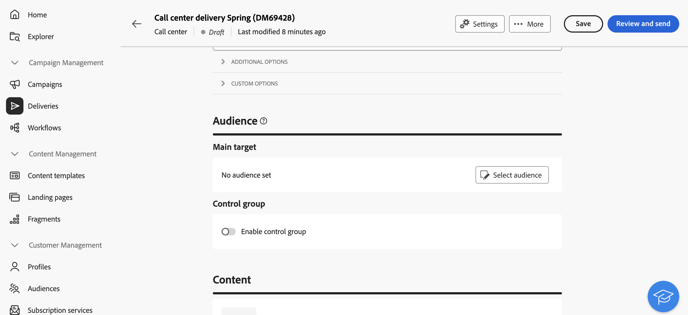
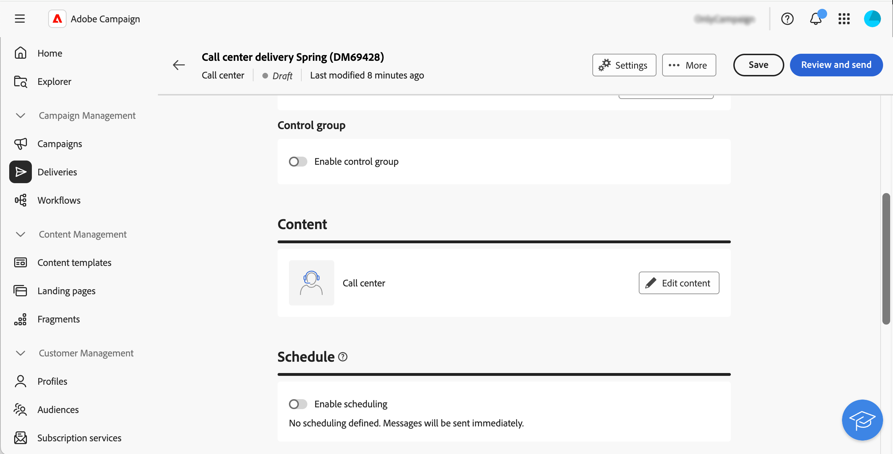
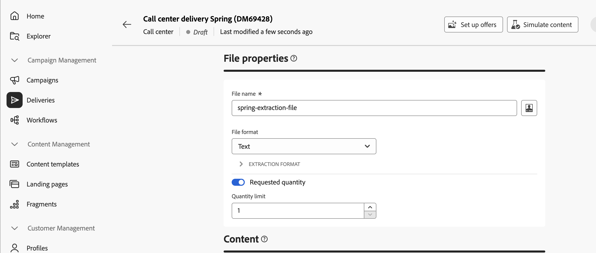
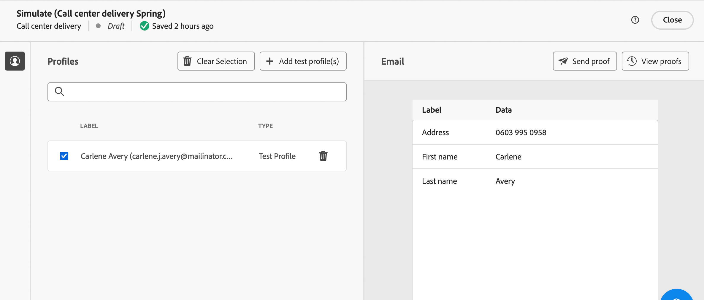
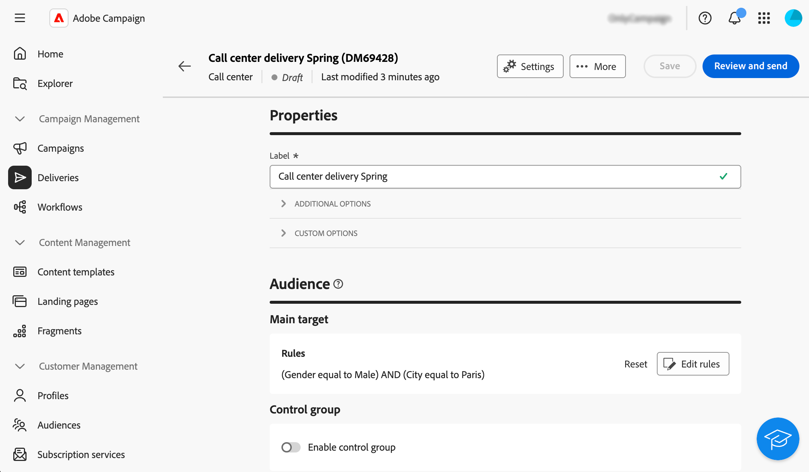
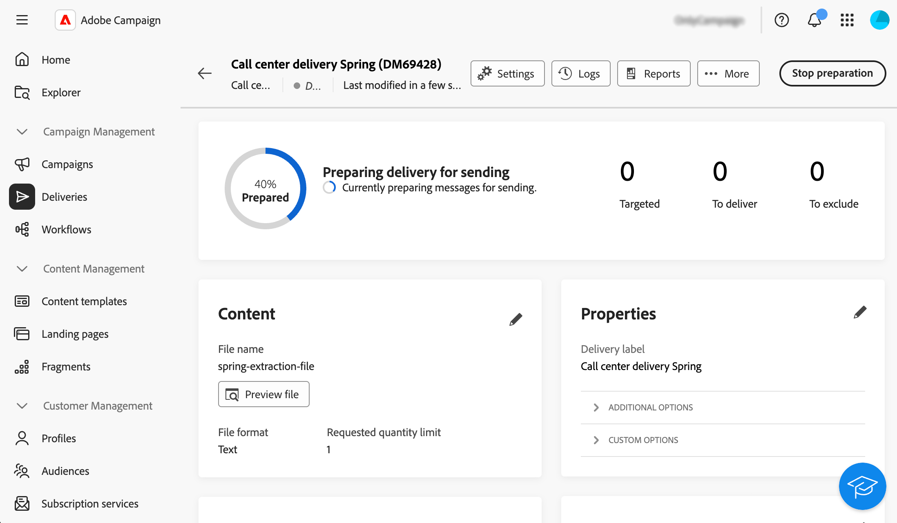

# 建立和傳送呼叫中心傳遞 {#create-call-center}

您可以建立獨立的客服中心傳遞，或在行銷活動工作流程的內容中建立一個。 以下步驟詳細說明獨立（一次性）傳送的程式。 如果您在行銷活動工作流程的內容中工作，建立步驟將在[本節](../workflows/activities/channels.md#create-a-delivery-in-a-campaign-workflow)中詳細說明。

若要建立並傳送新的獨立客服中心傳遞，請遵循下列主要步驟：

1. 建立傳遞，[瞭解詳情](#create-delivery)
1. 定義對象，[瞭解詳情](#select-audience)
1. 編輯內容，[瞭解詳情](#edit-content)
1. 預覽並傳送傳遞，[瞭解詳情](#preview-send)

## 建立傳遞{#create-delivery}

請依照下列步驟建立傳遞並設定其屬性：

1. 選取&#x200B;**[!UICONTROL 傳遞]**&#x200B;功能表並按一下&#x200B;**[!UICONTROL 建立傳遞]**&#x200B;按鈕。

1. 選擇&#x200B;**[!UICONTROL 客服中心]**&#x200B;作為頻道，然後按一下&#x200B;**[!UICONTROL 建立傳遞]**&#x200B;以進行確認。

   {zoomable="yes"}

   >[!NOTE]
   >
   >如果您想要選取不同的範本，請參閱此[頁面](../msg/delivery-template.md)。

1. 在&#x200B;**[!UICONTROL 屬性]**&#x200B;下，輸入傳遞的&#x200B;**[!UICONTROL 標籤]**。 此[區段](../email/create-email.md#create-email)中詳細說明了其他選項。

   {zoomable="yes"}

>[!NOTE]
>
>您可以排程在特定日期傳送您的傳遞。 如需詳細資訊，請參閱本[區段](../msg/gs-deliveries.md#gs-schedule)。

## 定義客群{#select-audience}

現在，您需要定義擷取檔案的目標對象。

1. 在傳遞頁面的&#x200B;**[!UICONTROL 對象]**&#x200B;區段中，按一下&#x200B;**[!UICONTROL 選取對象]**。

   {zoomable="yes"}

1. 選擇現有對象或建立您自己的對象。

   * [瞭解如何選取現有對象](../audience/add-audience.md)
   * [瞭解如何建立新受眾](../audience/one-time-audience.md)

   {zoomable="yes"}

>[!NOTE]
>
>客服中心收件者必須至少包含其姓名和電話號碼。 所有資訊不完整的收件者都會從客服中心傳遞中排除。
>
>若要瞭解如何設定控制群組，請參閱此[頁面](../audience/control-group.md)。

## 編輯內容{#edit-content}

現在，讓我們編輯呼叫中心傳遞產生的擷取檔案內容。

1. 從傳遞頁面，按一下&#x200B;**[!UICONTROL 編輯內容]**&#x200B;按鈕。

   {zoomable="yes"}

1. 指定&#x200B;**[!UICONTROL 檔案名稱]**。 若要瞭解如何個人化檔案名稱，請參閱此[頁面](../personalization/personalize.md)。

1. 選取&#x200B;**[!UICONTROL 檔案格式]**： **文字**、**使用固定寬度資料行的文字**、**CSV (Excel)**&#x200B;或&#x200B;**XML**。

   {zoomable="yes"}

   >[!NOTE]
   >
   >此[頁面](../direct-mail/content-direct-mail.md#properties)中詳細說明了擷取格式選項。

1. 如果您無法限制傳遞的收件者數目，請開啟&#x200B;**[!UICONTROL 要求的數量]**&#x200B;選項。

1. 在&#x200B;**[!UICONTROL Content]**&#x200B;區段中，按一下&#x200B;**[!UICONTROL 新增屬性]**&#x200B;按鈕，以建立要顯示在擷取檔案中的新欄。

1. 選擇要顯示在欄中的屬性，然後確認。 若要進一步瞭解如何選取屬性並將其新增至我的最愛，請參閱此[頁面](../get-started/attributes.md)。

   ![熒幕擷圖顯示[新增屬性]按鈕和將屬性新增至擷取檔案的選項。](assets/cc-add-attribute.png)

1. 重複這些步驟，視需要為解壓縮檔案新增任意數目的欄。

   然後，您可以編輯屬性、排序擷取檔案或變更欄的位置。 如需關於此項目的詳細資訊，請參閱此[頁面](../direct-mail/content-direct-mail.md#content)。

   

## 預覽並傳送傳遞{#preview-send}

當傳送內容準備就緒時，您可以使用測試設定檔來預覽並傳送校樣。 然後，您可以傳送呼叫中心傳遞以產生擷取檔案。

預覽和傳送解壓縮檔案的主要步驟如下。 [此頁面](../direct-mail/send-direct-mail.md)中有更多詳細資料。

1. 從傳遞內容頁面，按一下&#x200B;**[!UICONTROL 模擬內容]**&#x200B;按鈕。

   {zoomable="yes"}

1. 選取一或多個測試設定檔以預覽個人化內容。 您也可以傳送校樣。 [閱讀更多](../direct-mail/send-direct-mail.md#preview-dm)

   {zoomable="yes"}

1. 從傳遞頁面，按一下&#x200B;**[!UICONTROL 檢閱與傳送]**。

   {zoomable="yes"}

1. 按一下&#x200B;**[!UICONTROL 準備]**&#x200B;並監視提供的進度和統計資料，然後確認。

   {zoomable="yes"}

1. 按一下&#x200B;**[!UICONTROL 傳送]**&#x200B;以繼續進行最後的傳送程式，然後確認。

傳送傳遞後，擷取檔案會自動產生，並匯出至傳遞範本的&#x200B;**[!UICONTROL 進階設定]**&#x200B;中所選[路由](../advanced-settings/delivery-settings.md)外部帳戶中指定的位置。 您也可以按一下熒幕&#x200B;**內容**&#x200B;區段中的&#x200B;**預覽檔案**&#x200B;按鈕，預覽檔案。

從您的傳遞頁面追蹤您的KPI （關鍵績效指標）資料，並從&#x200B;**[!UICONTROL 記錄檔]**&#x200B;功能表追蹤資料。

開始使用內建報告測量訊息的影響。 [了解更多](../reporting/direct-mail.md)
