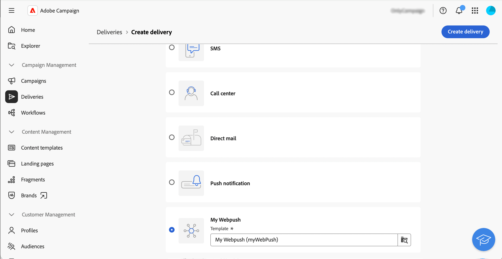
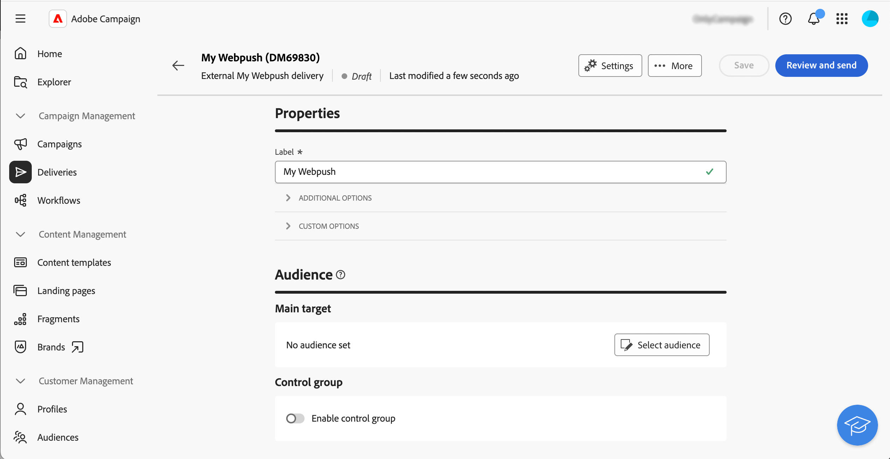
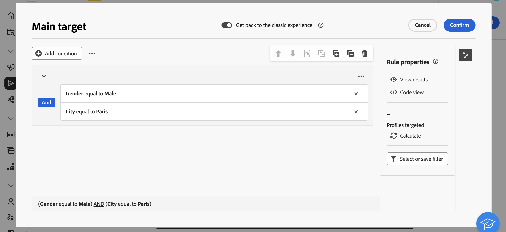
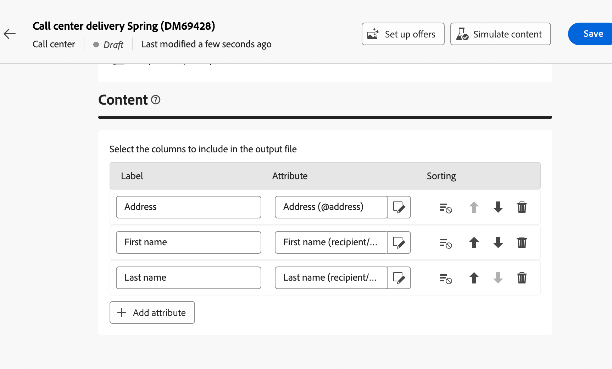
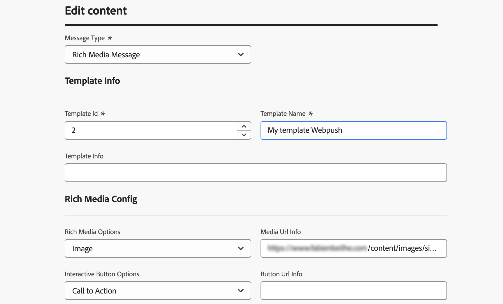
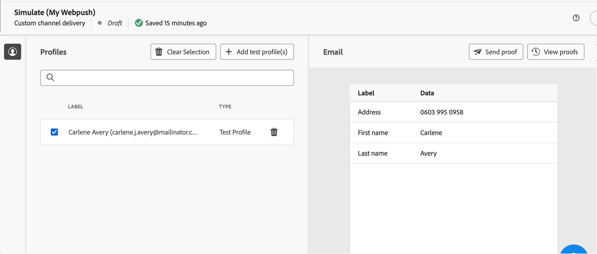
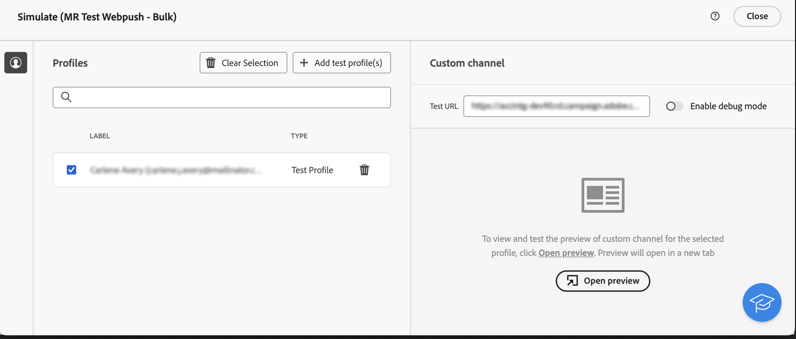
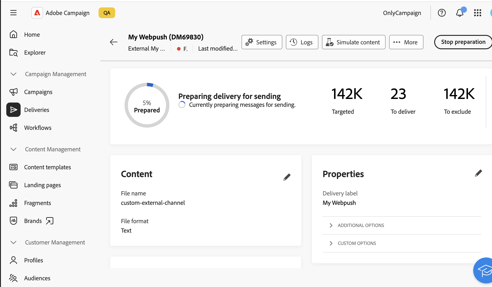

# 開始使用自訂頻道 {#gs-custom-channel}

>[!CONTEXTUALHELP]
>id="acw_homepage_welcome_rn1"
>title="API傳遞的自訂頻道"
>abstract="您現在可以直接從Adobe Campaign Web UI，根據自訂API通道來協調和執行傳送。 這些傳送可以是獨立或工作流程的一部分。"
>additional-url="https://experienceleague.adobe.com/docs/campaign-web/v8/release-notes/release-notes.html?lang=zh-hant" text="請參閱發行說明"

您可以直接從Adobe Campaign Web UI，根據與第三方整合的自訂頻道來協調和執行傳遞。 自訂頻道的設定是在使用者端主控台中執行。

支援兩種型別的自訂管道：外部和API。 透過外部管道，Campaign會產生可自訂的匯出檔案，其中包含所有必要的聯絡和個人化資料。 透過API通道，訊息會透過已設定的API傳送至目標設定檔。

您可以在工作流程中新增自訂通道傳送，或將其用作獨立傳送。

以下步驟詳細說明獨立（一次性）傳送的程式。 大多數步驟類似於呼叫中心傳遞。 如需詳細資訊，請參閱此[頁面](../call-center/create-call-center.md)。

若要傳送新的獨立自訂傳送，請遵循下列主要步驟：

1. 設定自訂頻道，[瞭解詳情](#create-channel)
1. 建立傳遞，[瞭解詳情](#create-delivery)
1. 定義對象，[瞭解詳情](#select-audience)
1. 編輯內容，[瞭解詳情](#edit-content)
1. 預覽並傳送傳遞，[瞭解詳情](#preview-send)

## 設定自訂頻道{#create-channel}

首先，您需要設定自訂頻道。 以下是要在使用者端主控台中執行的主要步驟。 自訂外部和API管道共用以下步驟：

1. 設定結構以新增通道至可用通道清單。 [閱讀更多](https://experienceleague.adobe.com/docs/campaign/campaign-v8/send/custom-channel.html#configure-schema){target="_blank"}
1. 建立新的路由外部帳戶。 [閱讀更多](https://experienceleague.adobe.com/docs/campaign/campaign-v8/send/custom-channel.html#reate-ext-account){target="_blank"}
1. 建立與新頻道關聯的新傳遞範本。 [閱讀更多](https://experienceleague.adobe.com/docs/campaign/campaign-v8/send/custom-channel.html#create-template){target="_blank"}

自訂API通道需要其他設定。 [閱讀更多](https://experienceleague.adobe.com/docs/campaign/campaign-v8/send/custom-channel.html#api-additional){target="_blank"}

## 建立傳遞{#create-delivery}

請依照下列步驟建立傳遞並設定其屬性：

1. 選取&#x200B;**[!UICONTROL 傳遞]**&#x200B;功能表並按一下&#x200B;**[!UICONTROL 建立傳遞]**&#x200B;按鈕。

1. 選擇所需的自訂頻道，選取關聯的範本，然後按一下[建立傳遞] **[!UICONTROL 進行確認。]**

   {zoomable="yes"}

1. 在&#x200B;**[!UICONTROL 屬性]**&#x200B;下，輸入傳遞的&#x200B;**[!UICONTROL 標籤]**。

   {zoomable="yes"}

如需傳遞建立的詳細資訊，請參閱客服中心[檔案](../call-center/create-call-center.md#create-delivery)。

## 定義客群{#select-audience}

現在，您需要定義將定位的對象。

1. 從傳遞控制面板的&#x200B;**[!UICONTROL 對象]**&#x200B;區段，按一下&#x200B;**[!UICONTROL 選取對象]**。

1. 選擇現有對象或建立您自己的對象。

   {zoomable="yes"}

如需對象定義的詳細資訊，請參閱客服中心[檔案](../call-center/create-call-center.md#select-audience)。

## 編輯內容{#edit-content}

現在，讓我們編輯傳送的內容。

>[!BEGINTABS]

>[!TAB 自訂外部管道]

1. 在傳遞控制面板中，按一下&#x200B;**[!UICONTROL 編輯內容]**&#x200B;按鈕。

1. 指定&#x200B;**[!UICONTROL 檔案名稱]**、選取&#x200B;**[!UICONTROL 檔案格式]**，並視需要為解壓縮檔案新增欄數。

   

>[!TAB 自訂API頻道]

1. 在傳遞控制面板中，按一下&#x200B;**[!UICONTROL 編輯內容]**&#x200B;按鈕。

1. 視需要填寫欄位。 若要瞭解如何設定此熒幕，請參閱此[頁面](https://experienceleague.adobe.com/docs/campaign/campaign-v8/send/custom-channel.html#api-additional-screen){target="_blank"}。

   

>[!ENDTABS]

如需內容版本的詳細資訊，請參閱客服中心[檔案](../call-center/create-call-center.md#edit-content)。

## 預覽並傳送傳遞{#preview-send}

當傳送內容準備就緒時，您可以使用測試設定檔來預覽它。 然後，您可以傳送傳遞以產生解壓縮檔案，或透過API傳送訊息。

>[!BEGINTABS]

>[!TAB 自訂外部管道]

1. 在傳遞控制面板中，按一下&#x200B;**[!UICONTROL 編輯內容]**&#x200B;按鈕。

1. 從傳遞內容頁面，按一下&#x200B;**[!UICONTROL 模擬內容]**&#x200B;按鈕並選取測試設定檔。

   {zoomable="yes"}

>[!TAB 自訂API頻道]

1. 在傳遞控制面板中，按一下&#x200B;**[!UICONTROL 編輯內容]**&#x200B;按鈕。

1. 從傳遞內容頁面，按一下&#x200B;**[!UICONTROL 模擬內容]**&#x200B;按鈕並選取測試設定檔。

1. 按一下右邊的&#x200B;**開啟預覽**。 需要使用JSSP來設定此功能。 請參見此[頁面](https://experienceleague.adobe.com/docs/campaign/campaign-v8/send/custom-channel.html#api-additional-preview){target="_blank"}。

   {zoomable="yes"}

>[!ENDTABS]

從傳遞儀表板，按一下&#x200B;**[!UICONTROL 檢閱和傳送]**，然後按一下&#x200B;**[!UICONTROL 準備]**。 然後，確認。 按一下&#x200B;**[!UICONTROL 傳送]**&#x200B;以繼續進行最後的傳送程式，然後確認。

{zoomable="yes"}

如需預覽和傳送的詳細資訊，請參閱客服中心[檔案](../call-center/create-call-center.md#preview-send)。
