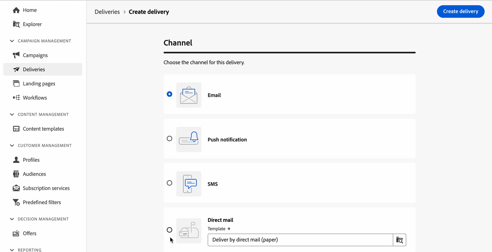
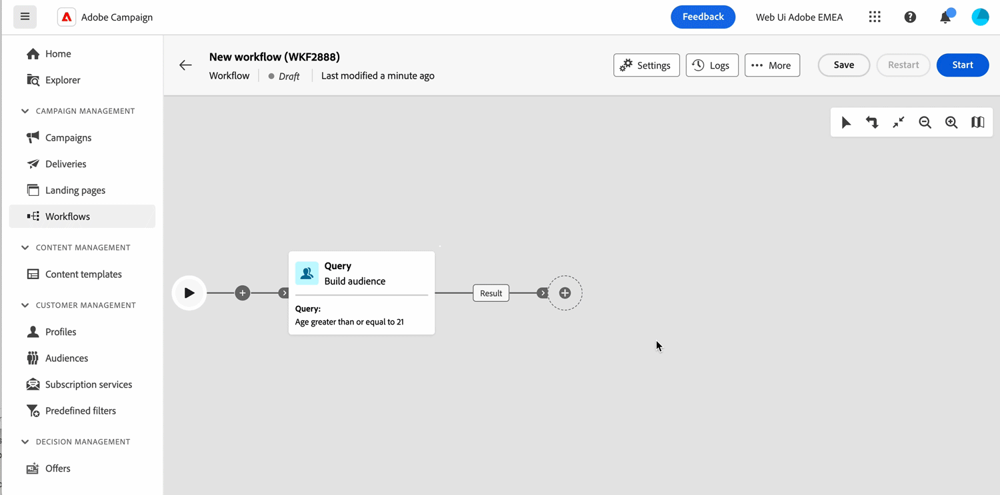

# Adobe Campaign Web 使用者介面文件 {#campaign-documentation}

>[!CONTEXTUALHELP]
>id="acw_homepage_learning_card1"
>title="說明和文件"
>abstract="Campaign 現在會提供新的 Web 使用者介面 (UI)，具有增強的可用性、可存取性和新設計，可大幅提升您的使用者體驗。這個新的現代 UI 會簡化行銷活動的設計和傳遞，並帶來一致性和其他 Adobe 解決方案。"

>[!CONTEXTUALHELP]
>id="acw_homepage_welcome_title"
>title="體驗新的 Adobe Campaign 使用者介面"
>abstract="更現代、更直覺、更動態。"

>[!CONTEXTUALHELP]
>id="acw_homepage_welcome_list1"
>title="項目 1"
>abstract="新電子郵件、簡訊和推播通知設計體驗"

>[!CONTEXTUALHELP]
>id="acw_homepage_welcome_list2"
>title="項目 2"
>abstract="簡化的工作流程畫布介面"

>[!CONTEXTUALHELP]
>id="acw_homepage_welcome_list3"
>title="項目 3"
>abstract="Audiences、訂閱、AEM Assets、登陸頁面的使用者體驗重新設計"

>[!CONTEXTUALHELP]
>id="acw_homepage_welcome_list4"
>title="項目 4"
>abstract="新一代查詢建模工具和電子郵件設計工具"

我們很高興推出 Adobe Campaign Web 使用者介面的新版本。我們的最新版本包含直覺的功能，旨在簡化個人化跨管道行銷活動的建立，推動卓越的成果，並為您提供跨所有管道的競爭優勢。這個新的現代 UI 簡化行銷活動的設計和傳遞，並帶來一致性，與其他 Adobe 解決方案 (包括 Adobe Experience Platform) 相符。

## 新增功能

快速一覽 Adobe Campaign Web 產品和文件的最新增強功能！如需完整的關鍵功能和版本更新功能清單，請參閱[此頁面](rn/whats-new.md)。

>[!BEGINTABS]

>[!TAB 3 月版本已上線！]

了解 Adob&#x200B;&#x200B;e Campaign Web 使用者介面 24.3 版本帶來的新功能和改善事項。

>[!TAB 直接郵件頻道]

**直接郵件**&#x200B;頻道現已可在工作流程中使用，並可作為獨立傳遞來使用。直接郵件是離線頻道，可讓您建立、個人化和產生摘取檔案，並將該檔案與您的直接郵件提供者分享，以便他們傳送郵件給您的客戶。

>[!TAB 新的變更資料來源工作流程活動]

新的&#x200B;**變更資料來源**&#x200B;目標定位活動可讓您變更工作流程工作表格使用的資料來源。 此活動可讓您跨不同的資料庫管理資料，為您提供更多彈性並改善工作效率。

>[!ENDTABS]

## 從基本概念開始

<table style="table-layout:fixed">
  <tr style="border: 0;">
    <td>
    
    
<strong>探索新使用者介面</strong> 探索與 Adobe Experience Platform 整合的 Adobe Campaign Web 新介面和導覽體驗。

    </td>
    <td>
    
    
<strong>重新設計的工作流程畫布</strong> 了解如何建立工作流程，協調全方位的流程和任務，以及改進行銷活動各個方面的速度和規模。
 
    </td>
    <td>
    
    
<strong>認識電子郵件設計工具</strong> 了解如何從範本開始，或使用 Adobe Campaign 的新電子郵件設計工具，無須編寫任何程式碼即可建立電子郵件。
    
</td>
    <td>
    
    
<strong>提供動態內容</strong> 了解如何根據您收集的個人資料資訊自訂內容，以使內容更具吸引力並增加引人閱讀的可能性。

    </td>
  </tr>
  <tr style="border: 0;">
    <td align="center"></td>
    <td align="center"></td>
    <td align="center"></td>
    <td align="center"></td>
    </tr>
</table>

## 探索文件

<table style="table-layout:auto">
  <tr style="border: 0;">
    <td>
      
     
      <strong>開始使用</strong> <a href="get-started/user-interface.md">使用者介面</a> - <a href="get-started/connect-to-campaign.md">連結至 Campaign</a> - <a href="get-started/using-ai.md">AI 支援的內容說明</a> - <a href="get-started/permissions.md">存取權與權限</a>
    </td>
    <td>
      
     
      <strong>客戶體驗</strong> <a href="workflows/gs-workflows.md" target="_blank">使用工作流程自動化</a> - <a href="campaigns/gs-campaigns.md" target="_blank">Campaign 協調流程</a> - <a href="personalization/gs-personalization.md">動態內容</a> - <a href="reporting/gs-reports.md">報告與分析</a>
    </td>
    <td>
      
     
      <strong>傳送訊息</strong> <a href="msg/gs-deliveries.md">建立傳遞</a> - <a href="email/create-email.md">電子郵件</a> -  <a href="push/gs-push.md">推播通知</a> - <a href="sms/gs-sms.md">簡訊</a> - <a href="msg/delivery-template.md">傳遞範本</a> - <a href="preview-test/preview-test.md">預覽與測試</a> 
    </td>
    <td>
      
     
      <strong>設定檔與對象</strong> <a href="audience/gs-audiences-recipients.md">開始使用</a> - <a href="audience/create-audience.md">建立對象</a> - <a href="audience/test-profiles.md">測試設定檔</a> - <a href="audience/manage-services.md">訂閱服務</a> - <a href="query/query-modeler-overview.md">查詢建模工具</a>
    </td>
  </tr>
</table>

## 額外資源

* [Adobe Campaign 產品說明](https://helpx.adobe.com/tw/legal/product-descriptions/adobe-campaign-managed-cloud-services.html){target="_blank"}
* [Adobe Campaign V8 文件](https://experienceleague.adobe.com/docs/campaign-v8.html?lang=zh-Hant){target="_blank"}