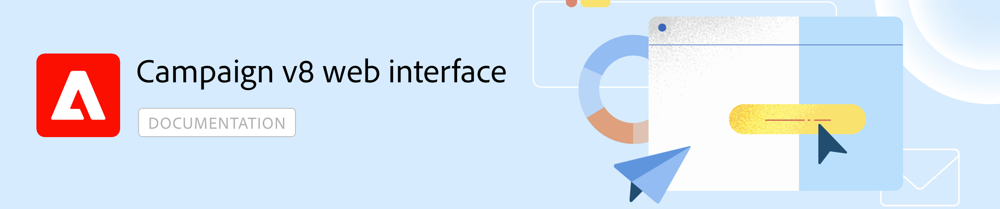

# Adobe Campaign v8 Web Documentation {#campaign-documentation}

 

 

Campaign now provides a new web user interface with enhanced usability, accessibility, and a new design to significantly improve your user experience. This new modern UI simplifies marketing campaign design and delivery, and brings consistency, along with other Adobe solutions, including Adobe Experience Platform. [Learn more](get-started/get-started.md)

>Campaign v8 Web is currently in Alpha version. Access is restricted to a small set of Alpha customers. Please be aware that product interface, capabilities and usage flows can change without notice. [Learn more](rn/release-notes.md)

<table style="table-layout:fixed"><tr style="border: 0;">
<td>

<a href="get-started/user-interface.md"><strong>Campaign New UI</strong>

</td>
<td>

<a href="content/create-email-content.md"><strong>Design an email</strong></a>

</td>
<td>

<a href="audience/about-audiences.md"><strong>Select an audience</strong></a>

</td>
<td>

<a href="preview-test/proofs.md"><strong>Preview and test an email</strong></a>

</td>
</tr></table>
