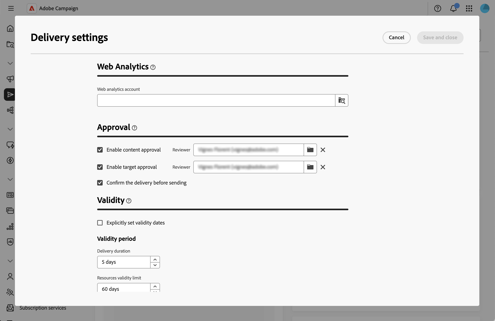

# 管理核准流程 {#campaign-approvals}

>[!IMPORTANT]
>
>核准僅適用於行銷活動內建立的傳送。 這不適用於獨立傳送或在行銷活動內容以外的工作流程中建立的傳送。

核准程式可協助協調多個利害關係人，並確保在傳送前進行品質控制。 當您的組織需要來自不同團隊的驗證時（例如行銷經理稽核內容或資料分析師驗證目標對象），請使用核准。

啟用核準時，您必須提交內容或目標以供核准。 指定的稽核者會收到要求驗證的電子郵件通知，並可直接從Web UI介面核准或拒絕。 在授予所有必要的核准之前，無法傳送傳遞。 您可以啟用：

* **內容核准**：驗證訊息內容、設計和個人化
* **目標核准**：驗證對象和目標定位條件
* **傳遞確認**：傳送前需要最終確認

## 設定核准設定 {#configure-approvals}

核准設定繼承自行銷活動範本，並可針對個別行銷活動修改。 請依照下列步驟設定核准設定：

1. 從&#x200B;**[!UICONTROL 行銷活動]**&#x200B;功能表開啟行銷活動或行銷活動範本，或建立新的行銷活動或行銷活動範本。

1. 按一下行銷活動控制面板右上角的&#x200B;**[!UICONTROL 設定]**&#x200B;按鈕。

1. 在&#x200B;**[!UICONTROL 核准]**&#x200B;區段中，設定下列選項：

   {zoomable="yes"}

   * **[!UICONTROL 啟用內容核准]**：啟用時，必須在傳送前核准傳遞內容。 按一下&#x200B;**[!UICONTROL 檢閱者]**&#x200B;欄位中的資料夾圖示，以選取運運算元或運運算元群組。

   * **[!UICONTROL 啟用目標核准]**：啟用時，必須核准傳遞目標對象。 按一下&#x200B;**[!UICONTROL 檢閱者]**&#x200B;欄位中的資料夾圖示，以選取運運算元或運運算元群組。

   * **[!UICONTROL 傳送前先確認傳遞]**：傳送前需要最終手動確認，即使所有其他核准已完成亦然。

>[!NOTE]
>
>* 若未指定稽核者，則會將行銷活動擁有者指派為稽核者。
>* 稽核者需要適當的許可權才能核准傳遞。 只有稽核者清單中識別的使用者可以核准。

## 提交以供核准 {#submit-approval}

建立傳遞後，請按照以下步驟提交內容和目標以供核准。

>[!NOTE]
>行銷活動工作流程傳送和行銷活動獨立傳送中皆可使用核准。

1. 從傳遞儀表板，按一下&#x200B;**[!UICONTROL 提交內容]**&#x200B;按鈕。 指定的稽核者可以核准或拒絕。 請參閱本[章節](#approve-reject)。

   ![顯示[送出內容]按鈕的熒幕擷圖](assets/approvals2.png){zoomable="yes"}

   傳遞儀表板的&#x200B;**[!UICONTROL 屬性]**&#x200B;區段中的核准狀態會變更為擱置。 請參閱本[章節](#rack-approvals)。

1. 內容核准後，按一下&#x200B;**[!UICONTROL 準備]**&#x200B;按鈕以準備傳遞目標。 系統會準備對象和目標定位條件。

1. 按一下&#x200B;**[!UICONTROL 提交目標]**&#x200B;按鈕。 然後指定的稽核者可以核准或拒絕。 請參閱本[章節](#approve-reject)。

   {zoomable="yes"}

   核准狀態變更為待定。 請參閱本[章節](#rack-approvals)。

1. 目標獲核准後，準備工作會繼續，且傳遞內容可以傳送。

>[!NOTE]
>如果核准遭拒，則傳遞擁有者必須根據稽核者的意見回饋對內容或目標進行所有必要的變更，並重新提交核准。

## 核准或拒絕 {#approve-reject}

指定的稽核者可以核准或拒絕內容並鎖定提交目標。 請參閱本[章節](#submit-approval)。

>[!NOTE]
>若要傳送電子郵件通知，必須在執行個體中設定檢閱者的地址。

1. 當您收到通知電子郵件時，請直接從Web UI介面開啟需要核准的傳遞。

1. 檢閱內容或目標資訊。

1. 按一下&#x200B;**[!UICONTROL 核准內容]**&#x200B;或&#x200B;**[!UICONTROL 核准目標]**&#x200B;按鈕。

   ![在傳遞控制面板中顯示[核准內容]按鈕的熒幕擷圖](assets/approvals3.png){zoomable="yes"}

1. 按一下&#x200B;**[!UICONTROL 核准]**&#x200B;或&#x200B;**[!UICONTROL 拒絕]**。

1. 選擇性地新增&#x200B;**[!UICONTROL 註解]**&#x200B;來說明您的決定。

   ![熒幕擷圖顯示具有[核准]、[拒絕]按鈕和[註解]欄位的核准對話方塊](assets/approvals4.png){zoomable="yes"}

1. 確認您的決定。 核准狀態會立即在傳遞控制面板中更新。 請參閱本[章節](#rack-approvals)。

## 追蹤核准狀態 {#track-approvals}

傳遞控制面板的&#x200B;**[!UICONTROL 屬性]**&#x200B;區段中會顯示核准狀態。 狀態顯示正在等待哪些核准及其目前狀態：

{zoomable="yes"}

* **[!UICONTROL 正在編輯]**：內容或目標尚未提交核准
* **[!UICONTROL 擱置核准]**：內容或目標正在等待檢閱
* **[!UICONTROL 已核准]**：內容或目標已由檢閱者核准
* **[!UICONTROL 已拒絕]**：檢閱者已拒絕內容或目標

當稽核者驗證或拒絕每個步驟時，核准區段會即時顯示所有啟用的核准和更新。

## 相關主題 {#related}

* [建立行銷活動](create-campaigns.md)
* [管理行銷活動](manage-campaigns.md)
