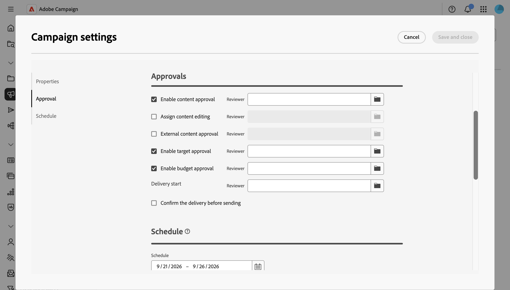
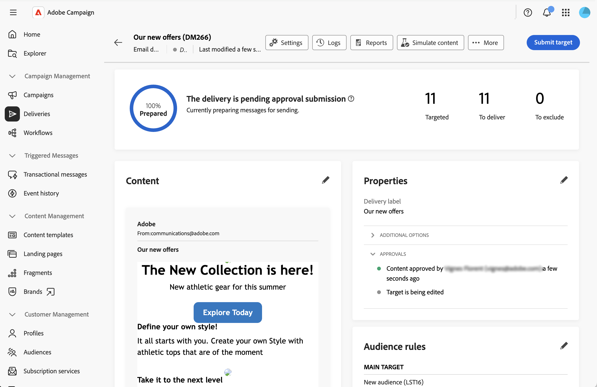

# 管理核准流程 {#campaign-approvals}

>[!IMPORTANT]
>
>核准僅適用於行銷活動內建立的行銷活動和傳遞。

核准程序有助於協調多個利害關係人，並在傳送前確認品質管控。 當您的組織需要來自不同團隊的驗證時 (例如行銷經理審閱內容或資料分析師驗證目標客群)，請使用核准。

啟用核準時，您必須提交內容或目標以供核准。 指定的稽核者會收到要求驗證的電子郵件通知，並可直接從Web UI介面核准或拒絕。 在授予所有必要的核准之前，無法傳送傳遞。 您可以啟用：

* **內容核准**：驗證訊息內容、設計和個人化。 您可以在內容核准前新增編輯步驟（由指定的操作員處理），並在內容獲得內部核准後新增外部稽核者的核准步驟。
* **目標核准**：驗證對象和目標定位條件
* **預算核准**：驗證傳遞預算
* **傳遞開始**：限制誰可以開始傳送傳遞給特定稽核者
* **傳遞確認**：傳送前需要最終確認

## 設定核准設定 {#configure-approvals}

核准設定繼承自行銷活動範本，並可針對個別行銷活動修改。 行銷活動內建立的傳遞設定中也提供相同的&#x200B;**[!UICONTROL 核准]**&#x200B;區段，可讓您僅覆寫該傳遞的行銷活動層級設定。

請依照下列步驟，在行銷活動層級設定核准設定：

1. 從&#x200B;**[!UICONTROL 行銷活動]**&#x200B;功能表開啟行銷活動或行銷活動範本，或建立新的行銷活動或行銷活動範本。

1. 按一下行銷活動控制面板右上角的&#x200B;**[!UICONTROL 設定]**&#x200B;按鈕。

1. 在&#x200B;**[!UICONTROL 核准]**&#x200B;區段中，設定下列選項：

   {zoomable="yes"}

   >[!NOTE]
   >
   > 如果您決定啟用核准選項，請按一下&#x200B;**[!UICONTROL 檢閱者]**&#x200B;欄位中的資料夾圖示，以選取操作員或操作員群組。

1. 設定&#x200B;**[!UICONTROL 內容核准]**：啟用時，必須在傳送前核准傳遞內容。 啟用此選項時，會顯示兩個欄位：

   * **[!UICONTROL 指派內容編輯]**：在內容核准前新增編輯步驟。 系統會通知指定的操作者（例如網站管理員）編輯內容，然後讓內容可供核准。
   * **[!UICONTROL 外部內容核准]**：為外部稽核者新增核准步驟，例如合作夥伴或供應商，在內容獲得內部核准後，該稽核者會驗證傳遞的呈現（例如品牌一致性）。

1. 定義&#x200B;**[!UICONTROL 目標核准]**：啟用時，必須核准傳遞目標對象。

1. 設定&#x200B;**[!UICONTROL 預算核准]**：啟用時，必須核准傳遞預算。 此選項需要目前已透過使用者端主控台完成之行銷活動的預算。

1. 設定&#x200B;**[!UICONTROL 傳遞開始]**：將傳遞開始限製為特定操作員或操作員群組。 如果未獲授權的操作員嘗試傳送傳遞，他們會看到錯誤，指出他們無權執行此動作。

1. 設定&#x200B;**[!UICONTROL 傳送前先確認傳遞]**：傳送前需要最終手動確認，即使所有其他核准已完成亦然。

>[!NOTE]
>
>* 若未指定稽核者，則會將行銷活動擁有者指派為稽核者。
>* 稽核者需要適當的許可權才能核准傳遞。 只有稽核者清單中識別的使用者可以核准。

## 提交以供核准 {#submit-approval}

建立傳遞後，請按照以下步驟提交內容和目標以供核准。

>[!NOTE]
>
>無論傳遞是直接在行銷活動中建立還是透過行銷活動工作流程建立，核准皆適用。

1. 從傳遞儀表板，按一下&#x200B;**[!UICONTROL 提交內容]**&#x200B;按鈕。 指定的稽核者可以核准或拒絕。 請參閱本[章節](#approve-reject)。

   ![顯示[送出內容]按鈕的熒幕擷圖](assets/approvals2.png){zoomable="yes"}

   傳遞儀表板的&#x200B;**[!UICONTROL 屬性]**&#x200B;區段中的核准狀態會變更為擱置。 請參閱本[章節](#track-approvals)。

1. 內容核准後，按一下&#x200B;**[!UICONTROL 準備]**&#x200B;按鈕以準備傳遞目標。 系統會準備對象和目標定位條件。

1. 按一下&#x200B;**[!UICONTROL 提交目標]**&#x200B;按鈕。 然後指定的稽核者可以核准或拒絕。 請參閱本[章節](#approve-reject)。

   ![顯示[送出目標]按鈕的熒幕擷圖](assets/approvals5.png){zoomable="yes"}

   核准狀態變更為待定。 請參閱本[章節](#track-approvals)。

1. 如果已啟用預算核准，請遵循相同的原則提交預算以供核准。 指定的稽核者可以核准或拒絕。 請參閱本[章節](#approve-reject)。

1. 一旦目標和（如果適用）預算獲得核准，準備工作就會繼續，而且可以傳送傳遞。

>[!NOTE]
>如果核准遭拒，則傳遞擁有者必須根據稽核者的意見回饋對內容或目標進行所有必要的變更，並重新提交核准。

## 核准或拒絕 {#approve-reject}

指定的稽核者可以核准或拒絕內容、目標和預算提交。 請參閱本[章節](#submit-approval)。

>[!NOTE]
>若要傳送電子郵件通知，必須在執行個體中設定檢閱者的地址。

1. 當您收到通知電子郵件時，請直接從Web UI介面開啟需要核准的傳遞。

1. 檢閱內容或目標資訊。

1. 按一下&#x200B;**[!UICONTROL 核准內容]**、**[!UICONTROL 核准目標]**&#x200B;或&#x200B;**[!UICONTROL 核准預算]**&#x200B;按鈕。

   ![在傳遞控制面板中顯示[核准內容]按鈕的熒幕擷圖](assets/approvals3.png){zoomable="yes"}

1. 按一下&#x200B;**[!UICONTROL 核准]**&#x200B;或&#x200B;**[!UICONTROL 拒絕]**。

1. 選擇性地新增&#x200B;**[!UICONTROL 註解]**&#x200B;來說明您的決定。

   ![熒幕擷圖顯示具有[核准]、[拒絕]按鈕和[註解]欄位的核准對話方塊](assets/approvals4.png){zoomable="yes"}

1. 確認您的決定。 核准狀態會立即在傳遞控制面板中更新。 請參閱本[章節](#track-approvals)。

## 追蹤核准狀態 {#track-approvals}

傳遞控制面板的&#x200B;**[!UICONTROL 屬性]**&#x200B;區段中會顯示核准狀態。 狀態顯示正在等待哪些核准及其目前狀態：

{zoomable="yes"}

* **[!UICONTROL 正在編輯]**：內容或目標尚未提交核准
* **[!UICONTROL 擱置核准]**：內容或目標正在等待檢閱
* **[!UICONTROL 已核准]**：內容或目標已由檢閱者核准
* **[!UICONTROL 已拒絕]**：檢閱者已拒絕內容或目標

當稽核者驗證或拒絕每個步驟時，核准區段會即時顯示所有啟用的核准和更新。

## 相關主題 {#related}

* [建立行銷活動](create-campaigns.md)
* [管理行銷活動](manage-campaigns.md)
