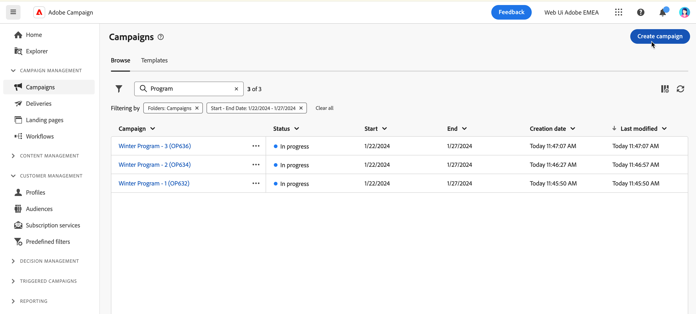
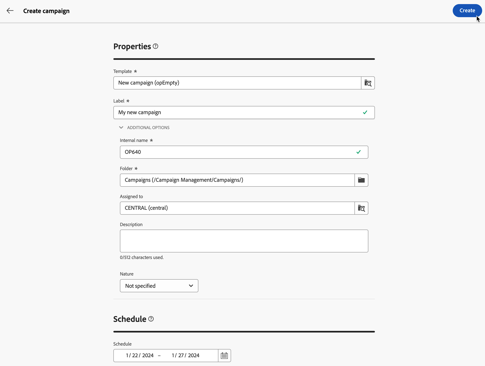

# 建立您的第一個行銷活動 {#create-first-campaigns}

>[!CONTEXTUALHELP]
>id="acw_campaign_creation_properties"
>title="Campaign 建立屬性"
>abstract="在此畫面中，定義您的行銷活動設定：選取範本，然後輸入行銷活動的標籤。瀏覽到其他設定以變更預設內部名稱、資料夾、新增說明並選取受託人。"

>[!CONTEXTUALHELP]
>id="acw_campaign_properties"
>title="行銷活動屬性"
>abstract="在此畫面中，您可以檢查和更新行銷活動設定：其標籤、內部名稱、資料夾和說明。您還可以檢視其指派的使用者。"

若要建立新的行銷活動，您必須定義其設定、排程，並包含工作流程和傳遞。

## 建立行銷活動 {#campaign-create}

若要建立新的行銷活動，請遵循下列步驟：

1. 按一下 **[!UICONTROL 行銷活動]** 功能表，然後按一下 **[!UICONTROL 建立行銷活動]** 按鈕。

   

1. 選取 **範本** 以使用並提供促銷活動的標籤。 [顯示全文](manage-campaigns.md#manage-campaign-templates)。
1. 如有需要，您可以變更下列專案 **其他選項**：內部名稱、資料夾、工作負責人、說明和性質。
1. 定義 **排程** 您的行銷活動中的。 瞭解如何在中設定您的行銷活動排程 [本節](#campaign-schedule)
1. 按一下 **建立**.

   

1. 將工作流程與傳遞新增至行銷活動：

   * 從 **工作流程** 標籤，按一下 **建立工作流程**. 當您建立行銷活動時，會自動新增預設工作流程。 進一步瞭解如何 [建立工作流程](../workflows/create-workflow.md).

   * 從 **傳遞** 標籤，按一下 **建立傳遞**. [了解更多](../msg/gs-messages.md)

## 監視和追蹤您的行銷活動{#campaign-monitoring}

行銷活動監控是分析行銷活動成效的關鍵步驟。 開啟您的行銷活動，然後按一下 **記錄檔** 按鈕。

您也可以按一下 **報表** 按鈕。 請參閱本[章節](../reporting/campaign-reports.md)。

## 定義行銷活動排程 {#campaign-schedule}

>[!CONTEXTUALHELP]
>id="acw_campaign_creation_schedule"
>title="行銷活動排程"
>abstract="選取行銷活動排程。您可以建立行銷活動，它會在到達開始日期時展開。預設情況下，行銷活動開始日期為建立日期，並持續 5 天。開始和結束日期會顯示在行銷活動清單中，並當成篩選器使用。"

行銷活動在到達開始日期時開始。 只要未到達開始日期，行銷活動就會具有 **[!UICONTROL 草稿]** 狀態。 然後，當達到開始日期時，它會變成 **[!UICONTROL 進行中]**. 達到結束日期後，行銷活動會設為 **[!UICONTROL 已完成]**.

開始和結束日期會顯示在行銷活動清單中，並作為篩選條件使用。 請參閱本[章節](manage-campaigns.md#access-campaigns)。

>[!NOTE]
>
>您稍後一律可以從 **設定行銷活動設定** 圖示，位於行銷活動標籤旁。 請參閱本[章節](gs-campaigns.md#campaign-dashboard)。

一旦到達日期，在已準備好傳送的工作流程內容中，在該行銷活動中建立的傳送實際上會傳送。 為此，工作流程必須已啟動。

<!--
    +++WORKF
++screen
## Create a cross-channel campaign {#cross-channel-campaign}

In a cross-channel campaign, a single marketing communication uses different channels. Data is passed between the channels. The customer receives communication through multiple channels based on, for example, their interaction with the previous communication.

-->
<!--
existing campaign: settings button -> properties like when creation
schedule in header

About plans, programs and campaigns
Adobe Campaign allows you to plan marketing campaigns in which you can create and manage different types of activities: emails, SMS messages, push notifications, workflows, landing pages. These campaigns and their contents can be gathered into programs.

The programs and campaigns allow you to regroup and view the different marketing activities that are linked to them.

A program may contain other programs as well as campaigns, workflows, and landing pages. It appears in the timeline and help you organize your marketing activities: you can separate them by country, by brand, by unit, etc.
A campaign enables you to gather all the marketing activities of your choice under a single entity. A campaign may contain emails, SMS, push notifications, direct mails, workflows, and landing pages.
To better organize your marketing plans, Adobe recommends the following hierarchy: Program > Sub-programs > Campaigns > Workflows > Deliveries.

Reports on programs and campaigns allow you to analyze their impact. For example, you can build reports at the campaign level to aggregate data on all deliveries contained in that campaign.

Related topics:

Timeline
About dynamic reports
Creating a campaign
In programs and sub-programs, you can add campaigns. Campaigns can contain marketing activities such as emails, SMS, push notifications, workflows, and landing pages.

From the Adobe Campaign home page, select the Programs & Campaigns card and access a program or sub-program.

Click on the Create button and select Campaign.

In the Creation mode screen, select a campaign type.

The campaign types available are based on templates defined in Resources > Templates > Campaign templates. For more on this, refer to the Managing templates section.

In the Properties screen, enter the name and ID of the campaign.

Select a start and end date to your campaign. These dates only apply to the campaign itself.

Click on Create to confirm the creation of the campaign.

The campaign is created and displayed. Use the Create button to add marketing activities to your campaign.

NOTE
Depending on your license agreement, you may access only some of these activities.

You can also create a campaign from the marketing activity list. You can choose to link the marketing activity to a parent program or sub-program via the properties window of the campaign.

Programs and campaigns icons and statuses
Each program and each campaign in the list has a visual symbol and an icon whose color indicates the execution status. This status depends on the validity period of the program or the campaign.

Gray: the program/campaign has not yet started - Editing status.
Blue: the program/campaign is in progress - In progress status.
Green: the program/campaign has finished - Finished status. By default, the current date is automatically shown as the validity start date and the end date is calculated according to the start date (D+186 days). You can change these dates in the program or campaign properties.

Business.Adobe.com resources
-->
