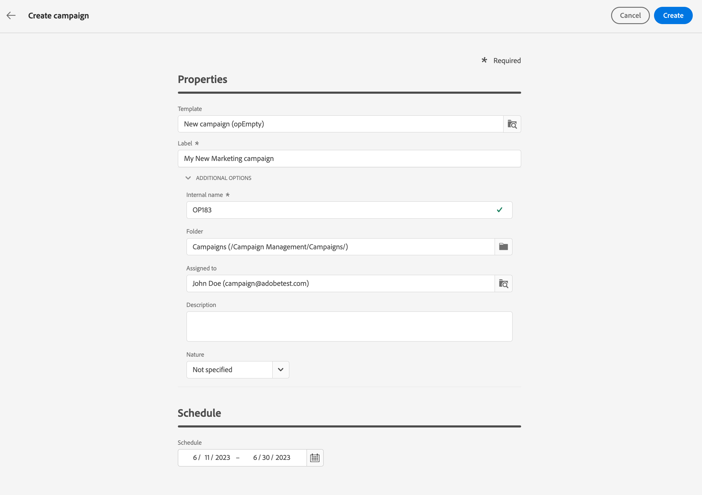

# 開始使用行銷活動 {#campaigns}

使用Adobe Campaign建立跨渠道市場活動。 憑借其營銷活動協調功能，您可以管理和集中客戶資料、設計客戶溝通和活動，以跨不同渠道建立個性化體驗。 電子郵件、推送和簡訊通道可用。

設計並執行不大量的電子郵件活動，以針對所有平台和螢幕大小提供個性化的消息。
<!--Measure the effectiveness of your deliveries with detailed reports including thecounts of opens, clicks, forwards, and more.--> 利用Adobe Campaign細分功能，您可以針對高容量資料庫運行查詢，並輕鬆定義完全針對您的市場活動的動態市場細分。

## 建立跨渠道市場活動 {#cross-channel-campaign}

在跨頻道行銷活動中，單一行銷通訊使用不同的頻道。 資料會在頻道之間傳遞。 客戶透過多個頻道接收通訊，例如以他們與先前通訊的互動為基礎。

## 定義市場活動屬性 {#campaign-properties}

>[!CONTEXTUALHELP]
>id="acw_campaign_creation_properties"
>title="Campaign 建立屬性"
>abstract="定義市場活動的屬性和元資料。"

市場活動屬性隨建立新市場活動一起顯示。

您也可以從 **配置市場活動設定** 表徵圖。

在此螢幕中，您可以更改：

## 定義市場活動計畫 {#campaign-schedule}

>[!CONTEXTUALHELP]
>id="acw_campaign_creation_schedule"
>title="Campaign 建立排程"
>abstract="使用市場活動屬性的「計畫」部分選擇其時間範圍。 市場活動在達到「開始日期」時開始。"

使用 **計畫** 的子菜單。 市場活動在達到「開始日期」時開始。

「開始」和「結束」日期顯示在市場活動清單中，可用作篩選器。

要篩選市場活動計畫，請開啟篩選器，然後使用 **開始 — 結束日期** 部分：

