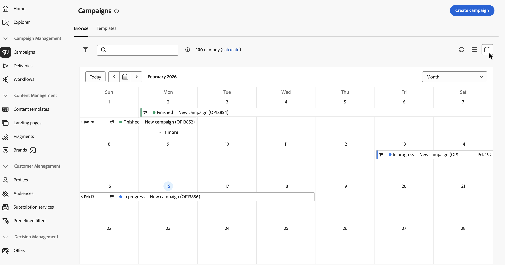
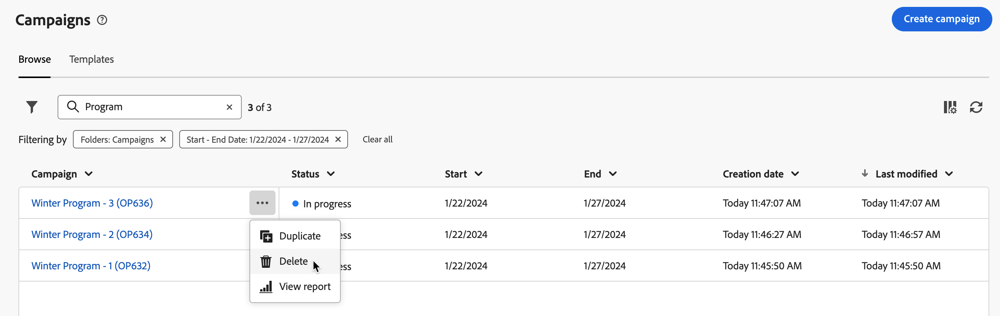

# 存取和管理您的行銷活動 {#manage-campaigns}

>[!CONTEXTUALHELP]
>id="acw_campaign_schedule"
>title="行銷活動排程"
>abstract="設定或修改您的行銷活動排程。"

若要存取和管理您的行銷活動，請按一下左側導覽的&#x200B;**[!UICONTROL 行銷活動]**&#x200B;功能表。 有兩個索引標籤可供使用：

* 「**瀏覽**」標籤會列出所有現有的行銷活動。按一下任一行銷活動，即可開啟其儀表板，按一下「**建立行銷活動**」按鈕，即可建立新的行銷活動。請參閱本[章節](create-campaigns.md#create-campaigns)。

* 「**範本**」標籤會列出所有可用的行銷活動範本。您可以檢視現有範本或建立新範本。 [閱讀全文](#manage-campaign-templates)。

![說明：行銷活動清單畫面顯示[瀏覽]和[範本]索引標籤，以及建立或檢視行銷活動的選項](assets/campaign-list.png)

## 行銷活動詳細目錄 {#inventory}

**[!UICONTROL 瀏覽]**&#x200B;索引標籤提供行銷活動的目前狀態、開始和結束日期、建立日期、上次修改行銷活動的時間等資訊。 按一下清單右上角的「**設定自訂版面的欄**」圖示，即可自訂要顯示的欄。這可讓您新增或移除行銷活動清單中的欄，以及重新排序資訊。

### 搜尋和篩選詳細目錄 {#search}

搜尋列和篩選器可方便您在清單中輕鬆搜尋。 [進一步瞭解](../get-started/user-interface.md#list-screens)。例如，您可以根據您的行銷活動排程進行篩選。開啟篩選器面板並使用&#x200B;**開始 - 結束日期**&#x200B;區段：

### 時間表檢視 {#timeline}

依預設，行銷活動畫面會顯示&#x200B;**清單檢視** （詳細目錄）。 您可以使用檢視切換隨時切換到&#x200B;**時間表檢視**。 兩個檢視都會顯示相同的行銷活動，並共用相同的篩選器和搜尋 — 當您在一個檢視中變更篩選器或搜尋時，另一個檢視則會反映相同的選擇。

時間軸檢視可協助您視覺化及管理一段時間內的行銷活動。 您可以基於時間格式檢視所有行銷活動，讓您更輕鬆地規劃、排程及協調行銷活動。

**時間軸的運作方式：**

* 時間軸會根據其開始和結束日期顯示您的行銷活動。 橫跨多天的行銷活動會出現在相關日期中。
* 您可以依周、月或日導覽。 使用日期選擇器或箭頭按鈕在期間之間移動。 使用&#x200B;**Today**&#x200B;按鈕快速返回目前的日期。
* 選取行銷活動會開啟右側面板，其中包含行銷活動詳細資料：狀態、開始和結束日期、工作流程清單以及傳遞清單。 您可以從面板導覽至這些工作流程和傳送。
* 當許多行銷活動於相同日期時，進行中的行銷活動會在顯示中優先處理。
* 當許多行銷活動都在一天中時（例如，在月檢視中），**More**&#x200B;控制項可讓您展開以檢視該天的完整集合，或切換到周或日檢視以取得詳細資訊。

## 行銷活動儀表板 {#campaign-dashboard}

>[!CONTEXTUALHELP]
>id="acw_campaign_delivery_list"
>title="行銷活動中的傳遞清單"
>abstract="「**傳遞**」標籤會列出連結至目前行銷活動的所有傳遞。按一下傳遞的名稱以進行編輯。使用「建立傳遞」按鈕為此行銷活動新增傳遞。"

>[!CONTEXTUALHELP]
>id="acw_campaign_workflow_list"
>title="活動中的工作流程清單"
>abstract="「**工作流程**」索引標籤會列出連結至目前行銷活動的所有工作流程。"

在行銷活動清單的&#x200B;**瀏覽**&#x200B;標籤中，按一下行銷活動名稱以顯示其詳細資料。

行銷活動的狀態和排程會顯示在畫面頂端。 使用&#x200B;**設定**&#x200B;按鈕來更新行銷活動的屬性，例如其標籤、資料夾和說明。 您也可以從設定畫面變更行銷活動的排程。 在[本節](create-campaigns.md#campaign-schedule)中進一步瞭解行銷活動排程。

從行銷活動控制面板，使用&#x200B;**記錄檔**&#x200B;和&#x200B;**報告**&#x200B;按鈕來監視您的行銷活動。 在此[節](create-campaigns.md#create-campaigns)中瞭解更多。

控制面板會針對每個行銷活動顯示兩個主要標籤：工作流程與傳送。

* **工作流程**&#x200B;索引標籤會列出與行銷活動相關的所有工作流程。 此標籤還能讓您在行銷活動中建立新的工作流程。請參閱本[章節](create-campaigns.md#create-campaigns)。

* **傳遞**&#x200B;索引標籤會列出在目前行銷活動中建立的所有傳遞。 您還可以在行銷活動中建立新的傳遞。請參閱本[章節](create-campaigns.md#create-campaigns)。

>[!NOTE]
>
>「**傳遞**」標籤會顯示連結至行銷活動的所有傳遞。但是，在工作流程中建立的傳遞無法從該處刪除。若要刪除在工作流程內容中建立的傳遞，請從工作流程中刪除傳遞活動。 [了解更多資訊](../msg/gs-messages.md#delivery-delete)。

## 刪除行銷活動 {#campaign-delete}

刪除行銷活動有兩個方法：

* 從行銷活動清單中，按一下省略符號按鈕，然後選取&#x200B;**刪除**。

  

* 從行銷活動本身，按一下&#x200B;**更多**&#x200B;按鈕，然後選取&#x200B;**刪除**。

  ![說明：顯示[更多]按鈕和[刪除]選項的行銷活動儀表板畫面](assets/delete-a-campaign-from-dashboard.png)

## 複製行銷活動 {#campaign-duplicate}

複製行銷活動有兩個方法：

* 從行銷活動清單中，按一下省略符號按鈕，然後選取&#x200B;**複製**。

* 從行銷活動本身，按一下&#x200B;**更多**&#x200B;按鈕，然後選取&#x200B;**複製**。

在這兩種情況下，請確認複製以建立新行銷活動。 行銷活動的標籤是&#x200B;**`<label of the initial campaign>`**&#x200B;的復本。 瀏覽至行銷活動設定以更新此標籤。

## 使用行銷活動範本 {#manage-campaign-templates}

行銷活動範本包含預先設定的設定，可重複用於建立新的行銷活動。 有一組內建範本可協助您開始使用。 您可以建立和設定行銷活動範本，然後從這些範本建立行銷活動。

行銷活動範本可儲存下列資訊：

* 行銷活動&#x200B;**設定**
* 行銷活動&#x200B;**排程**
* 工作流程範本
* 傳遞範本

若要建立行銷活動範本，請遵循下列步驟：

1. 按一下&#x200B;**[!UICONTROL 行銷活動]**&#x200B;功能表，瀏覽至&#x200B;**範本**&#x200B;標籤，然後按一下&#x200B;**[!UICONTROL 建立範本]**&#x200B;按鈕。
1. 選取要使用的&#x200B;**範本**。 這可讓您以先前建立的範本為基礎建立新範本。
1. 提供範本的標籤。
1. 如有需要，請變更下列&#x200B;**其他選項**：內部名稱、資料夾、工作負責人、說明和性質。
1. 定義行銷活動的&#x200B;**排程**。 在[本節](create-campaigns.md#campaign-schedule)中瞭解如何設定行銷活動排程。
1. 按一下「**建立**」。
1. 將工作流程和傳遞範本新增至行銷活動。
