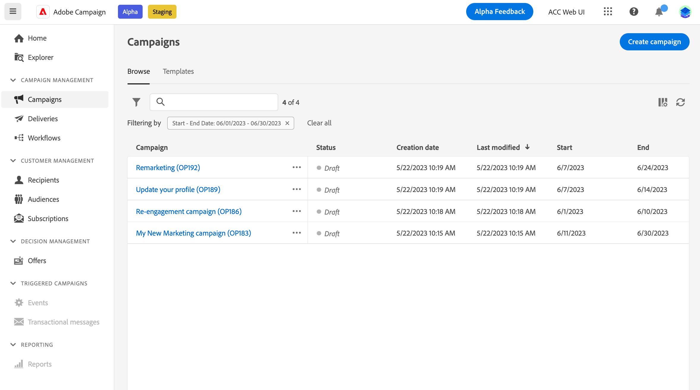
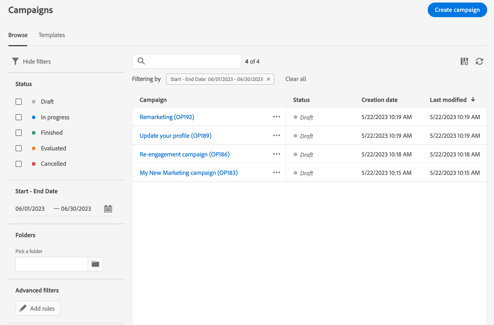
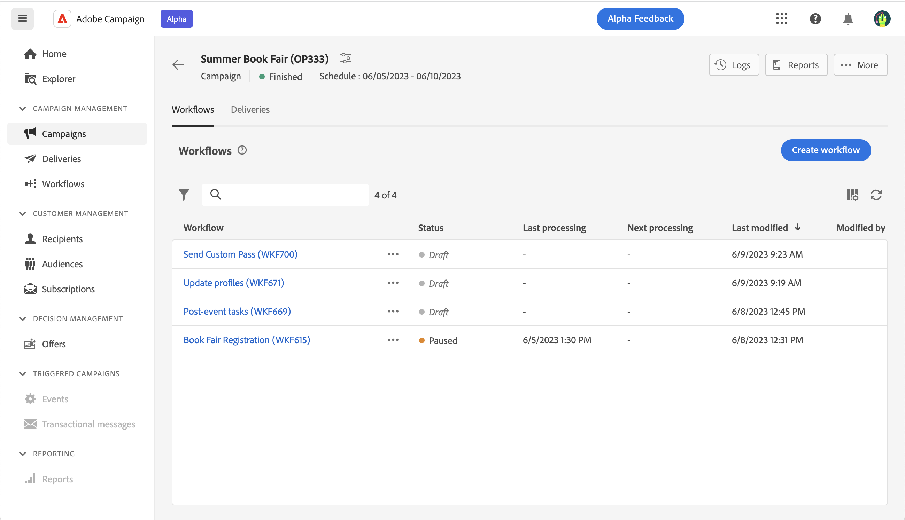

# 存取和管理您的行銷活動{#manage-campaigns}

>[!CONTEXTUALHELP]
>id="acw_campaign_schedule"
>title="行銷活動排程"
>abstract="設定或修改您的行銷活動排程。"

若要建立新的行銷活動，或管理您現有的行銷活動，請在左側導覽上按一下「**[!UICONTROL 行銷活動]**」選單。

## 行銷活動清單 {#access-campaigns}

在行銷活動清單中，有兩個可用標籤：

* 「**瀏覽**」標籤會列出所有現有的行銷活動。按一下任一行銷活動，即可開啟其儀表板，按一下「**建立行銷活動**」按鈕，即可建立新的行銷活動。請參閱本[章節](create-campaigns.md#create-campaigns)。

* 「**範本**」標籤會列出所有可用的行銷活動範本。您可以檢視現有範本或建立新範本。 [顯示全文](manage-campaign-templates.md)。

依據預設，清單中的每個行銷活動都會顯示其目前狀態、建立日期、上次修改時間等資訊。

按一下清單右上角的「**設定自訂版面的欄**」圖示，即可自訂要顯示的欄。這讓您可新增其他資訊到清單中。此外，還可使用搜尋列和篩選器，以便於在清單中輕鬆搜尋。[了解更多](../get-started/user-interface.md#list-screens)。

例如，您可以根據您的行銷活動排程進行篩選。開啟篩選器面板並使用&#x200B;**開始 - 結束日期**&#x200B;區段：

## 行銷活動儀表板{#campaign-dashboard}

>[!CONTEXTUALHELP]
>id="acw_campaign_delivery_list"
>title="行銷活動中的傳遞清單"
>abstract="「**傳遞**」標籤會列出連結至目前行銷活動的所有傳遞。按一下傳遞的名稱以進行編輯。 使用「建立傳送」按鈕為此行銷活動新增傳送。"

在行銷活動清單的「**瀏覽**」標籤中，按一下任一行銷活動即可顯示其詳細資料。

行銷活動的狀態和排程會顯示在畫面頂端。使用&#x200B;**設定行銷活動設定**&#x200B;圖示即可修改在建立行銷活動時定義的行銷活動屬性。有三個按鈕可讓您檢視紀錄、報告、複製或刪除行銷活動。請參閱本[章節](create-campaigns.md#create-campaigns)。

有兩個標籤可供使用：

* 「**工作流程**」標籤會列出連結至行銷活動的所有工作流程。此標籤還能讓您在行銷活動中建立新的工作流程。請參閱本[章節](create-campaigns.md#create-campaigns)。

* 「**傳遞**」標籤會列出連結至目前行銷活動的所有傳遞。您還可以在行銷活動中建立新的傳遞。請參閱本[章節](create-campaigns.md#create-campaigns)。

## 複製和刪除行銷活動

您可以複製或刪除行銷活動：

* 從行銷活動清單中，按一下省略符號按鈕，然後選取「**複製**」或「**刪除**」。
* 從行銷活動本身，按一下「**更多**」按鈕，然後選取「**複製**」或「**刪除**」。

>[!NOTE]
>
>「**傳遞**」標籤會顯示連結至行銷活動的所有傳遞。但是，在工作流程中建立的傳遞無法從該處刪除。若要刪除在工作流程中建立的傳遞，您必須從工作流程中刪除該傳遞活動。[了解更多](../msg/gs-messages.md#delivery-delete)。

## 使用行銷活動範本{#manage-campaign-templates}

行銷活動範本包含預先設定的設定，可重複用於建立新工作流程。 有一組內建範本可協助您開始使用。 您可以建立和設定行銷活動範本，然後從這些範本建立行銷活動。

行銷活動範本可儲存下列資訊：

* 行銷活動的 **屬性** 和 **排程** 設定
* 工作流程範本
* 傳遞範本

若要建立行銷活動範本，請遵循下列步驟：

1. 按一下 **[!UICONTROL 行銷活動]** 功能表，瀏覽至 **範本** 標籤，然後按一下 **[!UICONTROL 建立範本]** 按鈕。
1. 選取 **範本** 以使用並提供促銷活動的標籤。 這可讓您以已建立的範本為基礎建立新範本。
1. 如有需要，您可以變更下列專案 **其他選項**：內部名稱、資料夾、工作負責人、說明和性質。
1. 定義 **排程** 您的行銷活動中的。 瞭解如何在中設定您的行銷活動排程 [本節](create-campaigns.md#campaign-schedule)
1. 按一下 **建立**。
1. 將工作流程和傳遞範本新增至行銷活動。
