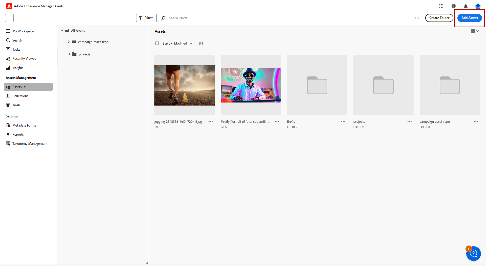
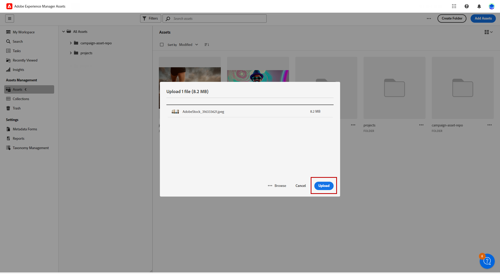
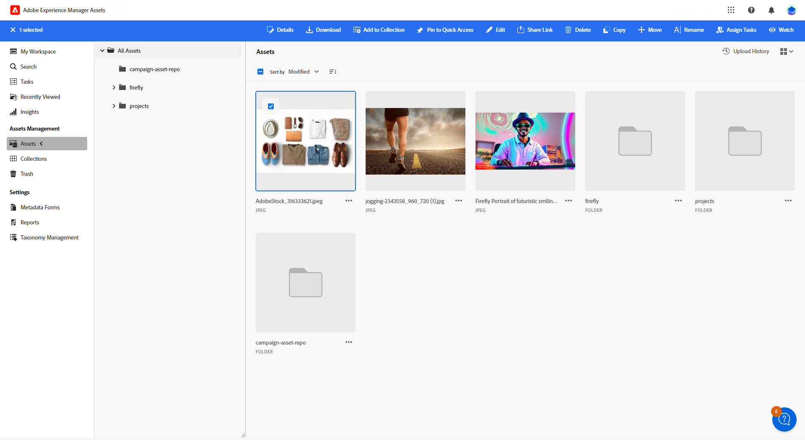

# 透過管理資產 [!DNL Adobe Experience Manager Assets as a Cloud Service]{#aem-assets}

## 開始使用 [!DNL Adobe Experience Manager Assets as a Cloud Service] {#get-started-assets-essentials}

[!DNL Adobe Experience Manager Assets as a Cloud Service] 是整合的合作平台，專為簡化您的創意工作流程及集中數位資產而設計，提供順暢的體驗傳送。 它可簡化組織、標籤和擷取已核准生產資產的流程，確保跨團隊的品牌一致性。 使用者易記的介面， [!DNL Assets as Cloud Service] 可讓您在Adobe創意和Experience Cloud應用程式中立即存取和共用資產。

進一步瞭解 [Adobe Experience Manager資產as a Cloud Service檔案](https://experienceleague.adobe.com/docs/experience-manager-cloud-service/content/assets/home.html){target="_blank"}.

## 上傳和插入資產{#add-asset}

將檔案匯入 [!DNL Assets as Cloud Service]，您必須先瀏覽或建立要儲存的資料夾。 然後，您就可以將它們插入您的電子郵件內容。

有關如何上傳資產的詳細資訊，請參閱 [Adobe Experience Manager資產as a Cloud Service檔案](https://experienceleague.adobe.com/docs/experience-manager-cloud-service/content/assets/assets-view/add-delete-assets-view.html){target="_blank"}.

1. 從首頁存取進階功能表，然後選取 [!DNL Experience Manager Assets].

   

1. 在 **資產管理**，按一下 **資產** 並在Adobe Campaign中選擇資產的存放庫。

1. 按一下中央區段或樹狀檢視中的資料夾以開啟它。

   您也可以按一下 **[!UICONTROL 建立資料夾]** 以建立新資料夾。

1. 一旦進入選取或建立的資料夾，按一下 **[!UICONTROL 新增資產]** 將新資產上傳至資料夾。

   

1. 從 **[!UICONTROL 上傳檔案]**，按一下 **[!UICONTROL 瀏覽]** 並選擇是否要 **[!UICONTROL 瀏覽檔案]** 或 **[!UICONTROL 瀏覽資料夾]**.

1. 選取您要上傳的檔案。 完成後，按一下 **[!UICONTROL 上傳]**.

   

1. 若要存取進階資產管理功能表，請選取您剛才上傳的資產。

   要瞭解有關如何管理資產的詳細資訊，請參閱本 [頁面](https://experienceleague.adobe.com/docs/experience-manager-cloud-service/content/assets/assets-view/manage-organize-assets-view.html).

   

1. 若要使用Adobe Photoshop Express進一步編輯您的資產，請連按兩下資產。 然後，從右側功能表中選取 **[!UICONTROL 編輯模式]** 圖示。 [了解更多](https://experienceleague.adobe.com/docs/experience-manager-cloud-service/content/assets/assets-view/edit-images-assets-view.html#edit-using-express){target="_blank"}。

1. 從 [!DNL Adobe Campaign]，選取 **[!UICONTROL 資產選取器]** 電子郵件設計工具左窗格中的功能表。

   

1. 選取您先前建立的 **[!UICONTROL 資產]** 資料夾。 您也可以在搜尋列中搜尋資產或資料夾。

   如有需要，請按一下  **[!UICONTROL 管理資產]** 直接存取 [!DNL Adobe Experience Manager Assets] 工作區。

1. 將您的資產拖放到電子郵件內容中。

   

1. 您可以進一步自訂資產，例如使用新增外部連結或文字 **[!UICONTROL 設定]** 和 **[!UICONTROL 樣式]** 索引標籤。 [深入瞭解元件設定](../content/content-components.md)

   
