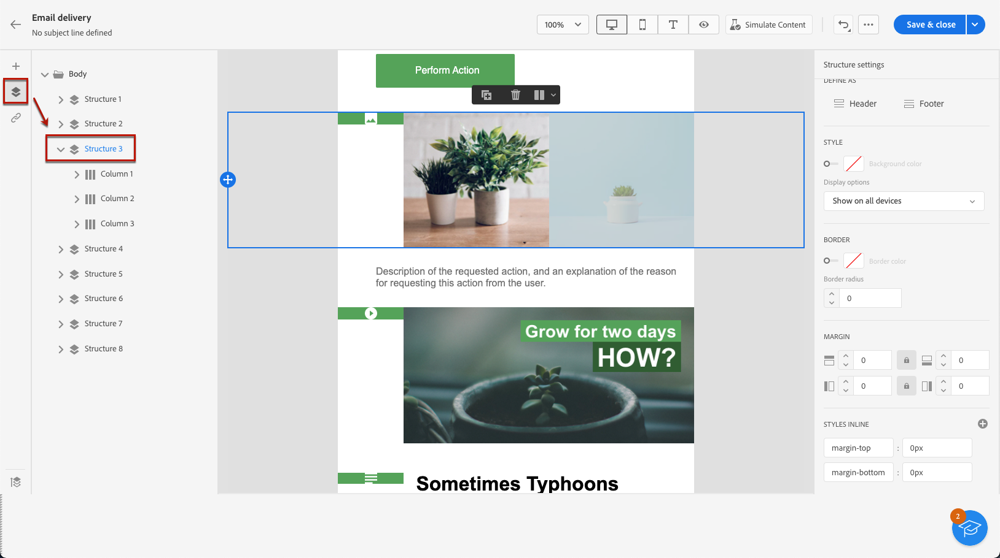
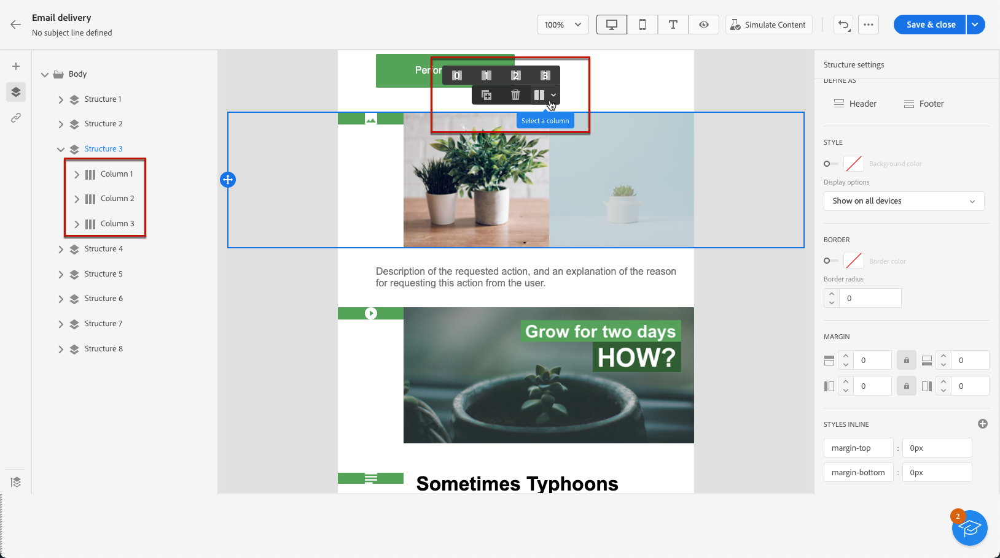
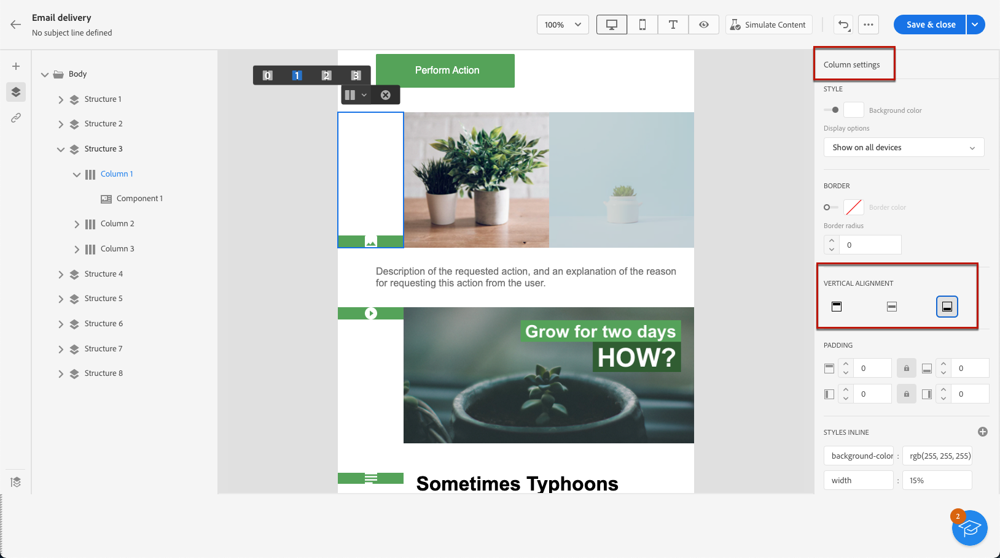
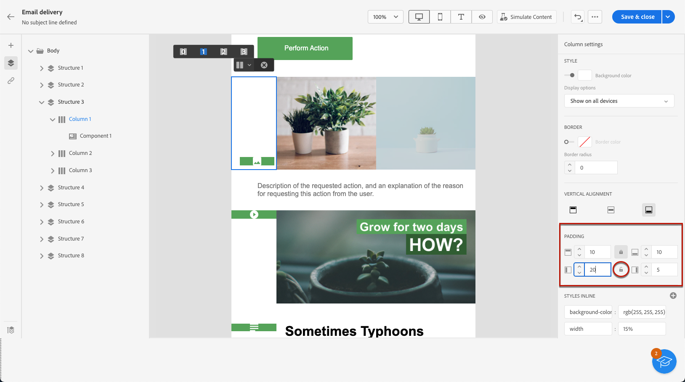

# Adjust vertical alignment and padding {#alignment-and-padding}

In this example, we adjust padding and vertical alignment inside a structure component composed of three columns.

1. Select the structure component directly in the email or using the **[!UICONTROL Navigation tree]** available in the left pane.

   

1. From the contextual toolbar, click **[!UICONTROL Select a column]** and choose the one that you want to edit. You can also select it from the structure tree on the left.

   

1. The editable parameters for that column are displayed in the **[!UICONTROL Column settings]** menu on the right. Adjust the **[!UICONTROL Vertical alignment]** using the dedicated section.

   

   For example, select **[!UICONTROL Bottom]**. The content component moves to the bottom of the column.

1. Under **[!UICONTROL Padding]**, define the top padding inside the column, and set the left and right padding for that column.

   >[!NOTE]
   >
   >Click the lock icon to break synchronization between the top/bottom or left/right padding.

   

1. Proceed similarly to adjust the other columns' alignment and padding.

1. Save your changes.
