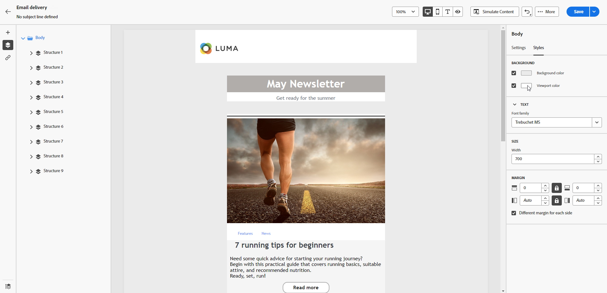
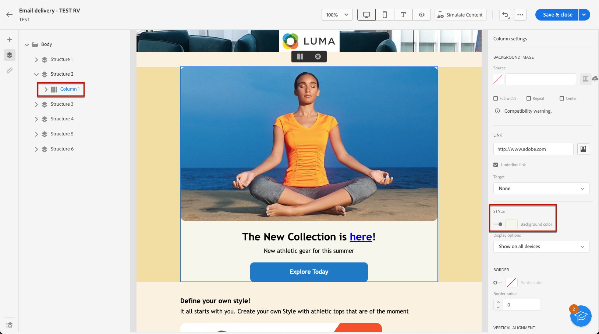

# Personalize your email background {#backgrounds}

>[!CONTEXTUALHELP]
>id="ac_edition_backgroundimage"
>title="Background settings"
>abstract="You can personalize the background color or background image for your content. Note that background image is not supported by all email clients." 

When it comes to setting backgrounds with the Email Designer, Adobe recommends the following:

1. Apply a background color to the body of your email if required by your design.
1. Usually, set background colors at the column level.
1. Try not to use background colors on image or text components as they are difficult to manage.

Below are the available background settings that you can use.

* Set a **[!UICONTROL Background color]** for the whole email. Make sure you select the body settings in the navigation tree accessible from the left pane.

  

* Set the same background color for all structure components by selecting **[!UICONTROL Viewport background color]**. This option enables you to select a different setting from the background color.

  

* Set a different background color for each structure component. Select a structure in the navigation tree on the left pane to apply a specific background color only to that structure.

  

  >[!NOTE]
  >
  >Make sure you do not set a viewport background color as it may hide the structure background colors.

* Set a **[!UICONTROL Background image]** for the content of a structure component.

  

  >[!NOTE]
  >
  >Some email programs do not support background images. When not supported, the row background color is used instead. Make sure you select an appropriate fallback background color in case the image cannot be displayed.

* Set a background color at the column level.

  

  >[!NOTE]
  >
  >This is the most common use case. Adobe recommends setting background colors at the column level as this allows for more flexibility when editing the whole email content.

  You can also set a background image at the column level, but this is rarely used.
