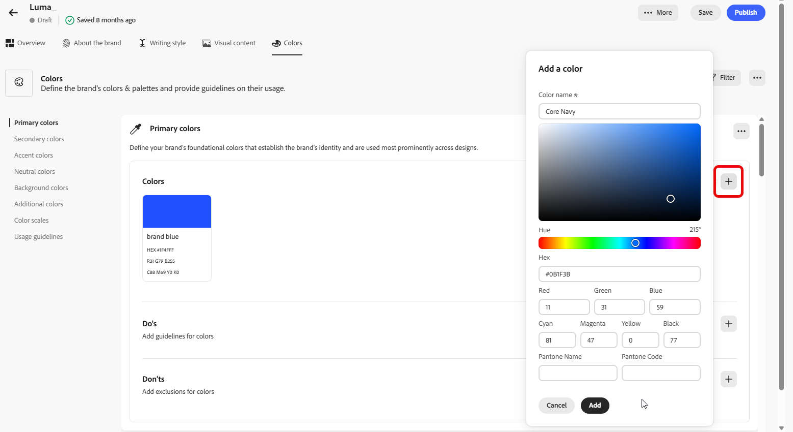
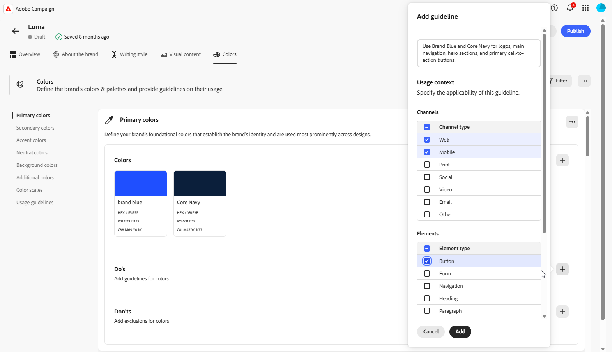
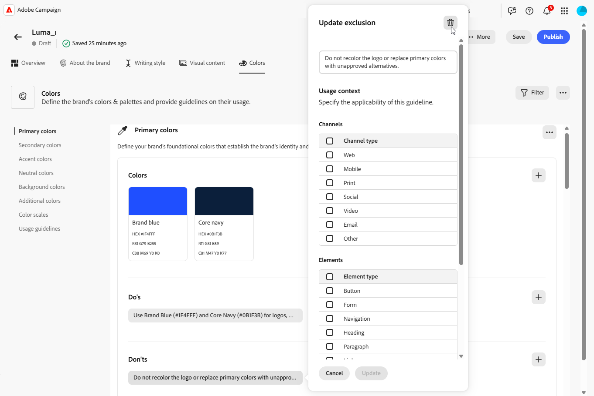

# 個人化您的品牌 {#brands-personalize}

若要建立可確保所有內容和管道一致性的全方位品牌套件，請設定下列四個索引標籤，每個索引標籤著重於品牌識別的不同層面：

* **[!UICONTROL 關於品牌]**&#x200B;建立您品牌的核心身分和值。
* **[!UICONTROL 書寫樣式]**&#x200B;定義語言和內容標準。
* **[!UICONTROL 視覺內容]**&#x200B;設定影像和設計准則。
* **[!UICONTROL 色彩]**&#x200B;管理您品牌的色彩系統與使用方式。

設定後，您可以使用品牌指引來驗證內容品質和品牌一致性。 [進一步瞭解內容品質驗證](brands-score.md#validate-quality)

## 關於品牌 {#about-brand}

使用「**[!UICONTROL 關於品牌]**」標籤來建立品牌的核心識別，概述其用途、個性、標語和其他定義屬性。

1. 首先，在&#x200B;**[!UICONTROL 重要詳細資料]**&#x200B;類別中填寫品牌的基本資訊：

   * **[!UICONTROL 品牌套件名稱]**：輸入您的品牌套件名稱。

   * **[!UICONTROL 何時使用]**：指定應套用此品牌套件的案例或內容。

   * **[!UICONTROL 品牌名稱]**：輸入品牌的正式名稱。

   * **[!UICONTROL 品牌說明]**：提供此品牌代表的概觀。

   * **[!UICONTROL 預設標語]**：新增與品牌關聯的主要標語。

     

1. 在&#x200B;**[!UICONTROL 指導原則]**&#x200B;類別中，請釐清品牌的核心方向與理念：

   * **[!UICONTROL 使命]**：詳細說明您品牌的用途。

   * **[!UICONTROL 願景]**：說明您的長期目標或想要的未來狀態。

   * **[!UICONTROL 市場定位]**：說明您的品牌在市場中的定位。

   

1. 在&#x200B;**[!UICONTROL 核心品牌值]**&#x200B;類別中，按一下以新增品牌的核心值並填入詳細資料：

   * **[!UICONTROL 值]**：命名核心品牌值。

   * **[!UICONTROL 描述]**：說明這個值對您品牌的意義。

   * **[!UICONTROL 行為]**：概述實際中反映此值的動作或態度。

   * **[!UICONTROL 表現]**：提供這個值在真實世界品牌中如何表示的範例。

     

1. 如有需要，請按一下圖示以更新或刪除您的核心品牌價值。

   

您現在可以進一步個人化您的品牌，或[發佈您的品牌](#create-brand-kit)。

## 寫作風格 {#writing-style}

**[!UICONTROL 撰寫樣式]**&#x200B;區段概述撰寫內容的標準，詳述如何使用語言、格式和結構來維持所有資料的清晰度、一致性和一致性。

+++ 可用的類別和範例

<table>
  <thead>
    <tr>
      <th>類別</th>
      <th>子類別</th>
      <th>指引範例</th>
      <th>排除專案範例</th>
    </tr>
  </thead>
  <tbody>
    <tr>
      <td rowspan="4">內容建立標準</td>
      <td>品牌訊息標準</td>
      <td>強調創新和客戶至上的訊息。</td>
      <td>請勿過度承諾產品功能。</td>
    </tr>
    <tr>
      <td>標語使用方式</td>
      <td>在所有數位行銷資產的標誌下方放置標語。</td>
      <td>請勿修改或翻譯標語。</td>
    </tr>
    <tr>
      <td>核心訊息</td>
      <td>強調主要優勢陳述，例如提高生產力。</td>
      <td>請勿使用不相關的值主張。</td>
    </tr>
    <tr>
      <td>命名標準</td>
      <td>使用簡單的描述性名稱，例如「ProScheduler」。</td>
      <td>請勿使用複雜字元或特殊字元。</td>
    </tr>
    <tr>
      <td rowspan="5">品牌溝通風格</td>
      <td>品牌人格特徵</td>
      <td>親切易懂。</td>
      <td>不要失敗。</td>
    </tr>
    <tr>
      <td>書寫力學</td>
      <td>讓句子儘量簡短並有影響力。</td>
      <td>不要使用過多的行話。</td>
    </tr>
    <tr>
      <td>情境色調</td>
      <td>維持危機溝通的專業語調。</td>
      <td>支援通訊時請勿不屑一顧。</td>
    </tr>
    <tr>
      <td>Word選擇指南</td>
      <td>使用「創新」和「智慧」等字眼。</td>
      <td>避免使用「便宜」或「駭客」等字眼。</td>
    </tr>
    <tr>
      <td>語言標準</td>
      <td>遵循美式英文慣例。</td>
      <td>請勿混合使用英式及美式拼字。</td>
    </tr>
    <tr>
      <td rowspan="3">法規遵循標準</td>
      <td>商標標準</td>
      <td>請一律使用™或®符號。</td>
      <td>必要時，請勿省略法定符號。</td>
    </tr>
    <tr>
      <td>版權標準</td>
      <td>在行銷資料中加入版權注意事項。</td>
      <td>未經許可請勿使用協力廠商內容。</td>
    </tr>
    <tr>
      <td>免責宣告標準</td>
      <td>在數位資產上清楚顯示免責宣告。</td>
      <td>請勿隱藏隱藏隱藏隱藏隱藏區域的免責宣告。</td>
    </tr>
</table>

+++

 

若要個人化您的&#x200B;**[!UICONTROL 撰寫樣式]**：

1. 從&#x200B;**[!UICONTROL 寫入樣式]**&#x200B;索引標籤，按一下以新增建議、例外或排除專案。

1. 輸入您的指引、例外或排除。 您也可以加入&#x200B;**[!UICONTROL 範例]**，以更好地說明應如何套用它。

   

1. 針對您的指引、例外或排除指定&#x200B;**[!UICONTROL 使用內容]**：

   * **[!UICONTROL 管道型別]**：選擇此建議、例外或排除的適用位置。 例如，您可能希望特定的書寫樣式僅顯示在電子郵件、行動裝置、列印或其他通訊通道中。

   * **[!UICONTROL 專案型別]**：指定規則套用的內容專案。 這可能包括標題、按鈕、連結或內容中的其他元件等元素。

   

1. 一旦您的指引、例外或排除設定完成後，請按一下[新增]。****
1. 如有需要，請選取其中一個准則或排除專案來更新或刪除。

1. 按一下以編輯您的範例，或按一下圖示以刪除範例。

   

您現在可以進一步個人化您的品牌，或[發佈您的品牌](#create-brand-kit)。

## 視覺內容 {#visual-content}

**[!UICONTROL 視覺內容]**&#x200B;區段定義影像和設計的標準，詳細說明維持統一一致的品牌外觀所需的規格。

+++ 可用的類別和範例

<table>
  <thead>
    <tr>
      <th>類別</th>
      <th>指引範例</th>
      <th>排除專案範例</th>
    </tr>
  </thead>
  <tbody>
    <tr>
      <td>攝影標準</td>
      <td>戶外鏡頭使用自然光線。</td>
      <td>避免過度編輯或畫素化的影像。</td>
    </tr>
    <tr>
      <td>插圖示準</td>
      <td>使用簡潔的極簡風格。</td>
      <td>避免過於複雜。</td>
    </tr>
    <tr>
      <td>圖示標準</td>
      <td>使用一致的24px格線系統。</td>
      <td>請勿混合圖示尺寸、使用不一致的線條粗細，或偏離格線規則。</td>
    </tr>
    <tr>
      <td>使用指南</td>
      <td>選擇反映真實客戶在專業環境中使用該產品的生活方式影像。</td>
      <td>請勿使用與品牌色調相抵觸或看起來與內容不符的影像。</td>
    </tr>
</table>

+++

 

若要個人化您的&#x200B;**[!UICONTROL 視覺內容]**：

1. 從&#x200B;**[!UICONTROL 視覺內容]**&#x200B;索引標籤，按一下以新增指引、排除專案或範例。

1. 輸入您的指引、排除專案或範例。

   

1. 針對您的指引或排除專案指定&#x200B;**[!UICONTROL 使用內容]**：

   * **[!UICONTROL 管道型別]**：選擇此建議、例外或排除的適用位置。 例如，您可能希望特定的書寫樣式僅顯示在電子郵件、行動裝置、列印或其他通訊通道中。

   * **[!UICONTROL 專案型別]**：指定規則套用的內容專案。 這可能包括標題、按鈕、連結或內容中的其他元件等元素。

     

1. 一旦您的指引、例外或排除設定完成後，請按一下[新增]。****

1. 若要新增顯示正確使用方式的影像，請選取&#x200B;**[!UICONTROL 範例]**，然後按一下&#x200B;**[!UICONTROL 選取影像]**。 您也可以新增使用方式不正確的影像，作為排除範例。

   

1. 選取您要更新或刪除的其中一個准則或排除專案。

1. 選取您的指引或排除專案以更新它。 按一下圖示以刪除它。

   

您現在可以進一步個人化您的品牌，或[發佈您的品牌](#create-brand-kit)。

## 顏色 {#colors}

**[!UICONTROL 色彩]**&#x200B;區段是您品牌色彩系統的標準，概述如何選擇、組織及套用不同體驗的色彩。 它可確保主色、次色、輔色和中性色的一致使用，以維持一致的、可存取和可辨識的品牌識別。

+++ 可用的類別和範例

<table>
  <thead>
    <tr>
      <th>類別</th>
      <th>指引範例</th>
      <th>排除專案範例</th>
    </tr>
  </thead>
  <tbody>
    <tr>
      <td>主要顏色</td>
      <td>針對圖志、標題和主要call-to-action元素使用主要品牌顏色。</td>
      <td>請勿取代或修改主要品牌顏色。</td>
    </tr>
    <tr>
      <td>次要顏色</td>
      <td>使用次要顏色來支援版面、插圖和UI元件。</td>
      <td>不要讓次要色彩超過主要品牌色彩。</td>
    </tr>
    <tr>
      <td>輔色</td>
      <td>謹慎使用按鈕、連結和警示的強調色。</td>
      <td>請勿在大型背景區域使用強調色。</td>
    </tr>
    <tr>
      <td>中性色</td>
      <td>針對文字、分隔線、框線及細微的UI元素使用中性色。</td>
      <td>避免使用對比度差或色彩投射過大的中性色片。</td>
    </tr>
    <tr>
      <td>背景顏色</td>
      <td>使用淺色或中性背景，確保可讀性和視覺清晰度。</td>
      <td>請勿在低對比度的背景上放置文字或標誌。</td>
    </tr>
    <tr>
      <td>其他顏色</td>
      <td>僅針對資料視覺效果或核准的行銷活動使用其他顏色。</td>
      <td>請勿引入未經核准或品牌外的顏色。</td>
    </tr>
    <tr>
      <td>色彩比例</td>
      <td>針對UI狀態（例如暫留、作用中及停用）使用核准的色調和陰影。</td>
      <td>請勿建立非官方的陰影或漸層。</td>
    </tr>
    <tr>
      <td>使用指南</td>
      <td>維持所有資產一致的色彩使用方式及可存取的對比。</td>
      <td>請勿混合衝突的調色盤或套用顏色不一致。</td>
    </tr>
</table>

+++

 

若要個人化您的&#x200B;**[!UICONTROL 色彩]**：

1. 從&#x200B;**[!UICONTROL 色彩]**&#x200B;索引標籤，按一下以新增色彩、指引或排除專案。

1. 輸入您的色彩資訊以精確定義：

   * **色彩名稱**：提供清楚的描述性名稱，以識別品牌系統內的色彩。

   * **色彩值**：使用色相選擇器選擇您的色彩，或使用RGB、十六進位或Pantone名稱/程式碼輸入精確值，以確保數位和列印資產的一致性。

   

1. 檢閱您的選取範圍以確認正確性和視覺一致性，然後按一下[新增] **[!UICONTROL 以儲存您的色彩。]**

1. 然後，輸入您的指引或排除。

1. 指定指引或排除專案的使用內容：

   * **[!UICONTROL 管道型別]**：選擇此建議、例外或排除的適用位置。 例如，您可能希望特定的書寫樣式僅顯示在電子郵件、行動裝置、列印或其他通訊通道中。

   * **[!UICONTROL 專案型別]**：指定規則套用的內容專案。 這可能包括標題、按鈕、連結或內容中的其他元件等元素。

     

1. 一旦您的指引、例外或排除設定完成後，請按一下[新增]。****

1. 如有需要，請選取其中一個准則或排除專案來更新或刪除。

1. 選取您的指引或排除專案以更新它。 按一下圖示以刪除它。

   

1. 按一下「**[!UICONTROL 新增群組]**」，為您的品牌定義其他顏色或新增色階群組。

您現在可以進一步個人化您的品牌，或[發佈您的品牌](brands.md#create-brand-kit)。

