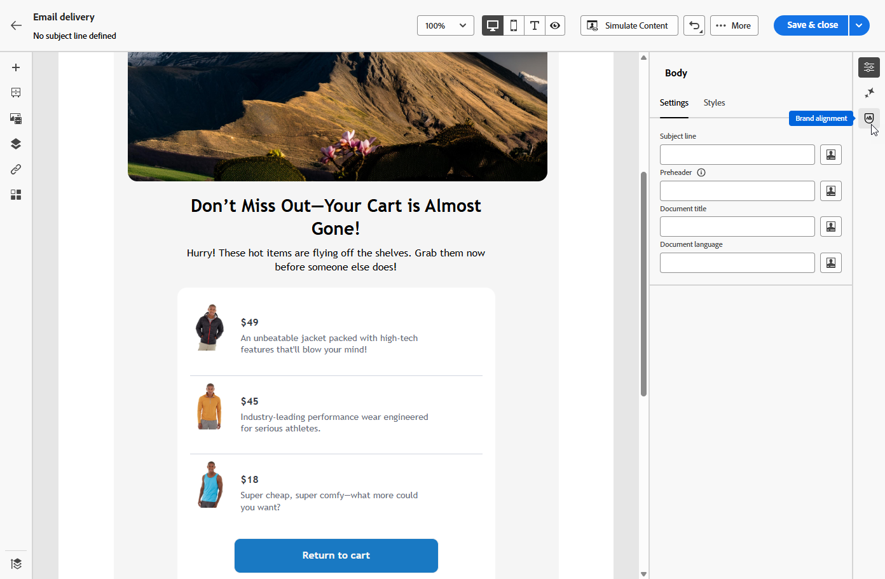
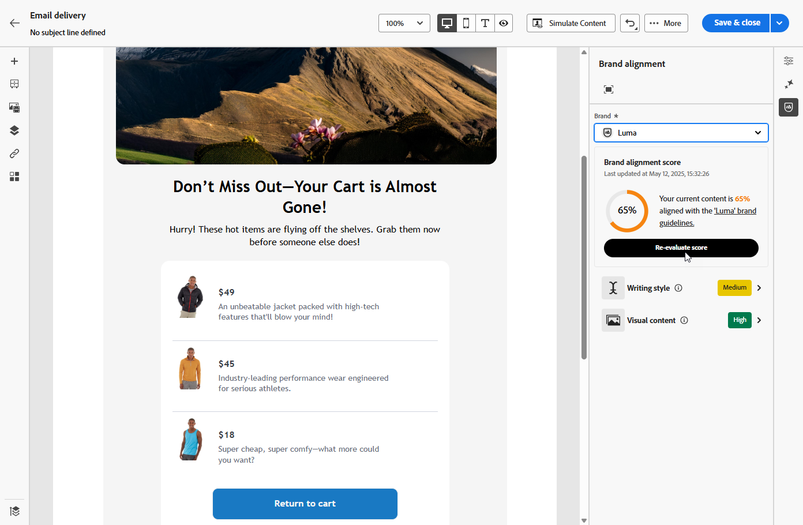
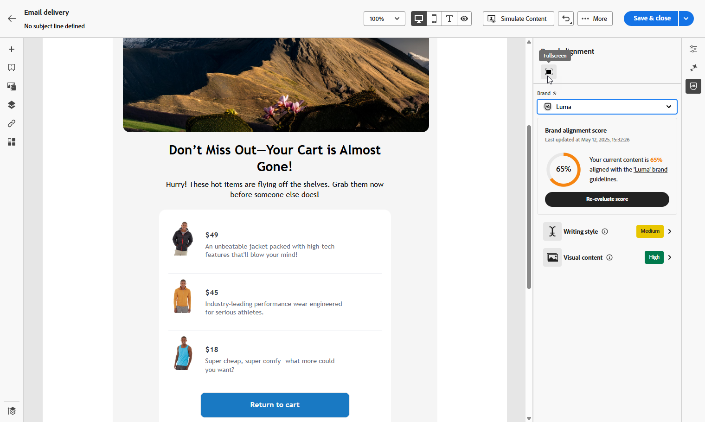
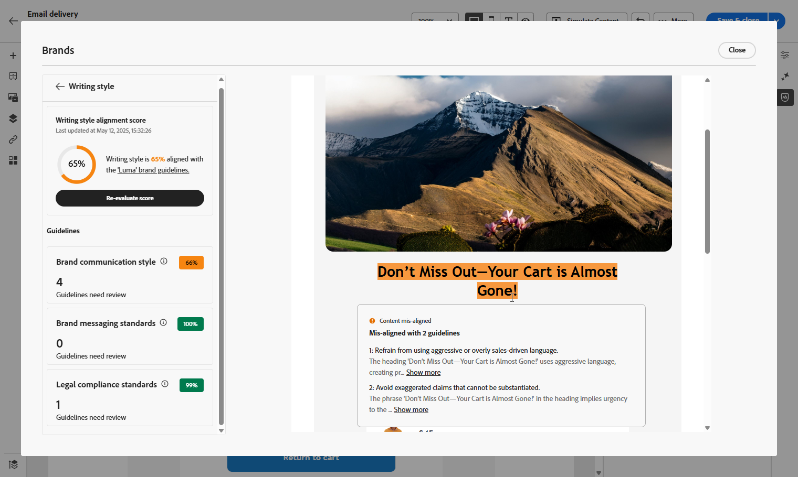
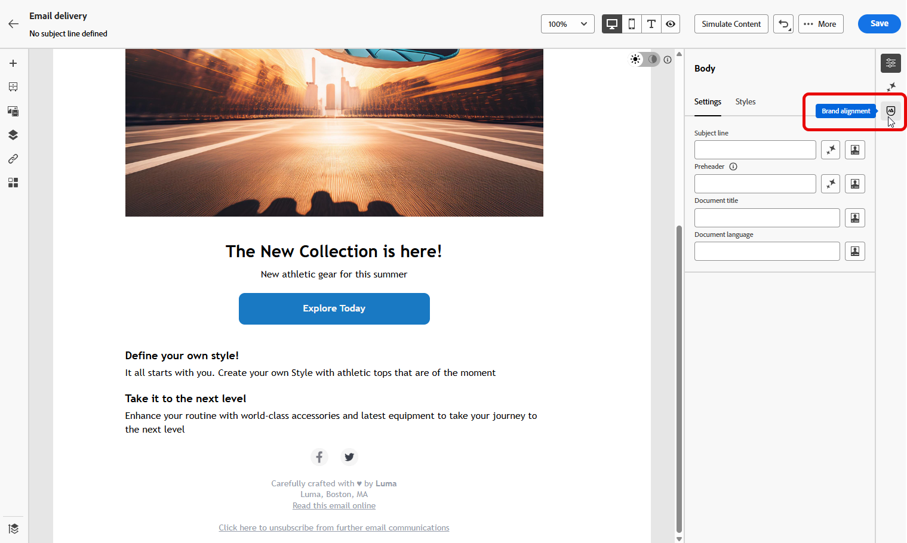
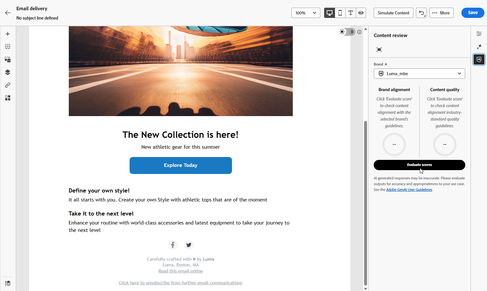
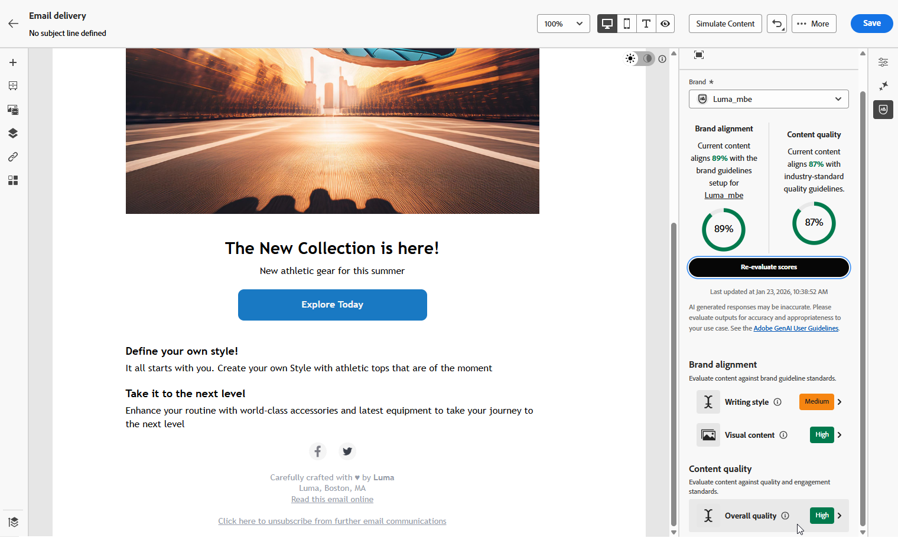
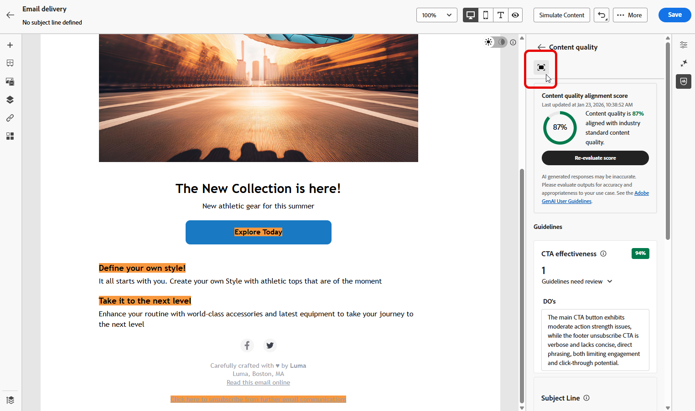
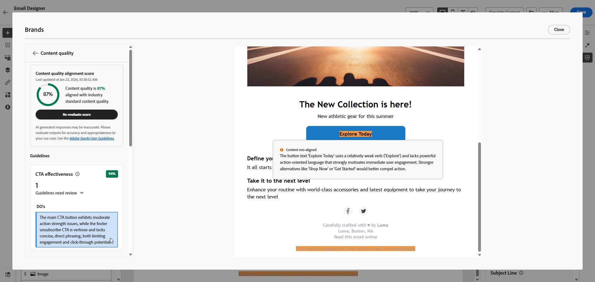

# 評估您的內容 {#brands-score}

>[!AVAILABILITY]
>
>您必須同意[使用者合約](https://www.adobe.com/tw/legal/licenses-terms/adobe-dx-gen-ai-user-guidelines.html){target="_blank"}，才能使用AI小幫手。 如需詳細資訊，請聯絡您的 Adobe 代表。

內容檢閱功能提供全面的評估工具，用於評估行銷活動與品牌指引的符合程度，並維護所有通訊的內容品質標準：

* **品牌一致性**：檢閱並管理符合品牌指引的內容。 這可確保在電子郵件行銷活動中的語氣、訊息和視覺身分的一致性。
* **品質檢查**：在內容上線之前驗證內容，以維持高標準與品牌完整性。

## 透過品牌一致性驗證您的內容 {#validate-content}

設定並發佈[您的品牌後](brands.md)，請直接在電子郵件行銷活動中評估您的品牌一致性分數，以確保您的內容符合您的品牌准則：

1. 建立您的[電子郵件行銷活動](../email/create-email.md)。

1. 開啟電子郵件設計工具中的&#x200B;**[!UICONTROL 品牌一致性]**&#x200B;功能表。

   系統會自動根據您的預設品牌評估您的內容。 [瞭解如何指派預設品牌](brands.md)。

   

1. 若要使用其他品牌進行評估，請從&#x200B;**[!UICONTROL 品牌]**&#x200B;下拉式功能表中選取該品牌，然後按一下&#x200B;**[!UICONTROL 重新評估分數]**。

   

1. 瀏覽&#x200B;**品牌一致性分數** (高、Medium、低)並檢閱詳細的意見反應。

1. 按一下圖示，以檢視更多關於您評分的深入分析。

   

1. 選取任何已標幟的指引以檢視特定意見和建議。

   

1. 根據建議編輯您的內容，以改善品牌一致性。

1. 進行變更後手動重新評估內容，以重新整理對齊分數。

## 驗證您的內容品質 {#validate-quality}

>[!NOTE]
>
>內容品質評估不受品牌指引影響。 即使在下拉式選單中選取了品牌，其准則也不會套用至品質檢查。 品牌選擇僅與品牌一致性評分相關。

除了品牌一致性之外，您還可以評估一般內容品質，以找出可讀性、內容一致性和有效性方面的潛在問題，而不受品牌指南影響。

若要評估您的內容品質：

1. 建立您的[電子郵件傳遞](../email/create-email.md)。

1. 開啟[電子郵件Designer]中的&#x200B;**[!UICONTROL 品牌一致性]**&#x200B;功能表。

   

1. 按一下&#x200B;**[!UICONTROL 評估分數]**&#x200B;以產生品牌一致性和內容品質分數。

   

1. 導覽至&#x200B;**[!UICONTROL 整體品質]**&#x200B;標籤，檢閱您的內容品質深入分析和建議。

   

1. 按一下圖示，以取得您品質分數的詳細檢視。

   

1. 選取任何已標幟的專案，以檢視特定意見和可操作的改進建議。 分數以下列類別為基礎：

   * **[!UICONTROL CTA有效性]**：評估您的call-to-action激勵讀者採取所需動作的效果。
   * **[!UICONTROL 主旨列]**：評估清晰度、相關性和吸引注意力的品質，以鼓勵電子郵件開啟。
   * **[!UICONTROL 可讀性]**：衡量內容是否容易及吸引人，讓讀者瞭解。
   * **[!UICONTROL 垃圾郵件檢查]**：識別可能影響傳遞能力的常見垃圾郵件觸發器。
   * **[!UICONTROL 內容一致性]**：確保您的內容流暢流暢並停留在主題上。
   * **[!UICONTROL 校訂]**：檢查拼字、語法和清晰度問題。

   

1. 根據建議編輯您的內容，以增強可讀性、內容凝聚度和整體品質。

1. 進行變更以重新整理您的品質分數後，按一下&#x200B;**[!UICONTROL 重新評估分數]**。
