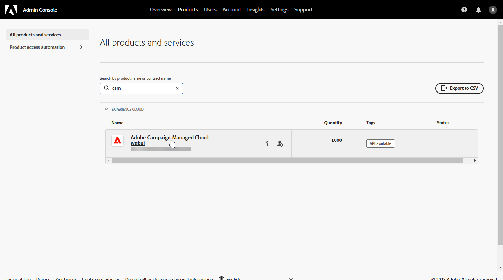
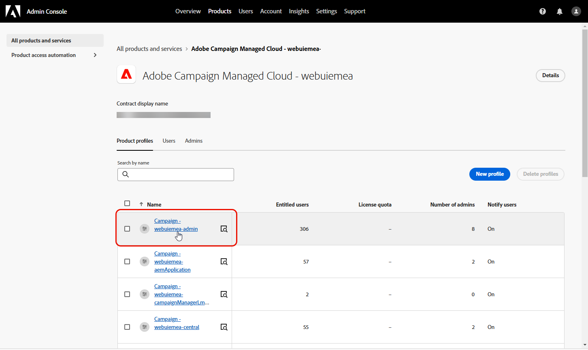
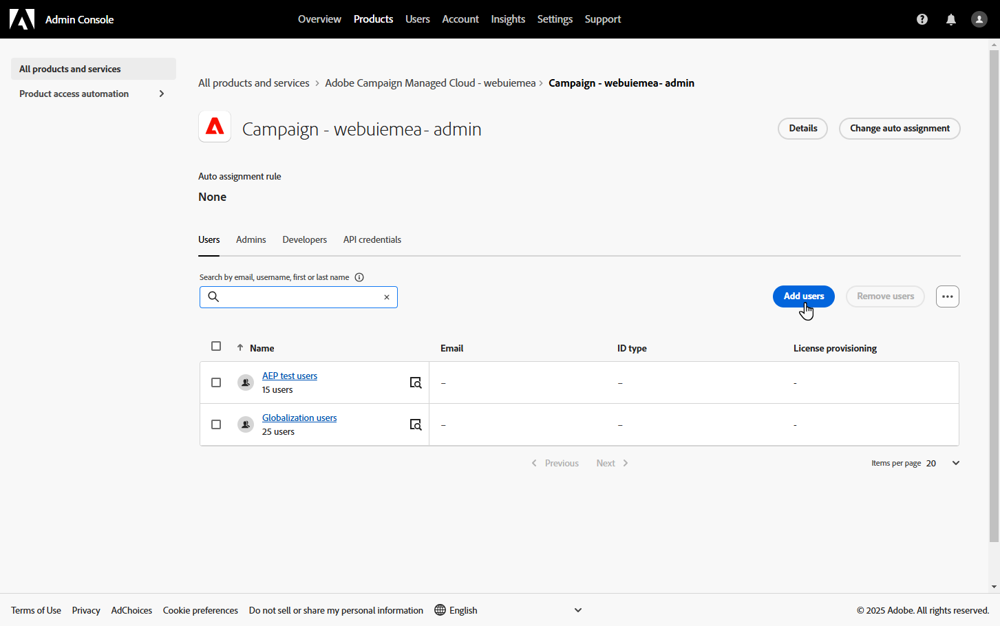
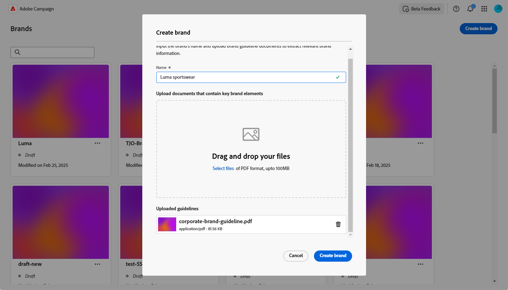
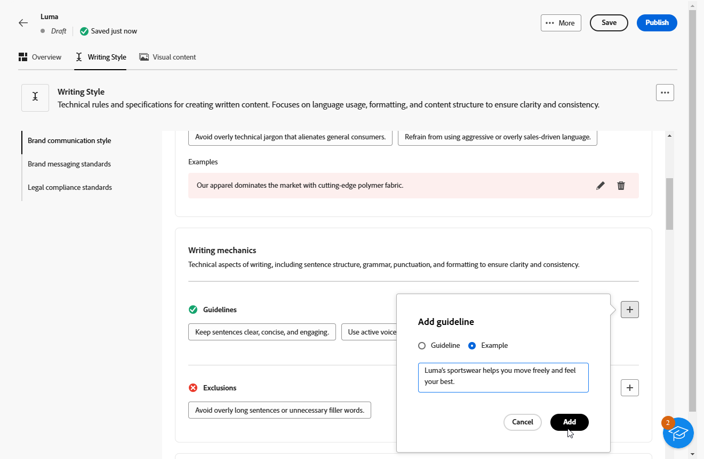
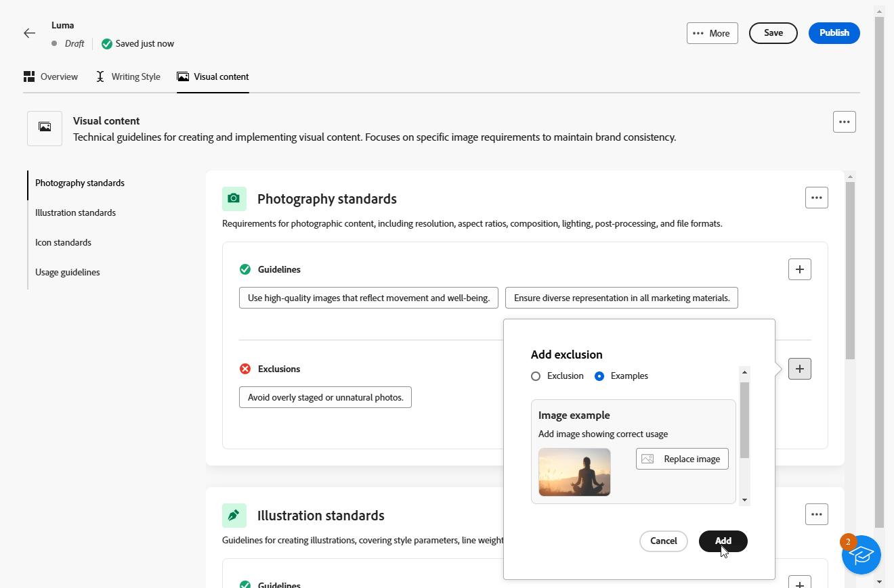
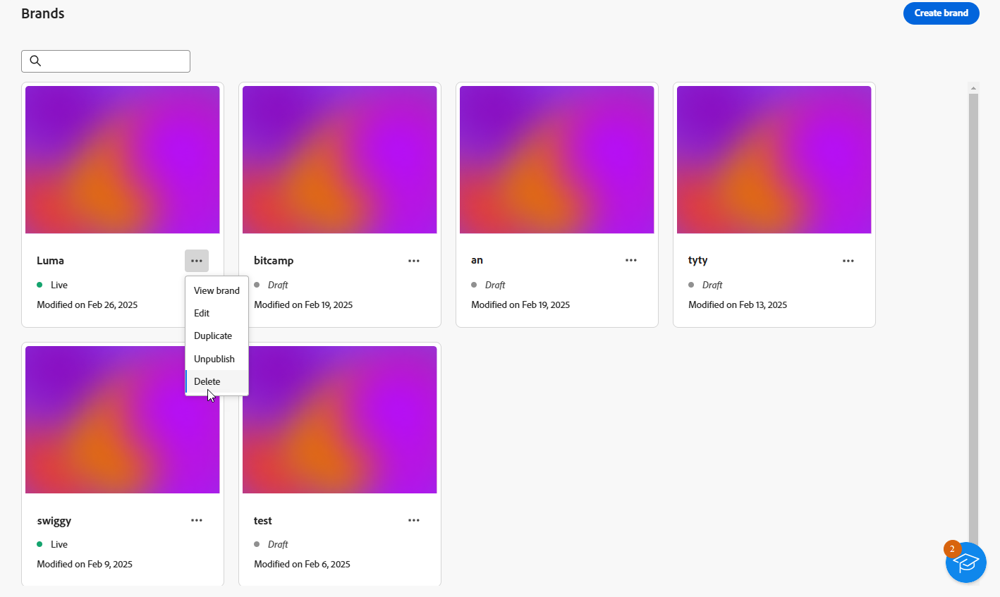
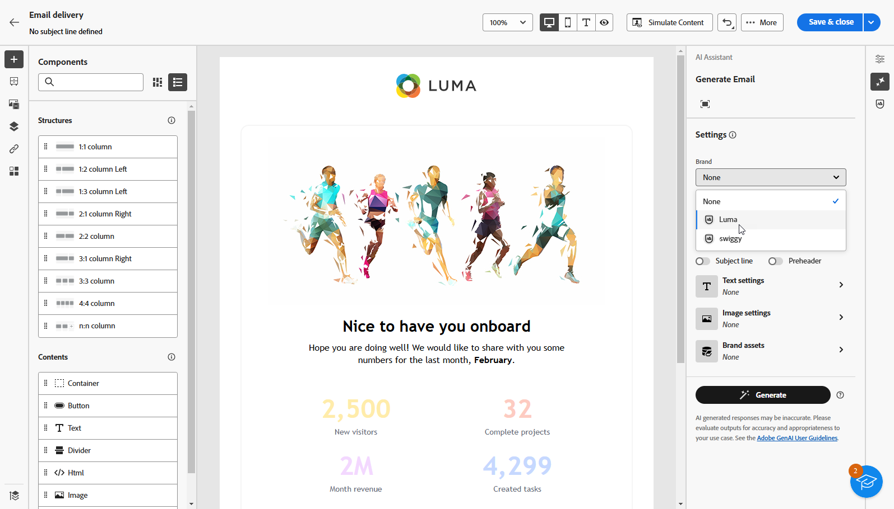

# 建立並管理您的品牌 {#brands}

>[!AVAILABILITY]
>
>此功能已發佈私人測試版。 即將發行的版本將逐步開放所有客戶使用。

品牌指引是一組完整的規則和標準，可定義品牌的視覺和口頭識別。 這些區段可作為參考，以確保在所有行銷和通訊管道中一致的品牌代表性。

在[!DNL Adobe Campaign Web]中，使用者可以手動輸入及組織品牌資訊，或上傳品牌指引檔案以進行自動資料擷取。

## 存取品牌 {#generative-access}

若要存取[!DNL Adobe Campaign Web]中的&#x200B;**[!UICONTROL 品牌]**&#x200B;功能表，必須指派使用者&#x200B;**[!UICONTROL 管理員（管理員）]**&#x200B;和&#x200B;**[!UICONTROL 品牌套件]**&#x200B;產品設定檔，才能建立和管理品牌。 若為唯讀存取，使用者需要[!UICONTROL AI助理]產品設定檔。

[了解更多](https://experienceleague.adobe.com/en/docs/campaign/campaign-v8/admin/permissions/manage-permissions)

+++ 瞭解如何指派品牌相關許可權

1. 在[Admin Console](https://adminconsole.adobe.com/enterprise)首頁中，存取您的行銷活動產品。

   

1. 根據您要授與使用者的許可權層級選取&#x200B;**[!DNL Product profile]**。

   

1. 按一下&#x200B;**[!DNL Add users]**&#x200B;以指派選取的產品設定檔。

   

1. 輸入您的使用者名稱、使用者群組或電子郵件地址。

1. 按一下[儲存]以套用變更。****

已指派給此角色的使用者會自動更新其許可權。

+++

## 建立您的品牌 {#create-brand-kit}

若要建立和管理您的品牌指引，請遵循下列步驟。

使用者可以手動輸入詳細資料，或上傳品牌指引檔案以自動擷取資訊：

1. 從&#x200B;**[!UICONTROL 內容管理]**&#x200B;功能表，選取&#x200B;**[!UICONTROL 品牌]**。

1. 在&#x200B;**[!UICONTROL 品牌]**&#x200B;功能表中，按一下&#x200B;**[!UICONTROL 建立品牌]**。

   ![具有[建立品牌]選項的[品牌]功能表](assets/brands_1.png)

1. 輸入您品牌的&#x200B;**[!UICONTROL 名稱]**。

1. 拖放或選取您的檔案，以上傳您的品牌指導方針並自動擷取相關的品牌資訊。 按一下&#x200B;**[!UICONTROL 建立品牌]**。

   資訊擷取程式隨即開始。 請注意，可能需要幾分鐘才能完成。

   

1. 系統會自動填入您的內容和視覺化建立標準。 瀏覽不同的標籤，視需要調整資訊。

1. 從&#x200B;**[!UICONTROL 撰寫樣式]**&#x200B;索引標籤，按一下以新增指引或排除專案，包括範例。

   

1. 從&#x200B;**[!UICONTROL 視覺內容]**&#x200B;索引標籤，按一下以新增其他准則或排除專案。

1. 若要新增顯示正確使用方式的影像，請選取&#x200B;**[!UICONTROL 範例]**&#x200B;並按一下&#x200B;**[!UICONTROL 選取影像]**。 您也可以新增使用方式不正確的影像，作為排除範例。

   

1. 設定之後，按一下&#x200B;**[!UICONTROL 儲存]**，然後按一下&#x200B;**[!UICONTROL 發佈]**，讓您的品牌指引可在AI助理中取得。

1. 若要修改已發佈的品牌，請按一下[編輯品牌]。****

   >[!NOTE]
   >
   >這會在編輯模式中建立臨時副本，並在發佈後取代即時版本。

   ![在[品牌]功能表中編輯品牌選項](assets/brands_4.png)

1. 從您的&#x200B;**[!UICONTROL 品牌]**&#x200B;儀表板，按一下圖示以開啟進階功能表：

   * 檢視品牌
   * 編輯
   * 複製
   * 發佈
   * 取消發佈
   * 刪除

   品牌儀表板中的

您現在可以從AI助理功能表的&#x200B;**[!UICONTROL 品牌]**&#x200B;下拉式清單存取品牌指南。 這可讓AI助理產生符合您規格的內容和資產。 [進一步瞭解AI助理](../email/generative-gs.md)

