# 建立並管理您的品牌 {#brands}

品牌指引是一組完整的規則和標準，可定義品牌的視覺和口頭識別。 這些區段可作為參考，以確保在所有行銷和通訊管道中一致的品牌代表性。

在[!DNL Adobe Campaign Web]中，使用者可以手動輸入及組織品牌資訊，或上傳品牌指引檔案以進行自動資料擷取。

## 存取品牌 {#generative-access}

若要存取&#x200B;**[!UICONTROL 中的]**&#x200B;品牌[!DNL Adobe Campaign Web]功能表，必須指派使用者&#x200B;**[!UICONTROL 管理員（管理員）]**&#x200B;和&#x200B;**[!UICONTROL 品牌套件]**&#x200B;產品設定檔，才能建立和管理品牌。 若為唯讀存取，使用者需要[!UICONTROL AI助理]產品設定檔。

[了解更多](https://experienceleague.adobe.com/en/docs/campaign/campaign-v8/admin/permissions/manage-permissions)

+++ 瞭解如何指派品牌相關許可權

1. 在[Admin Console](https://adminconsole.adobe.com/enterprise)首頁中，存取您的行銷活動產品。

   

1. 根據您要授與使用者的許可權層級選取&#x200B;**[!DNL Product profile]**。

   

1. 按一下&#x200B;**[!DNL Add users]**&#x200B;以指派選取的產品設定檔。

   

1. 輸入您的使用者名稱、使用者群組或電子郵件地址。

1. 按一下[儲存]以套用變更。****

已指派給此角色的使用者會自動更新其許可權。

+++

## 建立您的品牌 {#create-brand-kit}

若要建立和管理您的品牌指引，請遵循下列步驟。

使用者可以手動輸入詳細資料，或上傳品牌指引檔案以自動擷取資訊：

1. 在&#x200B;**[!UICONTROL 品牌]**&#x200B;功能表中，按一下&#x200B;**[!UICONTROL 建立品牌]**。

   ![具有[建立品牌]選項的[品牌]功能表](assets/brands-1.png)

1. 輸入您品牌的&#x200B;**[!UICONTROL 名稱]**。

1. 拖放或選取您的檔案，以上傳您的品牌指引，並自動擷取相關的品牌資訊。 按一下&#x200B;**[!UICONTROL 建立品牌]**。

   資訊擷取程式現在開始。 請注意，可能需要幾分鐘才能完成。

   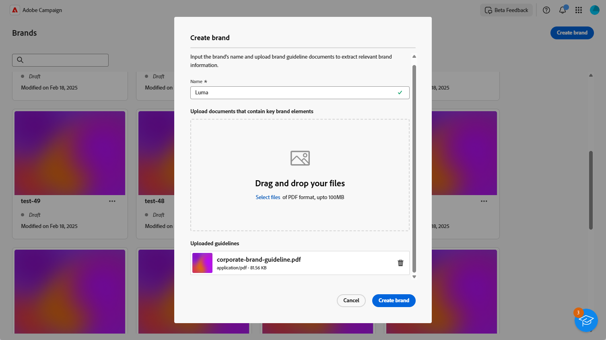

1. 系統現在會自動填入您的內容和視覺化建立標準。 瀏覽不同的標籤，視需要調整資訊。 [了解更多](#personalize)

1. 從每個區段或類別的進階功能表中，您可以新增參照以自動擷取相關品牌資訊。

   若要移除現有內容，請使用&#x200B;**[!UICONTROL 清除區段]**&#x200B;或&#x200B;**[!UICONTROL 清除類別]**&#x200B;選項。

   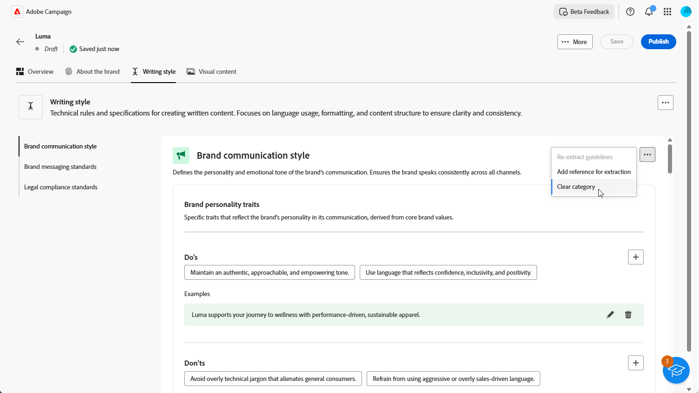

1. 設定之後，按一下&#x200B;**[!UICONTROL 儲存]**，然後按一下&#x200B;**[!UICONTROL 發佈]**，讓您的品牌指引可在AI助理中取得。

1. 若要修改您發佈的品牌，請按一下[編輯品牌]。****

   >[!NOTE]
   >
   >這會在編輯模式中建立臨時副本，並在發佈後取代即時版本。

   ![在[品牌]功能表中編輯品牌選項](assets/brands-8.png)

1. 從您的&#x200B;**[!UICONTROL 品牌]**&#x200B;儀表板，按一下圖示以開啟進階功能表：

   * 檢視品牌
   * 編輯
   * 標籤為預設品牌
   * 複製
   * 發佈
   * 取消發佈
   * 刪除

   品牌儀表板中的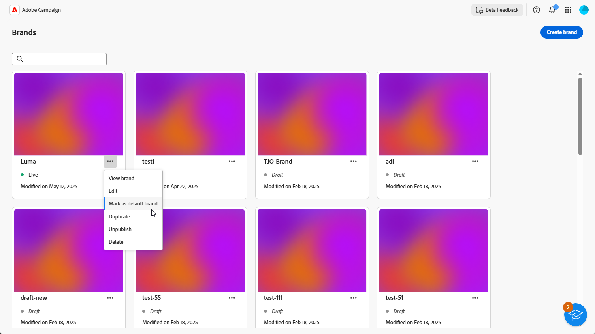

您現在可以從AI助理功能表的&#x200B;**[!UICONTROL 品牌]**&#x200B;下拉式清單存取品牌指南。 這可讓AI助理產生符合您規格的內容和資產。 [進一步瞭解AI小幫手](../content/generative-gs.md)

### 設定預設品牌 {#default-brand}

您可以指定預設品牌，在建立行銷活動期間產生內容及計算一致性分數時自動套用。

若要設定預設品牌，請移至您的&#x200B;**[!UICONTROL 品牌]**&#x200B;儀表板。 按一下圖示並選取&#x200B;**[!UICONTROL 標籤為預設品牌]**，以開啟進階功能表。

品牌儀表板中的

## 個人化您的品牌 {#personalize}

### 關於品牌 {#about-brand}

使用「**[!UICONTROL 關於品牌]**」標籤來建立品牌的核心識別，概述其用途、個性、標語和其他定義屬性。

1. 首先，在&#x200B;**[!UICONTROL 重要詳細資料]**&#x200B;類別中填寫品牌的基本資訊：

   * **[!UICONTROL 品牌套件名稱]**：輸入您的品牌套件名稱。

   * **[!UICONTROL 何時使用]**：指定應套用此品牌套件的案例或內容。

   * **[!UICONTROL 品牌名稱]**：輸入品牌的正式名稱。

   * **[!UICONTROL 品牌說明]**：提供此品牌代表的概觀。

   * **[!UICONTROL 預設標語]**：新增與品牌關聯的主要標語。

     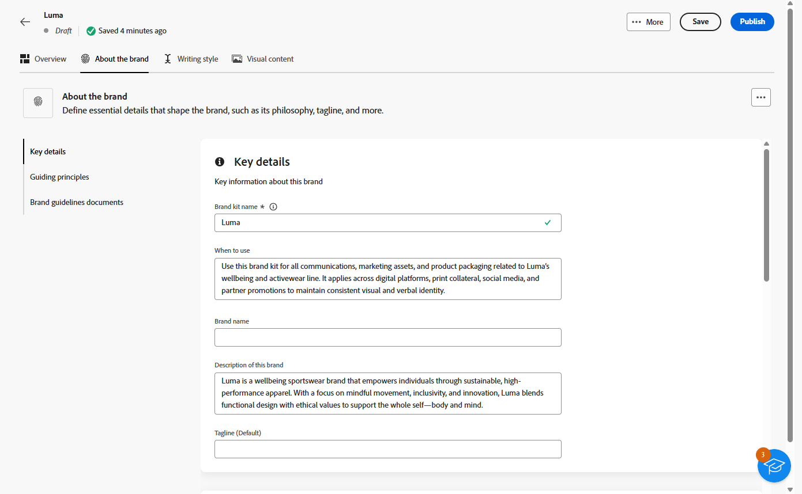

1. 在&#x200B;**[!UICONTROL 指導原則]**&#x200B;類別中，請釐清品牌的核心方向與理念：

   * **[!UICONTROL 使命]**：詳細說明您品牌的用途。

   * **[!UICONTROL 願景]**：說明您的長期目標或想要的未來狀態。

   * **[!UICONTROL 市場定位]**：說明您的品牌在市場中的定位。

   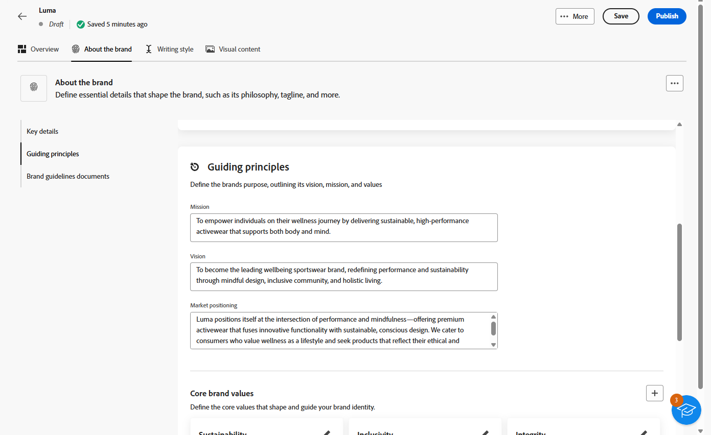

1. 在&#x200B;**[!UICONTROL 核心品牌值]**&#x200B;類別中，按一下以新增品牌的核心值並填入詳細資料：

   * **[!UICONTROL 值]**：命名核心品牌值。

   * **[!UICONTROL 描述]**：說明這個值對您品牌的意義。

   * **[!UICONTROL 行為]**：概述實際中反映此值的動作或態度。

   * **[!UICONTROL 表現]**：提供這個值在真實世界品牌中如何表示的範例。

     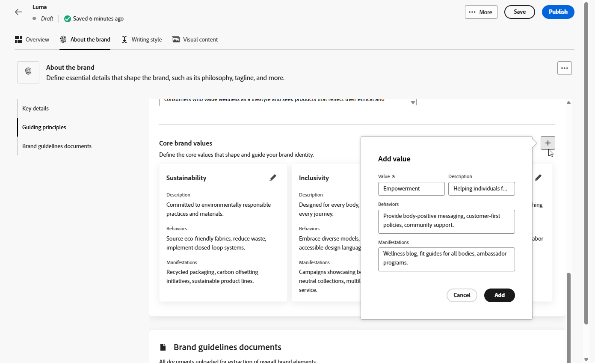

1. 如有需要，請按一下圖示以更新或刪除您的核心品牌價值。

   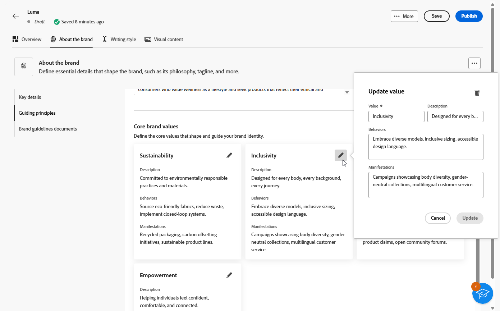

您現在可以進一步個人化您的品牌，或[發佈您的品牌](#create-brand-kit)。

### 寫作風格 {#writing-style}

**[!UICONTROL 撰寫樣式]**&#x200B;區段概述撰寫內容的標準，詳述如何使用語言、格式和結構來維持所有資料的清晰度、一致性和一致性。

+++ 可用的類別和範例

<table>
  <thead>
    <tr>
      <th>類別</th>
      <th>子類別</th>
      <th>指引範例</th>
      <th>排除專案範例</th>
    </tr>
  </thead>
  <tbody>
    <tr>
      <td rowspan="4">內容建立標準</td>
      <td>品牌訊息標準</td>
      <td>強調創新和客戶至上的訊息。</td>
      <td>請勿過度承諾產品功能。</td>
    </tr>
    <tr>
      <td>標語使用方式</td>
      <td>在所有數位行銷資產的標誌下方放置標語。</td>
      <td>請勿修改或翻譯標語。</td>
    </tr>
    <tr>
      <td>核心訊息</td>
      <td>強調主要優勢陳述，例如提高生產力。</td>
      <td>請勿使用不相關的值主張。</td>
    </tr>
    <tr>
      <td>命名標準</td>
      <td>使用簡單的描述性名稱，例如「ProScheduler」。</td>
      <td>請勿使用複雜字元或特殊字元。</td>
    </tr>
    <tr>
      <td rowspan="5">品牌溝通風格</td>
      <td>品牌人格特徵</td>
      <td>親切易懂。</td>
      <td>不要失敗。</td>
    </tr>
    <tr>
      <td>書寫力學</td>
      <td>讓句子儘量簡短並有影響力。</td>
      <td>不要使用過多的行話。</td>
    </tr>
    <tr>
      <td>情境色調</td>
      <td>維持危機溝通的專業語調。</td>
      <td>支援通訊時請勿不屑一顧。</td>
    </tr>
    <tr>
      <td>Word選擇指南</td>
      <td>使用「創新」和「智慧」等字眼。</td>
      <td>避免使用「便宜」或「駭客」等字眼。</td>
    </tr>
    <tr>
      <td>語言標準</td>
      <td>遵循美式英文慣例。</td>
      <td>請勿混合使用英式及美式拼字。</td>
    </tr>
    <tr>
      <td rowspan="3">法規遵循標準</td>
      <td>商標標準</td>
      <td>請一律使用™或®符號。</td>
      <td>必要時，請勿省略法定符號。</td>
    </tr>
    <tr>
      <td>版權標準</td>
      <td>在行銷資料中加入版權注意事項。</td>
      <td>未經許可請勿使用協力廠商內容。</td>
    </tr>
    <tr>
      <td>免責宣告標準</td>
      <td>在數位資產上清楚顯示免責宣告。</td>
      <td>請勿隱藏隱藏隱藏隱藏隱藏區域的免責宣告。</td>
    </tr>
</table>

+++

 

若要個人化您的&#x200B;**[!UICONTROL 撰寫樣式]**：

1. 從&#x200B;**[!UICONTROL 寫入樣式]**&#x200B;索引標籤，按一下以新增建議、例外或排除專案。

1. 輸入您的指引、例外或排除。 您也可以加入&#x200B;**[!UICONTROL 範例]**，以更好地說明應如何套用它。

   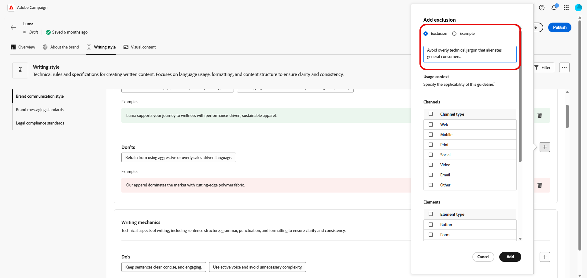

1. 針對您的指引、例外或排除指定&#x200B;**[!UICONTROL 使用內容]**：

   * **[!UICONTROL 管道型別]**：選擇此建議、例外或排除的適用位置。 例如，您可能希望特定的書寫樣式僅顯示在電子郵件、行動裝置、列印或其他通訊通道中。

   * **[!UICONTROL 專案型別]**：指定規則套用的內容專案。 這可能包括標題、按鈕、連結或內容中的其他元件等元素。

   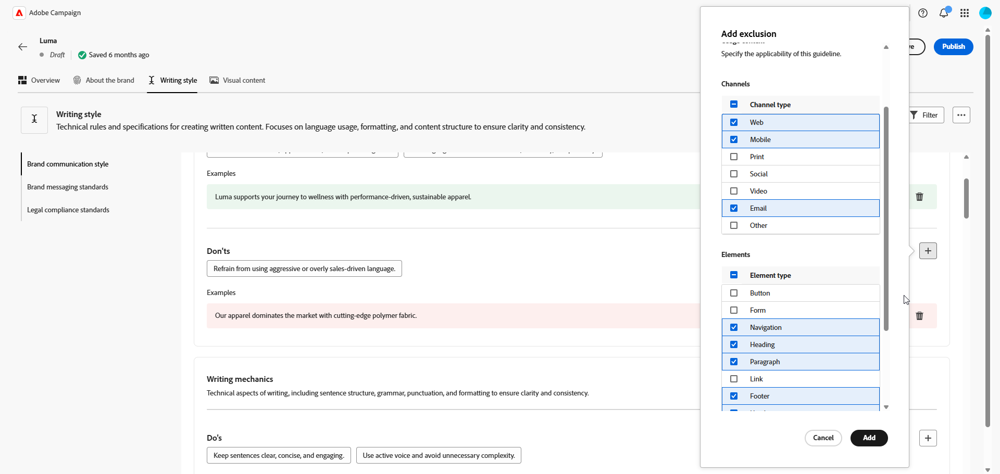

1. 一旦您的指引、例外或排除設定完成後，請按一下[新增]。****
1. 如有需要，請選取其中一個准則或排除專案來更新或刪除。

1. 按一下以編輯您的範例，或按一下圖示以刪除範例。

   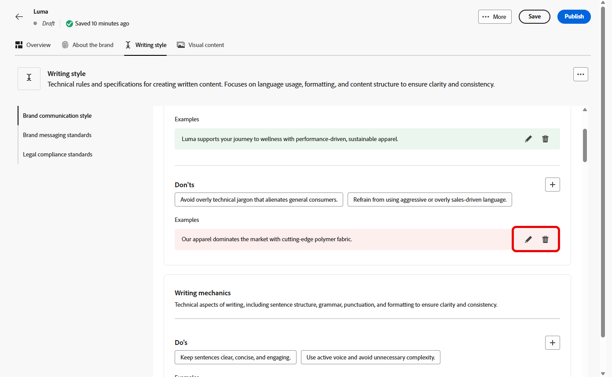

您現在可以進一步個人化您的品牌，或[發佈您的品牌](#create-brand-kit)。

### 視覺內容 {#visual-content}

**[!UICONTROL 視覺內容]**&#x200B;區段定義影像和設計的標準，詳細說明維持統一一致的品牌外觀所需的規格。

+++ 可用的類別和範例

<table>
  <thead>
    <tr>
      <th>類別</th>
      <th>指引範例</th>
      <th>排除專案範例</th>
    </tr>
  </thead>
  <tbody>
    <tr>
      <td>攝影標準</td>
      <td>戶外鏡頭使用自然光線。</td>
      <td>避免過度編輯或畫素化的影像。</td>
    </tr>
    <tr>
      <td>插圖示準</td>
      <td>使用簡潔的極簡風格。</td>
      <td>避免過於複雜。</td>
    </tr>
    <tr>
      <td>圖示標準</td>
      <td>使用一致的24px格線系統。</td>
      <td>請勿混合圖示尺寸、使用不一致的線條粗細，或偏離格線規則。</td>
    </tr>
    <tr>
      <td>使用指南</td>
      <td>選擇反映真實客戶在專業環境中使用該產品的生活方式影像。</td>
      <td>請勿使用與品牌色調相抵觸或看起來與內容不符的影像。</td>
    </tr>
</table>

+++

 

若要個人化您的&#x200B;**[!UICONTROL 視覺內容]**：

1. 從&#x200B;**[!UICONTROL 視覺內容]**&#x200B;索引標籤，按一下以新增指引、排除專案或範例。

1. 輸入您的指引、排除專案或範例。

   

1. 針對您的指引或排除專案指定&#x200B;**[!UICONTROL 使用內容]**：

   * **[!UICONTROL 管道型別]**：選擇此建議、例外或排除的適用位置。 例如，您可能希望特定的書寫樣式僅顯示在電子郵件、行動裝置、列印或其他通訊通道中。

   * **[!UICONTROL 專案型別]**：指定規則套用的內容專案。 這可能包括標題、按鈕、連結或內容中的其他元件等元素。

     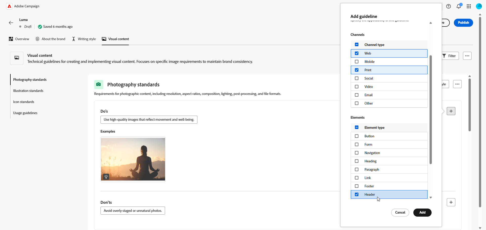

1. 一旦您的指引、例外或排除設定完成後，請按一下[新增]。****

1. 若要新增顯示正確使用方式的影像，請選取&#x200B;**[!UICONTROL 範例]**，然後按一下&#x200B;**[!UICONTROL 選取影像]**。 您也可以新增使用方式不正確的影像，作為排除範例。

   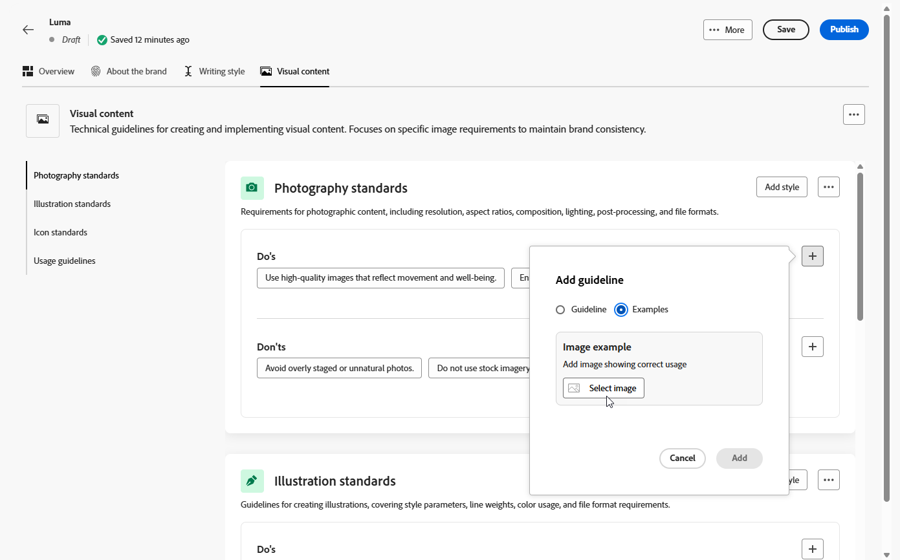

1. 選取您要更新或刪除的其中一個准則或排除專案。

1. 選取您的指引或排除專案以更新它。 按一下圖示以刪除它。

   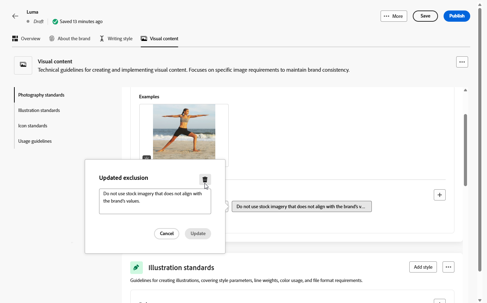

您現在可以進一步個人化您的品牌，或[發佈您的品牌](#create-brand-kit)。
