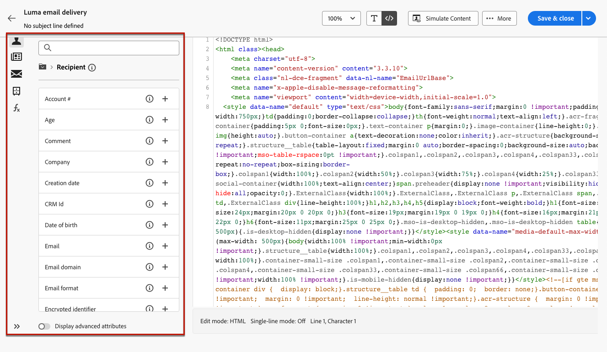

# 撰寫您自己電子郵件內容的程式碼 {#code-content}

使用&#x200B;**[!UICONTROL 自己撰寫程式碼]**&#x200B;模式匯入原始 HTML 和/或撰寫您電子郵件內容的程式碼。

>[!CAUTION]
>
>此方法需要 HTML 技能。

1. 於 [電子郵件設計工具](get-started-email-designer.md) 首頁，選取 **[!UICONTROL 自行撰寫程式碼]**.

   

1. 將原始HTML程式碼輸入或貼到主畫布中。

1. 使用左窗格來利用個人化功能。[了解更多](../personalization/gs-personalization.md)

   

1. 按一下「**[!UICONTROL 模擬內容]**」按鈕以使用測試設定檔來檢查訊息的設計和個人化。[了解更多](../preview-test/preview-test.md)

1. 程式碼就緒後，按一下 **[!UICONTROL 儲存並關閉]** 返回訊息建立畫面並完成訊息。
