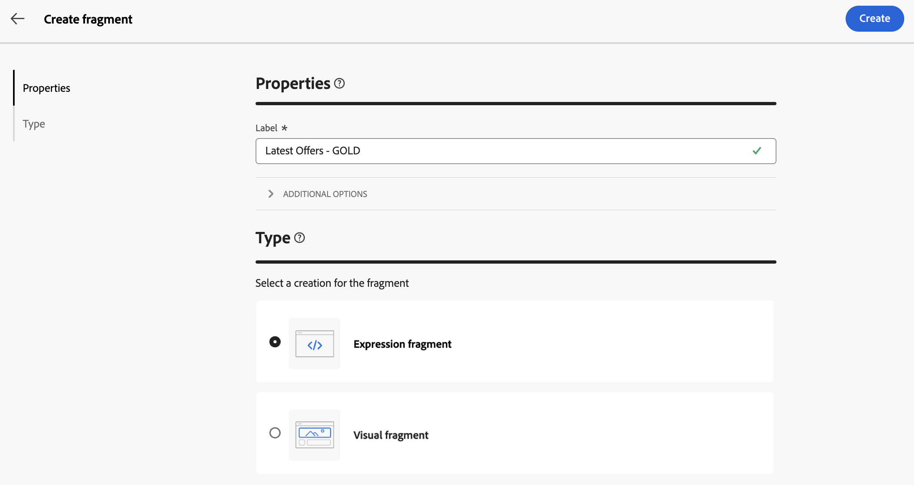
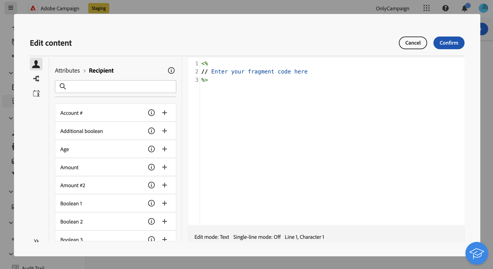
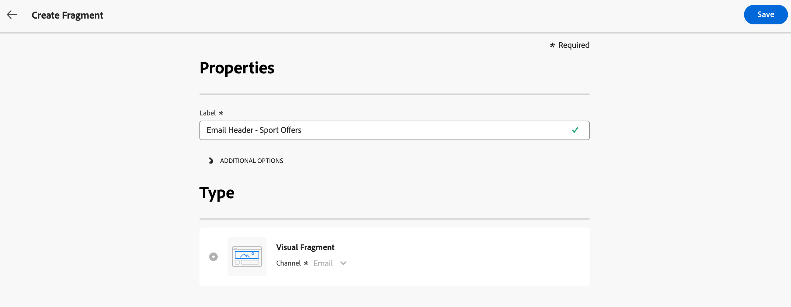
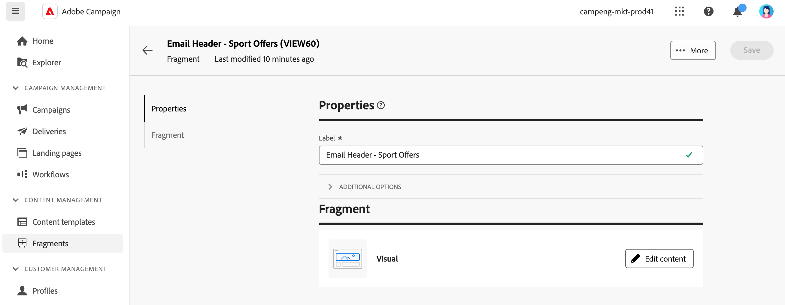
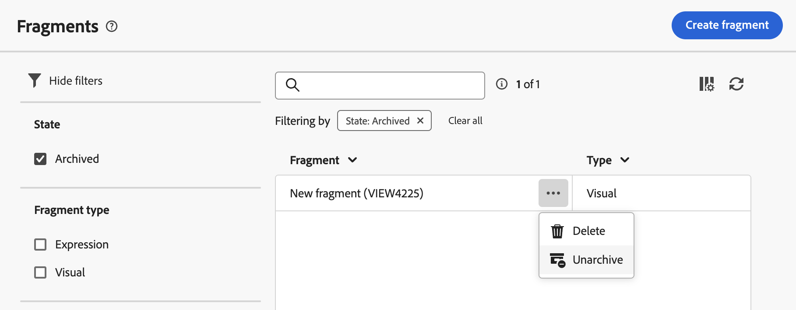

# 建立內容片段 {#fragments}

>[!CONTEXTUALHELP]
>id="acw_fragments_create"
>title="定義您自己的內容片段"
>abstract="定義您要建立的片段屬性和片段類型。然後，您可以使用電子郵件設計工具或運算式編輯器來設定片段的內容。"

<!-- pas vu dans l'UI-->

>[!CONTEXTUALHELP]
>id="acw_fragments_properties"
>title="片段屬性"
>abstract="輸入片段的標籤。如果需要，您可以定義其他選項，例如片段內部名稱、其資料夾和描述。"

>[!CONTEXTUALHELP]
>id="acw_fragments_type"
>title="內容片段的類型"
>abstract="選擇您想要建立之片段的類型。**視覺片段**&#x200B;是預先定義的視覺區塊，可在多個電子郵件傳遞或內容範本中重複使用。**運算式片段**&#x200B;是預先定義的運算式，可從運算式編輯器的專用項目中取得。"

建立內容片段的方式有兩種：

* 使用&#x200B;**[!UICONTROL 片段]**&#x200B;專用功能表，從頭開始建立片段。 [了解做法](#create-from-scratch)
* 設計內容時，請將部分內容儲存為片段。 [了解做法](#save-as-fragment)

  >[!NOTE]
  >
  >此功能僅適用於視覺片段。 運算式片段是從&#x200B;**片段**&#x200B;功能表獨家建立。

儲存後，內容片段即可用於任何傳遞或內容範本。

## 從頭開始建立內容片段 {#create-from-scratch}

若要從頭開始建立內容片段，請遵循下列步驟。

1. [透過](#access-manage-fragments)內容管理&#x200B;**[!UICONTROL >]**&#x200B;片段&#x200B;**[!UICONTROL 左側功能表存取片段清單]**，並選取&#x200B;**[!UICONTROL 建立片段]**。

   顯示[建立片段]選項的

1. 輸入片段的標籤。如有需要，請定義其他選項，例如片段內部名稱、其資料夾和說明。

1. 選擇要建立的片段型別： **視覺化片段**&#x200B;或&#x200B;**運算式片段**。 [瞭解視覺和運算式片段之間的差異](fragments.md)

   

   >[!AVAILABILITY]
   >
   >視覺片段需要更新Campaign v8.6.4。進一步瞭解[Campaign v8使用者端主控台發行說明](https://experienceleague.adobe.com/zh-hant/docs/campaign/campaign-v8/releases/release-notes)。

1. 按一下&#x200B;**建立**&#x200B;按鈕。

   * 針對&#x200B;**視覺片段**，會顯示[電子郵件Designer](../email/get-started-email-designer.md)。 視需要編輯內容，就像處理行銷活動內的任何電子郵件一樣，然後按一下&#x200B;**儲存並關閉**&#x200B;按鈕。 新增影像、連結、個人化欄位和動態內容。

     

   * 針對&#x200B;**運算式片段**，運算式編輯器會開啟。 使用其個人化和編寫功能來建置內容，然後按一下&#x200B;**確認**。 [瞭解如何使用運算式編輯器](../personalization/personalize.md)

     運算式片段的

1. 內容準備就緒後，按一下&#x200B;**儲存**。

內容片段現在已準備好在Campaign中建置任何傳遞或[內容範本](../content/use-email-templates.md)時使用。 在以下章節中瞭解如何使用視覺效果和運算式片段：
* [在您的電子郵件中新增視覺片段](use-visual-fragments.md)
* [將運算式片段新增至運算式編輯器](use-expression-fragments.md)

## 將內容另存為視覺片段 {#save-as-fragment}

>[!CONTEXTUALHELP]
>id="acw_fragments_save"
>title="另存為片段"
>abstract="若要將內容另存為視覺片段，選取要加入片段中的元素，包括個人化欄位和動態內容。僅可選取相鄰區段。不能選取空結構或其他內容片段。然後，內容會成為一個獨立的片段並新增到片段清單中，而您可從專用選單中存取。在 Campaign 中建置任何電子郵件或內容範本時，都可以使用此片段。"

<!--pas vu dans l'UI-->

任何電子郵件內容都可儲存為視覺片段，以供日後重複使用。 設計[內容範本](../content/use-email-templates.md)或[電子郵件](../email/get-started-email-designer.md)傳遞時，請將部分內容儲存為視覺片段。 要執行此操作，請遵循下列步驟：

1. 在[電子郵件Designer](../email/get-started-email-designer.md)中，按一下畫面右上方的&#x200B;**更多**&#x200B;按鈕。

1. 從下拉式選單中選取&#x200B;**[!UICONTROL 另存為片段]**。

   

1. **[!UICONTROL 另存為片段]**&#x200B;畫面隨即顯示。 選取要包含在片段中的元素，包括個人化欄位和動態內容。

   >[!CAUTION]
   >
   >僅可選取相鄰區段。無法選取空的結構或其他內容片段。

   

1. 按一下 **[!UICONTROL 建立]**。填寫片段名稱並儲存。

   

   此內容現在是獨立片段，新增到[片段清單](#manage-fragments)中，並可從專用功能表存取。 在Campaign中建置任何[電子郵件](../email/get-started-email-designer.md)或[內容範本](../content/use-email-templates.md)時，使用此片段。 [了解做法](../content/use-visual-fragments.md)

>[!NOTE]
>
>新片段的變更不會傳播到它源自的電子郵件或範本。 同樣地，在電子郵件或範本中編輯原始內容時，不會修改新片段。

## 管理您的內容片段 {#manage-fragments}

您可以從片段清單中編輯、更新、複製或刪除內容片段。

### 編輯和更新內容片段 {#edit-fragments}

若要編輯內容片段，請遵循以下步驟。

1. 從&#x200B;**[!UICONTROL 片段]**&#x200B;清單中按一下要編輯的片段名稱。
1. 按一下&#x200B;**編輯內容**&#x200B;按鈕以開啟片段的內容。

   

1. 進行必要的變更並儲存修改。

>[!CAUTION]
>
>對片段所做的變更會傳播至使用它的傳遞或範本。

### 刪除內容片段 {#delete-fragments}

要刪除內容片段，請執行以下步驟：

1. 瀏覽至片段清單，然後按一下要刪除的片段旁的&#x200B;**[!UICONTROL 更多動作]**&#x200B;按鈕。
1. 按一下&#x200B;**刪除**&#x200B;並確認。

   

>[!CAUTION]
>
>刪除片段時，會更新使用此片段的傳送和範本。 片段已從內容中移除，但仍會參照。 若要保留這些傳送和範本中的片段內容，請先中斷繼承，再刪除片段，[如本節](use-visual-fragments.md#break-inheritance)所詳述。

### 封存內容片段 {#archive}

您可以封存與您的品牌無關的片段，以清除片段清單。 若要這麼做，請按一下所需片段旁的&#x200B;**[!UICONTROL 更多動作]**&#x200B;按鈕，然後選取&#x200B;**[!UICONTROL 封存]**。 片段會從片段清單中移除，以防止使用者在未來的電子郵件或範本中使用此片段。

若要存取封存的片段，請使用篩選窗格來顯示它們。 若要取消封存片段，請按一下&#x200B;**[!UICONTROL 其他動作]**&#x200B;按鈕，然後選取&#x200B;**[!UICONTROL 取消封存]**。

>[!NOTE]
>
>如果您封存內容中使用的片段，該內容不受影響。

### 複製內容片段 {#duplicate-fragments}

您可以輕鬆複製內容片段以建立新片段。 若要複製現有片段，請執行以下步驟：

1. 瀏覽至片段清單，然後按一下要複製的片段旁的&#x200B;**[!UICONTROL 更多動作]**&#x200B;按鈕。
1. 按一下&#x200B;**複製**&#x200B;並確認。
1. 輸入新片段的標籤並儲存變更。

   片段會新增至內容片段清單。 視需要編輯和設定。