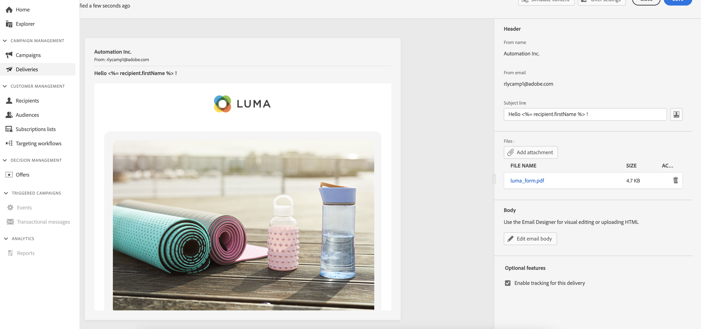

# Work with the Email Designer {#email-designer}

<!--
Acrite same as AJO but little diff:
no offers (offer component specific to AJO) -> need to use perso
perso is not acrite. icons are not the same as AJO: recipient, offers (define offer with code), content blocks (not in AJO). 
rest of design similar to AJO
dynamic content not in alpha
-->