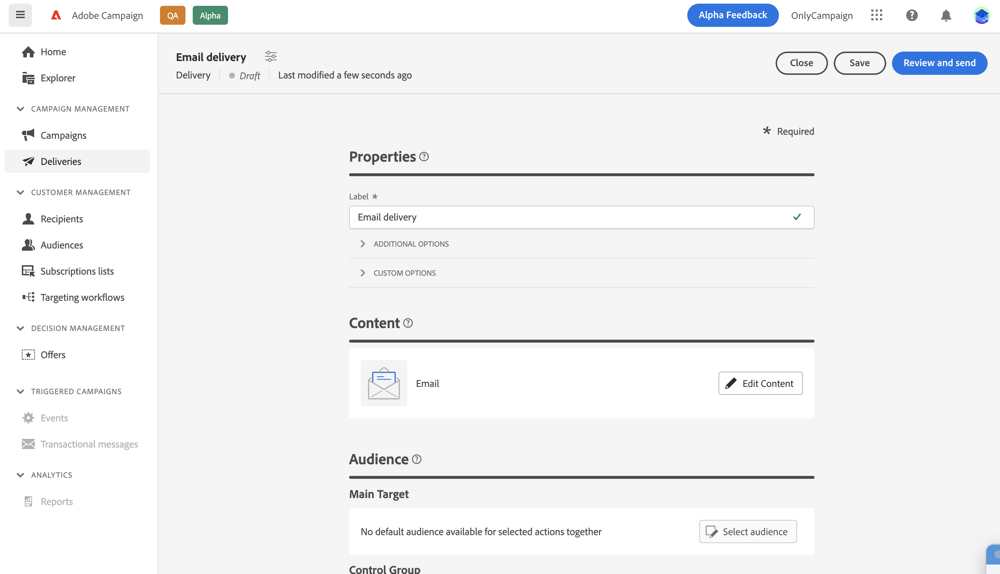

# Edit the email content {#configure-content}

>[!CONTEXTUALHELP]
>id="acw_deliveries_email_content"
>title="Create the email content"
>abstract="With this section, you can create the content for your email and use the Email Designer to give it a polished look."

>[!CONTEXTUALHELP]
>id="acw_deliveries_email_header"
>title="Email Header"
>abstract="TBC"

>[!CONTEXTUALHELP]
>id="acw_deliveries_email_attachment"
>title="Email attachment"
>abstract="TBC"

>[!CONTEXTUALHELP]
>id="acw_deliveries_email_options"
>title="Tracking options"
>abstract="TBC"

To start creating the content of an email, click the **[!UICONTROL Edit content]** button from the email creation screen.

This screen allows you to define the content of your email and access the Email Designer to design it.

The steps to define the content of your email are as follows:

1. Check the **[!UICONTROL From name]** and **[!UICONTROL From email]** information. These fields are read-only, they are configured in the email template selected when creating the email.

1. Define the email **[!UICONTROL Subject line]**. To do this, type your subject directly into the dedicated field, or open the Expression Editor to define to add personalization using various attributes and content blocks or offers. [Learn how to personalize content](../personalization/personalize.md)

1. If you want to send offers with your email, select them using the **[!UICONTROL Set up offers]** button. You are then able to insert them into the email using personalization fields. [Learn how to send offers](offers.md)

1. Click the **[!UICONTROL Edit email body]** button to structure and design the content of the email. Additional information on how to design email content are available in these sections:

    * [Learn how to design emails](create-email-content.md)
    * [Style your content](get-started-email-style.md)

1. If you want to attach a file to the email, click the **[!UICONTROL Add attachment]** button then select one or multiple file(s).
    
    To avoid performance issue, it is recommended not to include more than one attachment per email. 

    <!--limitation on size + number of files?-->

1. By default, tracking is enabled for the delivery. You can disable this option from from the **[!UICONTROL Optional features]** section. [Learn how to add links and manage tracking](message-tracking.md)

Once the content of your email has been defined, use the **[!UICONTROL Simulate content]** button to check how it displays before sending it. [Learn how to preview and test your email](../preview-test/preview-test.md)
