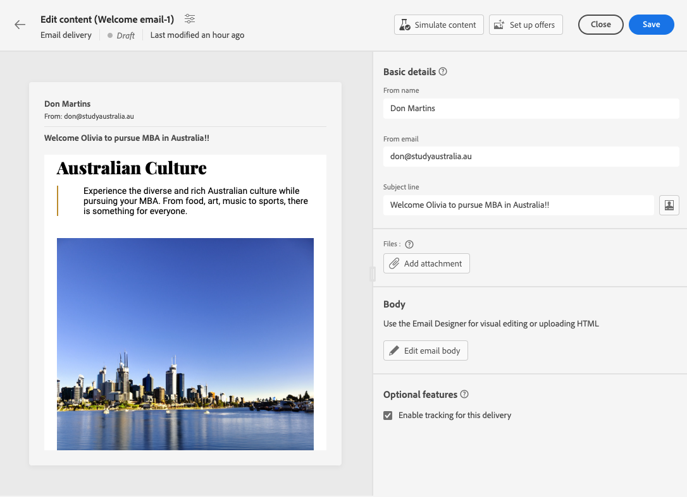

# 設定電子郵件內容 {#edit-content}

>[!CONTEXTUALHELP]
>id="acw_deliveries_email_content"
>title="建立電子郵件內容"
>abstract="使用此區段，您可以為電子郵件建立內容並使用電子郵件設計工具賦予其精美的外觀。"

>[!CONTEXTUALHELP]
>id="acw_deliveries_email_header"
>title="電子郵件參數"
>abstract="「寄件者」名稱和「寄件者」電子郵件值定義於電子郵件範本中。 主旨列可以使用運算式編輯器進行個人化。"

>[!CONTEXTUALHELP]
>id="acw_deliveries_email_attachment"
>title="電子郵件附件"
>abstract="選取要插入訊息的一或多個檔案。"

>[!CONTEXTUALHELP]
>id="acw_deliveries_email_options"
>title="追蹤選項"
>abstract="依預設，傳遞追蹤會啟用。您可以從此處停用此選項。"

電子郵件 **[!UICONTROL 編輯內容]** 熒幕可讓您：
* 定義訊息的基本元素，例如寄件者的地址和主旨行
* 執行其他動作，例如新增附件或設定優惠方案
* 存取 [電子郵件設計工具](get-started-email-designer.md#start-authoring) 以開始建立電子郵件的適當內容

若要設定或編輯電子郵件內容，請遵循下列步驟。

1. 按一下 **[!UICONTROL 編輯內容]** 按鈕來自 [電子郵件傳遞儀表板](../email/create-email.md) 畫面。

   

1. 電子郵件內容版本畫面隨即開啟。

   

   >[!NOTE]
   >
   >如果您要設定新電子郵件，請 **[!UICONTROL 發件人名稱]** 和 **[!UICONTROL 從電子郵件]** 欄位已填入。

1. 此 **[!UICONTROL 發件人名稱]** 欄位定義於電子郵件範本中。 若要修改此名稱，請使用收件者可輕鬆辨識的名稱（例如您的品牌名稱），以提高傳遞的開放率。

   >[!NOTE]
   >
   >若要進一步改善收件者的體驗，您可以新增個人名稱，例如「Eve from Luma」。

1. 此 **[!UICONTROL 從電子郵件]** 位址列位也定義在電子郵件範本中。 請確定位址網域與您委派給Adobe的子網域相同。

   >[!NOTE]
   >
   >您可以變更&#39;@&#39;之前的部分，但不能變更網域位址。

   <!--In the Reply address text fields, the sender's address is used by default for replies. However, Adobe recommends using an existing real address such as your brand's customer care. In this case, if a recipient sends a reply, the customer care will be able to handle it.-->

1. 定義電子郵件 **[!UICONTROL 主旨行]**。在專用欄位中直接鍵入您的主題，或開啟運算式編輯器，使用各種屬性和內容區塊或選件來新增個人化。 [了解如何個人化內容](../personalization/personalize.md)

1. 如果想要將檔案附加到電子郵件，請按一下「**[!UICONTROL 新增附件]**」按鈕然後選取一個或多個檔案。

   >[!NOTE]
   >
   >    為避免出現效能問題，建議每封電子郵件不要包含多個附件。

   <!--limitation on size + number of files?-->

1. 如果您想要透過電子郵件傳送優惠，請使用「**[!UICONTROL 設定優惠]**」按鈕。

   然後您可以使用個人化欄位將它們插入到電子郵件中。[了解如何傳送優惠](offers.md)

1. 按一下 **[!UICONTROL 編輯電子郵件內文]** 按鈕，以使用來建構及設計電子郵件內容 [電子郵件設計工具](#start-authoring). 以下章節提供如何設計電子郵件內容的詳細資訊：

   * [從頭開始編寫電子郵件](create-email-content.md)
   * [建立內容樣式](get-started-email-style.md)

   >[!NOTE]
   >
   >您也可以暫留在電子郵件預覽上並選取 **[!UICONTROL 開啟電子郵件設計工具]**.

1. 依預設，傳遞追蹤會啟用。您可以從「**[!UICONTROL 選擇性功能]**」區段停用此選項。[了解如何新增連結和管理追蹤](message-tracking.md)

1. 定義好電子郵件內容後，請使用「**[!UICONTROL 模擬內容]**」按鈕在傳送前檢查其如何顯示。[了解如何預覽和測試您的電子郵件](../preview-test/preview-test.md)

