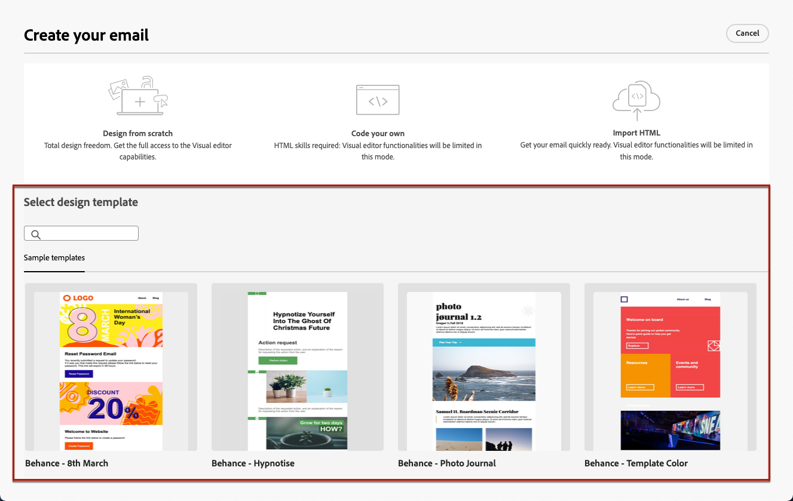

# 使用電子郵件範本 {#email-saved-content-templates}

時間 [建立電子郵件](#create-email)，使用 **[!UICONTROL 選取設計範本]** 部分 **[!UICONTROL 建立您的電子郵件]** 介面以開始從範本建立您的內容。

Campaign隨附一組內建範本，供您選擇。

若要使用其中一個範本開始建立您的內容，請遵循下列步驟。

1. 開啟 [電子郵件設計工具](create-email-content.md).

1. 於 **[!UICONTROL 建立您的電子郵件]** 畫面，清單 **[!UICONTROL 範例範本]**  顯示。

1. 從清單中選取範本以顯示其內容。

1. 使用向右和向左箭頭在範本之間導覽。

   

1. 按一下 **[!UICONTROL 使用此範本]** 在畫面的右上方。

1. 使用電子郵件設計工具視需要編輯您的內容。 [了解更多](create-email-content.md)
