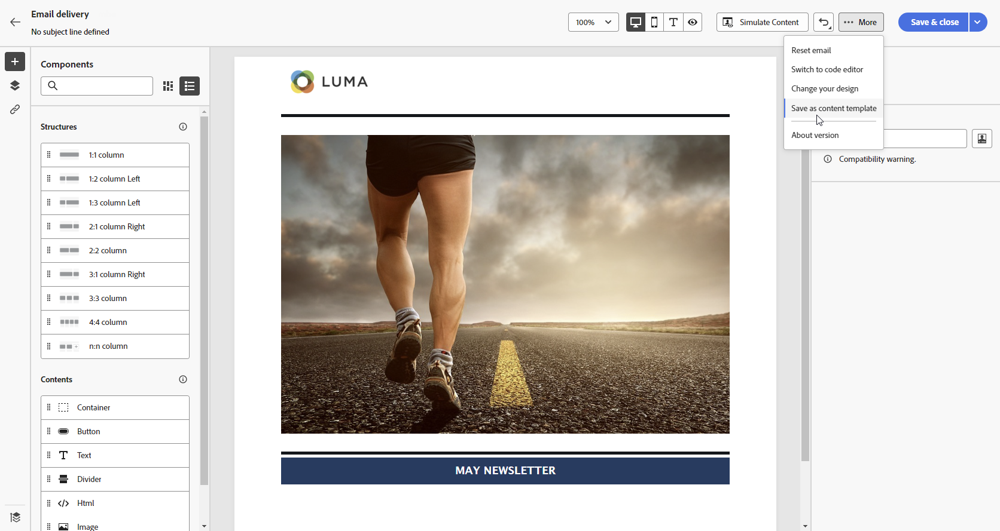
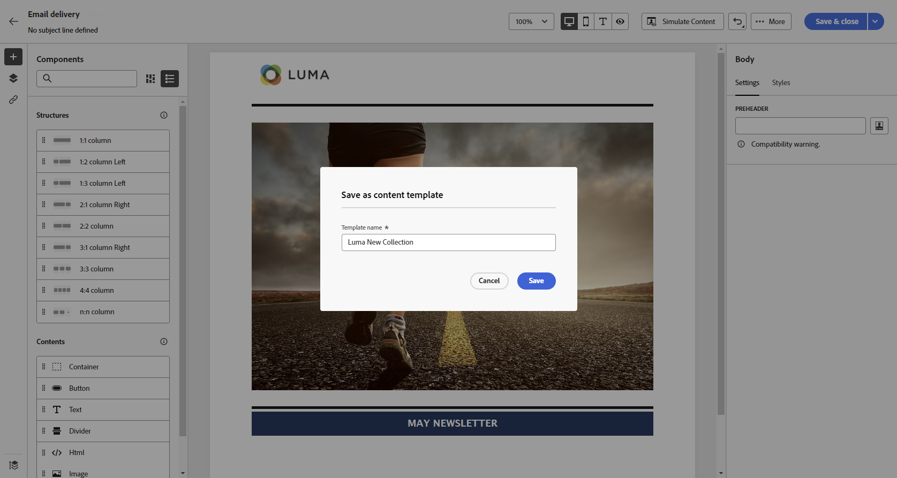

# 使用電子郵件內容範本 {#email-content-templates}

>[!NOTE]
>
>本檔案正在建置中，且經常更新。 此內容的最終版本將於2023年1月推出。

使用 **[!UICONTROL 選取設計範本]** 區段，開始從範本建立內容。

您可以選擇：
* 20個現成可用的電子郵件範本。
* 已儲存的範本. [了解更多](#save-as-template)

## 另存為範本 {#save-as-template}

設計好電子郵件內容後，您就可以儲存它，以供日後重複使用。 請依照下列步驟以執行此操作。

1. 按一下螢幕右上方的刪節號。

1. 選擇 **[!UICONTROL 儲存設計範本]** 從下拉式功能表。

   

1. 為此模板添加名稱。

   

1. 按一下 **[!UICONTROL 儲存]**.

下次您建立電子郵件時，可以使用此範本來建置內容。 [了解如何](#use-saved-template)

## 使用已儲存的範本 {#use-saved-template}

1. 開啟 [電子郵件設計工具](create-email-content.md).

1. 在 **[!UICONTROL 建立您的電子郵件畫面]**, **[!UICONTROL 範本範例]** 標籤。 選取 **[!UICONTROL 已儲存的範本]** 標籤。

   

1. 先前所有的清單 [已儲存的範本](#save-as-template) 顯示。 你可以對它們進行排序 **[!UICONTROL 依名稱]**, **[!UICONTROL 上次修改時間]** 和 **[!UICONTROL 上次建立時間]**.

   

1. 從清單中選取您選取的範本。

1. 選取後，您可以使用左右箭頭在所有儲存的範本之間導覽。

   

1. 按一下 **[!UICONTROL 使用此電子郵件]** 在螢幕的右上角。

1. 使用電子郵件設計工具，視需要編輯內容。
