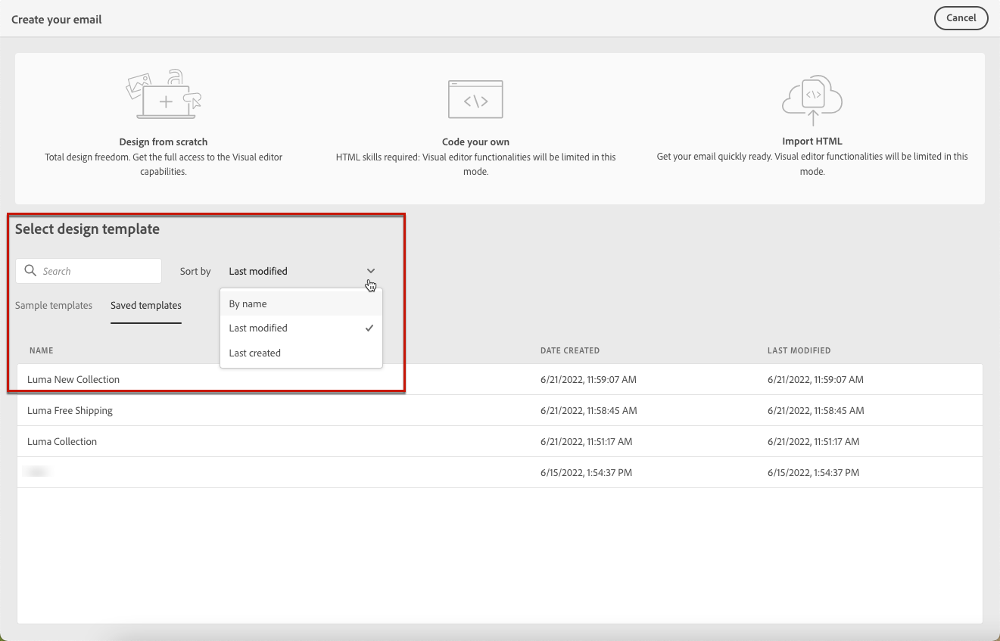

# 使用電子郵件範本 {#email-content-templates}

時間 [建立電子郵件](../email/create-email.md)，使用 **[!UICONTROL 選取設計範本]** 部分 **[!UICONTROL 建立您的電子郵件]** 介面以開始從範本建立您的內容。

您可以選擇：

* **範例範本**. Campaign隨附一組內建範本，供您選擇。

* **已儲存的範本**. 您也可以使用從現有內容另存為範本的自訂範本。

在以下各節中瞭解如何使用範本以及如何將電子郵件內容另存為範本。

## 使用範本 {#use-templates}

若要使用其中一個範例或儲存的範本開始建立您的內容，請遵循下列步驟。

1. 開啟 [電子郵件設計工具](create-email-content.md).

1. 在「**[!UICONTROL 建立您的電子郵件]**」畫面，「**[!UICONTROL 範例範本]**」索引標籤預設為選取狀態。

1. 若要使用現有的自訂範本，請瀏覽至 **[!UICONTROL 已儲存的範本]** 標籤。

   

1. 所有[儲存的範本](#save-as-template)的清單會顯示。你可以&#x200B;**[!UICONTROL 依名稱]**、**[!UICONTROL 上次修改日期]**&#x200B;和&#x200B;**[!UICONTROL 上次建立日期]**&#x200B;來排序儲存的範本。

   

1. 從清單中選取範本以顯示其內容。

1. 使用向右和向左箭頭在範本之間導覽（範例或儲存取決於您的選擇）。

   

1. 按一下 **[!UICONTROL 使用此範本]** 在畫面的右上方。

1. 使用電子郵件設計工具依需要編輯您的內容。[了解更多](create-email-content.md)

## 將電子郵件內容另存為範本 {#save-as-template}

一旦您 [設計電子郵件](create-email-content.md)，您可以將此內容儲存為範本以供日後重複使用。 儲存的範本可供 Adobe Campaign 環境的所有使用者使用。

若要將電子郵件內容另存為範本，請依照以下步驟操作：

1. 在電子郵件設計工具中，按一下畫面右上方的省略符號。

1. 選取 **[!UICONTROL 另存為內容範本]** 從下拉式功能表。

   

1. 輸入並儲存此範本名稱.

   

您現在可以 [使用此範本](#use-templates) 若要建立新內容：此頁面位於 **[!UICONTROL 已儲存的範本]** 電子郵件設計工具的索引標籤。

