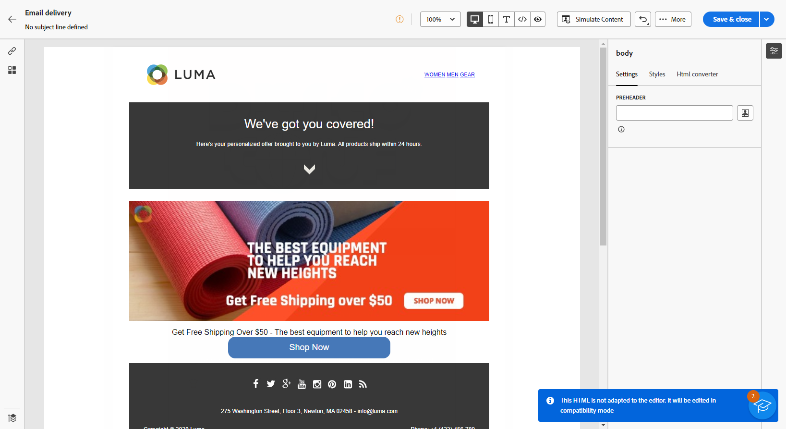

# Import your email content {#existing-content}

The Email designer allows you to import existing HTML content. This content can be:

* An **HTML file** with an incorporated style sheet,
* A **.zip folder** with the HTML file, the style sheet (.css) and images.

    >[!NOTE]
    >
    >There are no constraints on the .zip file structure. However, references must to be relative and fit with the tree structure of the .zip folder.

To import a file containing HTML content, follow the steps below:

1. In the Email Designer home page, select **[!UICONTROL Import HTML]**.

    

1. Drag and drop the HTML or .zip file containing your HTML content and click **[!UICONTROL Import]**.

1. Once the HTML content is uploaded, you can leverage the Email Designer capabilities to edit and preview your email. [Learn more in this section](create-email-content.md).

    