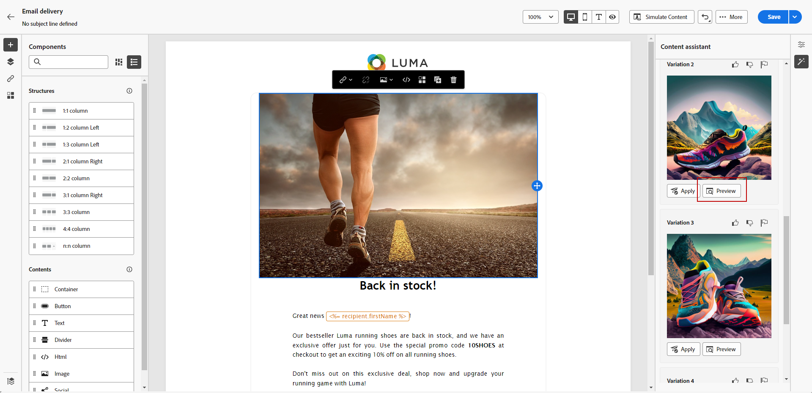
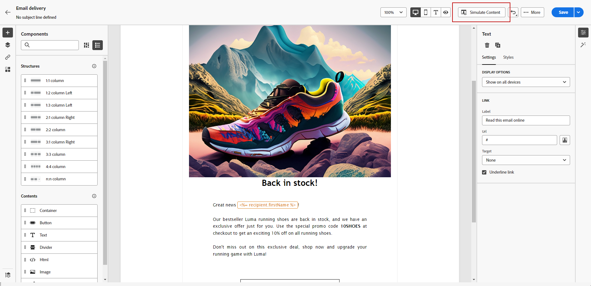

# 使用內容助理產生影像 {#generative-image}

在您製作和個人化電子郵件後，可以使用內容助理來增強您的內容。 此功能可簡化個人化和內容改善的程式。

在下列範例中，如何運用內容助理來最佳化和改善您的內容，確保更人性化的使用體驗。 請按照以下步驟操作：

1. 建立及設定電子郵件傳遞後，請按一下 **[!UICONTROL 編輯內容]**.

   有關如何設定電子郵件傳送的詳細資訊，請參閱 [此頁面](../content/create-email-content.md).

1. 填入 **[!UICONTROL 基本詳細資訊]** 您的傳遞內容。 完成後，按一下 **[!UICONTROL 編輯電子郵件內容]**.

1. 選取您要使用內容助理變更的資產。

1. 從右側功能表中選取 **[!UICONTROL 體驗產生]**.

   

1. 新增提示以更好地微調您的結果。

   

1. 選取 **[!UICONTROL 上傳檔案]** 如果您想要新增行銷簡報，為內容助理提供更多內容。

   您也可以按一下 **[!UICONTROL 上傳的內容]** 以尋找先前更新的檔案。

1. 選取 **[!UICONTROL 外觀比例]** ，則不會產生任何影響。 這會決定資產的寬度和高度。

   您可以選擇一般比例，如16:9、4:3、3:2或1:1，也可以輸入自訂大小。

1. 自訂 **[!UICONTROL 色彩和色調]**， **[!UICONTROL 內容型別]**， **[!UICONTROL 照明]** 和 **[!UICONTROL 組合]** 設定以符合您所需的資產特性。

   

1. 在您滿意提示設定後，請按一下 **[!UICONTROL 產生]**.

1. 瀏覽 **[!UICONTROL 變數建議]** 以尋找所需的資產。 按一下 **[!UICONTROL 預覽]** 以檢視所選變數的全熒幕版本。

   

1. 按一下 **[!UICONTROL 選取]** 找到適當的內容之後。

   

1. 定義訊息內容後，按一下 **[!UICONTROL 模擬內容]** 按鈕來控制呈現，並使用測試設定檔檢查個人化設定。  [了解更多](../preview-test/preview-content.md)

   

1. 當您定義內容、對象和排程時，就能準備電子郵件傳送。 [了解更多](../monitor/prepare-send.md)