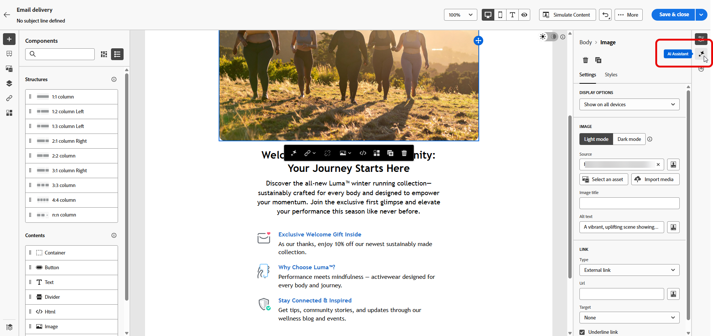
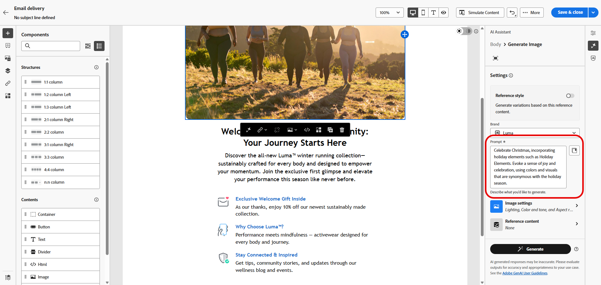
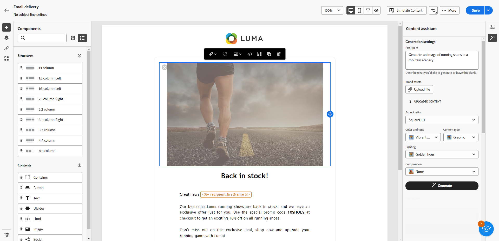
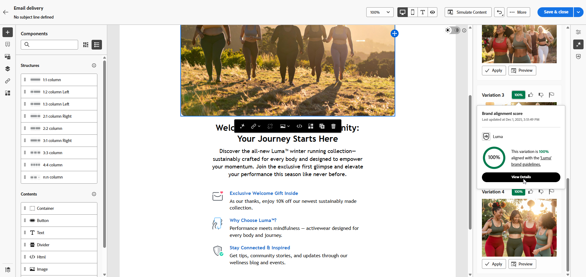
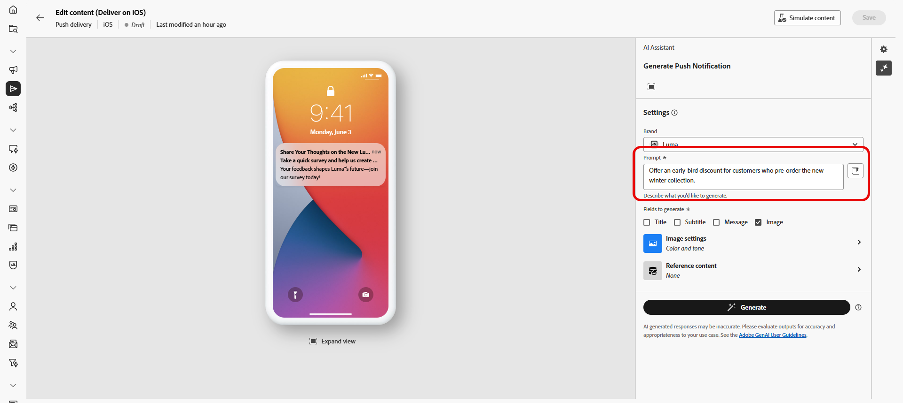
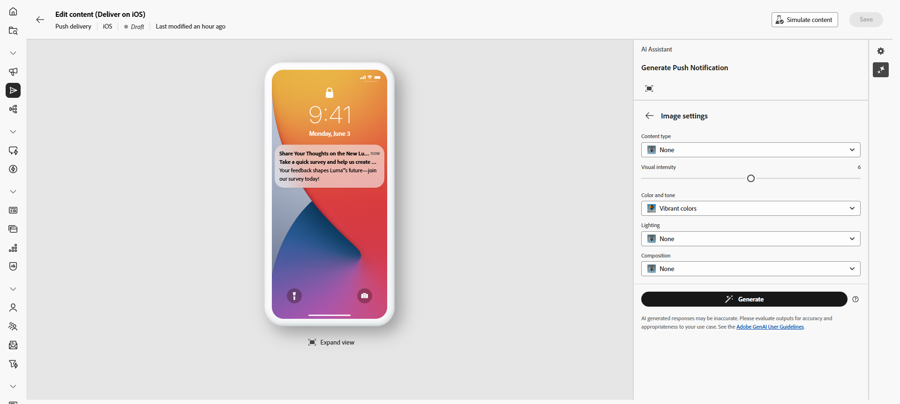
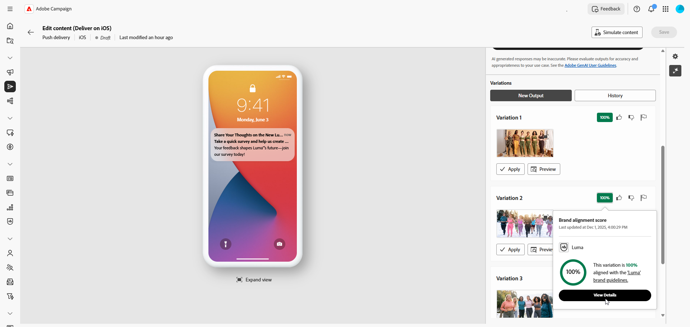

# 使用AI助理產生影像 {#generative-image}

>[!IMPORTANT]
>
>開始使用此功能之前，請先閱讀相關的[護欄和限制](generative-gs.md#generative-guardrails)。
> 
>
>您必須先同意[使用者合約](https://www.adobe.com/tw/legal/licenses-terms/adobe-dx-gen-ai-user-guidelines.html){target="_blank"}，才能在Adobe Campaign Web中使用AI小幫手。 如需詳細資訊，請聯絡您的 Adobe 代表。

在Adobe Campaign網頁中使用AI助理建立吸引人的視覺內容，以增強電子郵件、網頁、登陸頁面和推播通知中的訊息。 AI Assistant可協助您產生和最佳化影像，確保您的內容在視覺上吸引人並與您的品牌保持一致。

## 適用於電子郵件與登陸頁面 {#email-web-channels}

AI助理可以為您的電子郵件行銷活動和登入頁面產生完整的視覺體驗。 此功能可讓您在品牌上製作吸引目光的影像，並在數位接觸點與您的對象產生共鳴。

### 存取及設定 {#access-configure}

若要開始使用AI助理產生影像，請先設定您的傳送並開啟內容編輯器。 請依照下列步驟準備您的工作區並存取AI Assistant面板。

1. 建立及設定您的傳遞：

   * **電子郵件**：建立並設定您的電子郵件傳遞後，請按一下&#x200B;**[!UICONTROL 編輯內容]**。 [了解更多](../email/create-email-content.md)
   * **登陸頁面**：建立並設定您的登陸頁面後，請按一下&#x200B;**[!UICONTROL 編輯內容]**。 [了解更多](../landing-pages/create-lp.md)

1. 選取您要使用AI助理變更的資產，並存取&#x200B;**[!UICONTROL AI助理]**&#x200B;功能表。

   {zoomable="yes"}

### 產生內容 {#generate-content}

1. 啟用AI助理的&#x200B;**[!UICONTROL 參考樣式]**&#x200B;選項，以根據選取的內容個人化新內容。

1. 選取您的&#x200B;**[!UICONTROL 品牌]**，以確保AI產生的內容符合您的品牌規格。 [進一步瞭解](brands.md)品牌。

1. 描述您要在&#x200B;**[!UICONTROL 提示]**&#x200B;欄位中產生的內容，以微調內容。

   如果您需要製作提示的協助，請存取&#x200B;**[!UICONTROL 提示程式庫]**，它提供各種不同的提示概念，以改進您的傳遞。 [進一步瞭解提示最佳實務](ai-assistant-prompting-guide.md)

   {zoomable="yes"}

1. 使用&#x200B;**[!UICONTROL 影像設定]**&#x200B;選項量身打造您的提示：

   * **[!UICONTROL 外觀比例]**：決定資產的寬度和高度。 從一般比率（例如16:9、4:3、3:2或1:1）中選擇，或輸入自訂大小。
   * **[!UICONTROL 內容型別]**：將視覺元素的本質分類，區分不同的視覺呈現形式，例如像片、圖形或藝術品。
   * **[!UICONTROL 視覺強度]**：調整影像的強度，控制影像的影響。 較低的設定(2)可建立較柔和的外觀，而較高的設定(10)則使影像更鮮豔。
   * **[!UICONTROL 色彩和色調]**：調整色彩的整體外觀以及傳達的氣氛或氣氛。
   * **[!UICONTROL 光線]**：修改影像中的光線，以調整其氣氛並反白顯示特定元素。
   * **[!UICONTROL 構成]**：在影像框架中排列元素。

     {zoomable="yes"}

1. 從&#x200B;**[!UICONTROL 參考內容]**&#x200B;功能表，按一下&#x200B;**[!UICONTROL 上傳檔案]**&#x200B;以新增任何品牌資產，該資產包含可提供額外內容AI助理的內容或選取先前上傳的內容。

   先前上傳的檔案可在&#x200B;**[!UICONTROL 已上傳的參考內容]**&#x200B;下拉式清單中使用。 只需切換您要納入產生代的資產。

1. 在您滿意提示組態之後，請按一下[產生]。****

### 精簡並完成 {#refine-finalize}

1. 瀏覽產生的&#x200B;**[!UICONTROL 變數]**。

1. 按一下百分比圖示可檢視您的&#x200B;**[!UICONTROL 品牌一致性分數]**，並識別與您的品牌之間的任何不一致性。

   深入瞭解[品牌一致性分數](../content/brands-score.md)。

   {zoomable="yes"}

1. 按一下&#x200B;**[!UICONTROL 預覽]**&#x200B;以檢視所選變數的全熒幕版本，或按一下&#x200B;**[!UICONTROL 套用]**&#x200B;以取代您目前的內容。

1. 如果要檢視與此變體相關的影像，請選擇&#x200B;**[!UICONTROL 產生類似專案]**。

1. 開啟&#x200B;**[!UICONTROL 品牌一致性]**&#x200B;標籤，檢視您的內容如何與您的[品牌指南](../content/brands.md)一致。

1. 找到適當的內容後，按一下&#x200B;**[!UICONTROL 選取]**。

1. 定義訊息內容後，按一下&#x200B;**[!UICONTROL 模擬內容]**&#x200B;按鈕以控制轉譯，並使用測試設定檔檢查個人化設定。 [了解更多](../preview-test/preview-content.md)

1. 檢閱並啟用您的內容：
   * **電子郵件**：當您定義內容、對象和排程時，就可以準備電子郵件傳遞了。 [了解更多](../monitor/prepare-send.md)
   * **登陸頁面**：一旦您的登陸頁面準備就緒，您就可以發佈該頁面，以供訊息使用。 [了解更多](../landing-pages/create-lp.md)

## 適用於行動裝置頻道 {#mobile-channels}

AI Assistant可讓您產生推播通知和SMS訊息的吸引人文字，協助您建立行動通訊，以在所有行動接觸點吸引注意力和與對象產生共鳴。

### 存取及設定 {#mobile-access-configure}

若要開始使用AI助理為行動裝置頻道產生文字，請先設定您的傳送並開啟AI助理。 存取AI Assistant的步驟會因您使用的推播通知或SMS訊息而略有不同。

1. 建立及設定您的行動傳送：

   * **推播通知**：建立並設定您的推播通知傳遞後，請按一下&#x200B;**[!UICONTROL 編輯內容]**。 [了解更多](../push/create-push.md)
   * **簡訊**：建立並設定您的簡訊傳遞後，請按一下&#x200B;**[!UICONTROL 編輯內容]**。 [了解更多](../sms/create-sms.md)

1. 填寫傳遞的&#x200B;**[!UICONTROL 基本詳細資料]**。 完成後，按一下&#x200B;**[!UICONTROL 編輯內容]**。

1. 視需要個人化您的訊息：

   * **推播通知**： [深入瞭解](../push/content-push.md)
   * **簡訊**： [深入瞭解](../sms/content-sms.md)

1. 存取&#x200B;**[!UICONTROL 顯示AI助理]**&#x200B;功能表。

   ![顯示[顯示AI小幫手]功能表的熒幕擷圖](assets/push-img-1.png){zoomable="yes"}

### 產生內容 {#mobile-generate-content}

存取AI Assistant後，您可以調整產生設定，以建立符合您品牌並支援您目標的影像。

1. 選取您的&#x200B;**[!UICONTROL 品牌]**，以確保AI產生的內容符合您的品牌規格。 [進一步瞭解](brands.md)品牌。

1. 說明您要在&#x200B;**[!UICONTROL 提示]**&#x200B;欄位中產生的內容，以微調內容。

   如果您正在尋求製作提示的協助，請存取&#x200B;**[!UICONTROL 提示資料庫]**，其中提供各種提示概念，以改進您的行銷活動。 [進一步瞭解提示最佳實務](ai-assistant-prompting-guide.md)

   {zoomable="yes"}

1. 選取&#x200B;**[!UICONTROL 影像]**&#x200B;以僅產生資產。

1. 選擇您的&#x200B;**[!UICONTROL 影像設定]**：

   * **[!UICONTROL 內容型別]**：將視覺元素的本質分類，區分不同的視覺呈現形式，例如像片、圖形或藝術品。
   * **[!UICONTROL 視覺強度]**：調整影像的強度，控制影像的影響。 較低的設定(2)可建立更柔和、更克制的外觀，而較高的設定(10)則可讓影像更生動、視覺效果更強大。
   * **[!UICONTROL 光線]**：調整影像中的光線，以調整其大氣的形狀，並反白顯示特定的元素。
   * **[!UICONTROL 構成]**：在影像框架中排列元素。

     {zoomable="yes"}

1. 從&#x200B;**[!UICONTROL 參考內容]**&#x200B;功能表，按一下&#x200B;**[!UICONTROL 上傳檔案]**&#x200B;以新增任何品牌資產，該資產包含可提供額外內容AI助理的內容或選取先前上傳的內容。

   先前上傳的檔案可在&#x200B;**[!UICONTROL 已上傳的參考內容]**&#x200B;下拉式清單中使用。 只需切換您要納入產生代的資產。

1. 提示就緒後，請按一下[產生]。****

### 精簡並完成 {#mobile-refine-finalize}

產生行動訊息的影像變化後，您可以微調結果以確保其符合您的確切需求。

1. 產生之後，瀏覽&#x200B;**[!UICONTROL 變數]**。

1. 按一下百分比圖示可檢視您的&#x200B;**[!UICONTROL 品牌一致性分數]**，並識別與您的品牌之間的任何不一致性。

   深入瞭解[品牌一致性分數](../content/brands-score.md)。

   {zoomable="yes"}

1. 按一下&#x200B;**[!UICONTROL 預覽]**&#x200B;瀏覽&#x200B;**[!UICONTROL 變化]**。

1. 開啟&#x200B;**[!UICONTROL 品牌一致性]**&#x200B;標籤，檢視您的內容如何與您的[品牌指南](brands.md)一致。

1. 找到適當的內容後，按一下&#x200B;**[!UICONTROL 選取]**。

定義內容、對象和排程後，請準備推送傳送。 [了解更多](../monitor/prepare-send.md)
