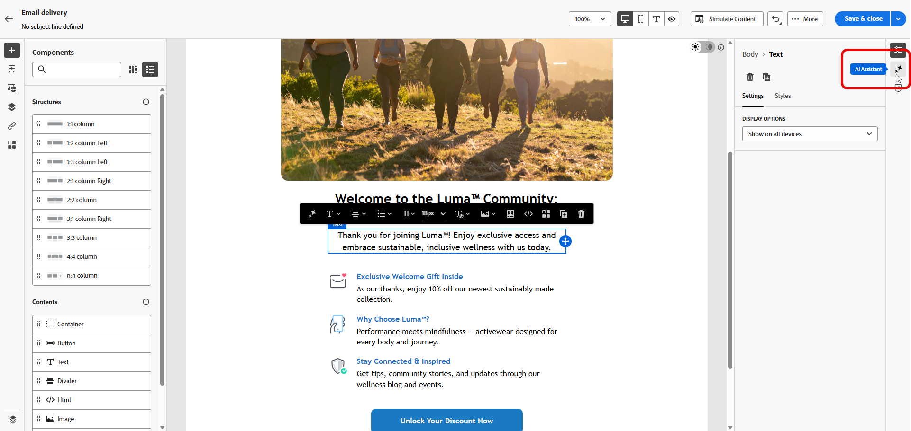
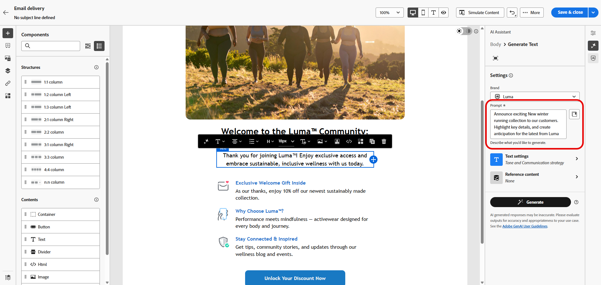
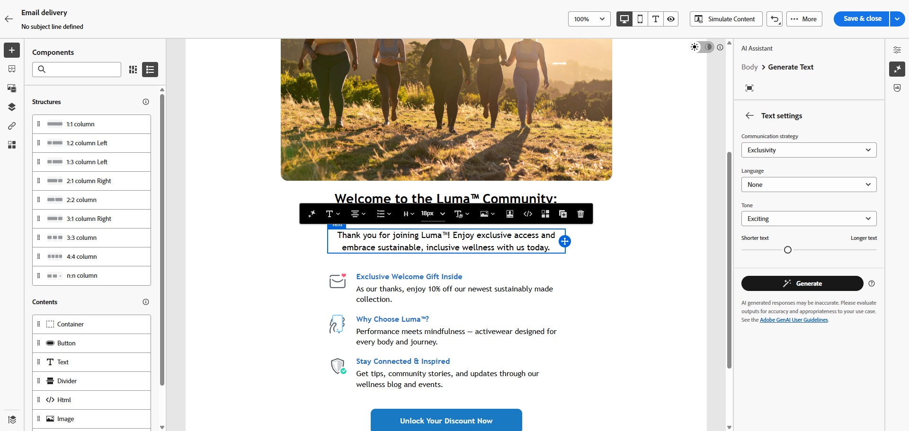
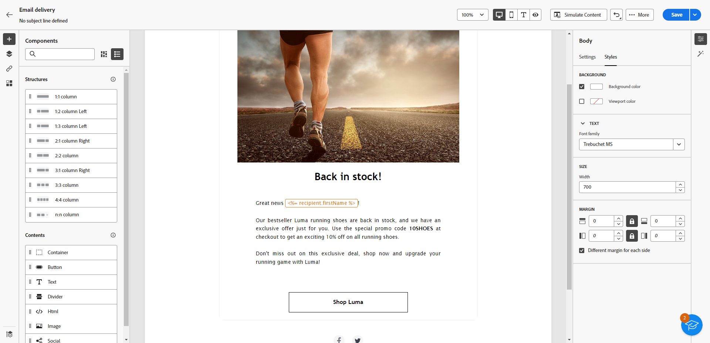
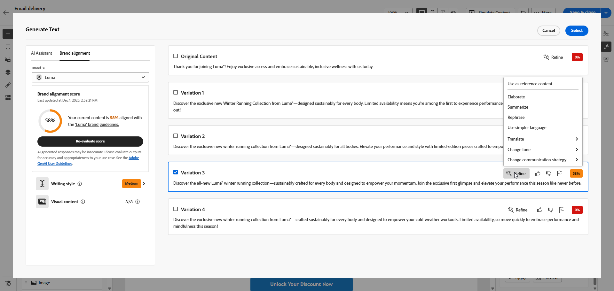
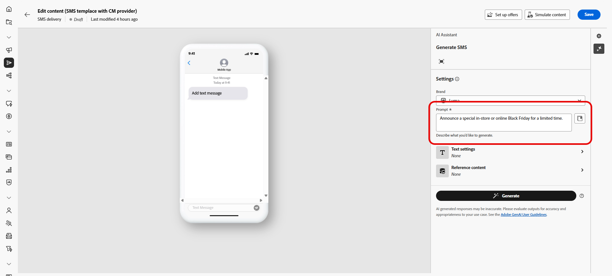
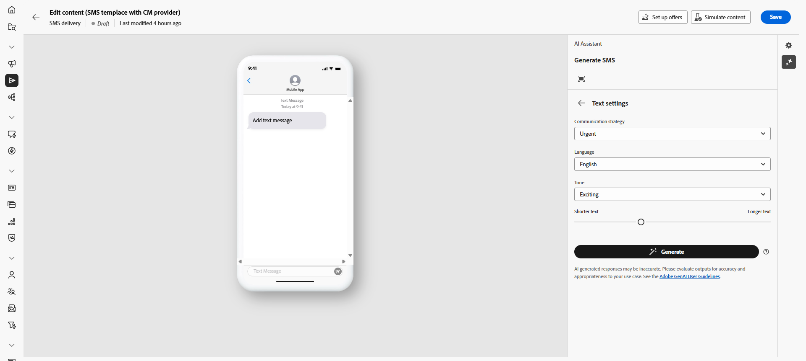
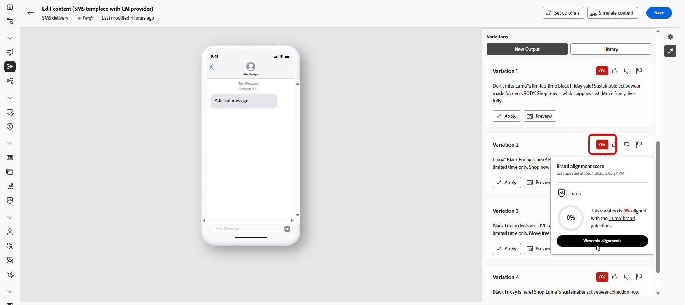
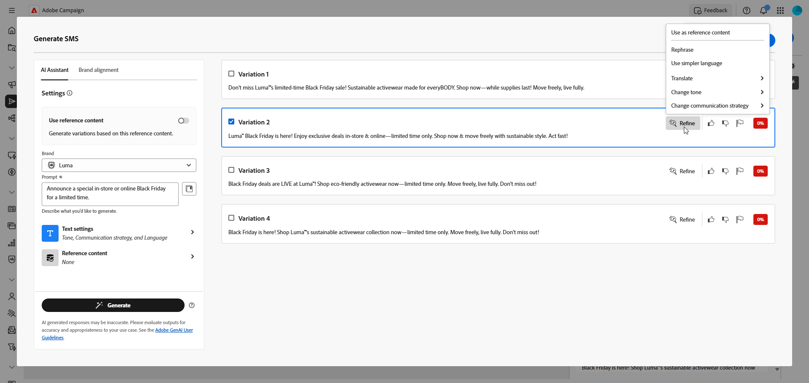

# 使用AI助理產生文字 {#generative-text}

>[!IMPORTANT]
>
>開始使用此功能之前，請先閱讀相關的[護欄和限制](generative-gs.md#generative-guardrails)。
> 
>
>您必須先同意[使用者合約](https://www.adobe.com/tw/legal/licenses-terms/adobe-dx-gen-ai-user-guidelines.html){target="_blank"}，才能在Adobe Campaign Web中使用AI小幫手。 如需詳細資訊，請聯絡您的 Adobe 代表。

使用Adobe Campaign網路中的AI助理產生吸引人的文字，與您的對象產生共鳴。 無論您是要增強電子郵件復本、製作有說服力的登陸頁面內容、撰寫推播通知訊息，還是撰寫SMS文字，AI Assistant都能協助您提供清晰、具影響力的通訊。

## 適用於電子郵件與登陸頁面 {#email-web-channels}

AI助理可以為您的電子郵件傳遞和登陸頁面產生高品質的文字內容。 此功能可讓您建立引人入勝的品牌內傳訊功能，透過數位接觸點與您的對象連結。

### 存取及設定 {#access-configure}

開始使用AI助理產生文字內容之前，您需要設定您的傳送並存取內容編輯器。 按照以下步驟準備您的工作區並開啟AI助理面板。

1. 建立及設定您的傳遞：

   * **電子郵件**：建立並設定您的電子郵件傳遞後，請按一下&#x200B;**[!UICONTROL 編輯內容]**。 [了解更多](../email/create-email-content.md)
   * **登陸頁面**：建立並設定您的登陸頁面後，請按一下&#x200B;**[!UICONTROL 編輯內容]**。 [了解更多](../landing-pages/create-lp.md)

1. 選取&#x200B;**[!UICONTROL 文字元件]**&#x200B;以鎖定特定內容，並存取&#x200B;**[!UICONTROL AI助理]**&#x200B;功能表。

   {zoomable="yes"}

### 產生內容 {#generate-content}

瞭解如何使用AI Assistant製作清晰的提示、微調設定並產生量身打造的文字，以確保您的訊息符合您的品牌和溝通目標。

1. 選取您的&#x200B;**[!UICONTROL 品牌]**，以確保AI產生的內容符合您的品牌規格。 [進一步瞭解](brands.md)品牌。

1. 描述您要在&#x200B;**[!UICONTROL 提示]**&#x200B;欄位中產生的內容，以微調內容。

   如果您需要製作提示的協助，請存取&#x200B;**[!UICONTROL 提示程式庫]**，它提供各種不同的提示概念，以改進您的傳遞。 [進一步瞭解提示最佳實務](ai-assistant-prompting-guide.md)

   {zoomable="yes"}

1. 使用&#x200B;**[!UICONTROL 文字設定]**&#x200B;選項量身打造您的提示：

   * **[!UICONTROL 通訊策略]**：選擇最適合您產生文字的通訊樣式。
   * **[!UICONTROL 語言]**：選擇您產生內容的語言。
   * **[!UICONTROL 語調]**：確定您的電子郵件語調可與您的對象產生共鳴。 無論您是要提供豐富資訊、好玩或有說服力的聲音，AI Assistant都會據以調整訊息。
   * **文字長度**：使用滑桿來選取所要的文字長度。

     {zoomable="yes"}

1. 從&#x200B;**[!UICONTROL 參考內容]**&#x200B;功能表，按一下&#x200B;**[!UICONTROL 上傳檔案]**&#x200B;以新增任何品牌資產，該資產包含可提供額外內容AI助理的內容或選取先前上傳的內容。

   先前上傳的檔案可在&#x200B;**[!UICONTROL 已上傳的參考內容]**&#x200B;下拉式清單中使用。 只需切換您要納入產生代的資產。

1. 提示就緒後，請按一下[產生]。****

### 精簡並完成 {#refine-finalize}

瞭解如何檢閱產生的文字、進行微調並套用個人化來最終確定您的內容、建立經過微調並準備傳送的互動訊息。

1. 瀏覽產生的&#x200B;**[!UICONTROL 變數]**。

1. 按一下百分比圖示可檢視您的&#x200B;**[!UICONTROL 品牌一致性分數]**，並識別與您的品牌之間的任何不一致性。

   深入瞭解[品牌一致性分數](brands-score.md)。

   {zoomable="yes"}

1. 按一下&#x200B;**[!UICONTROL 預覽]**&#x200B;以檢視所選變數的全熒幕版本，或按一下&#x200B;**[!UICONTROL 套用]**&#x200B;以取代您目前的內容。

1. 導覽至&#x200B;**[!UICONTROL 預覽]**&#x200B;視窗中的&#x200B;**[!UICONTROL 調整]**&#x200B;選項，以存取其他自訂功能：

   * **[!UICONTROL 使用作為參考內容]**：選擇的變體作為參考內容以產生其他結果。
   * **[!UICONTROL 精心設計]**：展開特定主題，提供更多詳細資訊，以增進瞭解與參與。
   * **[!UICONTROL 摘要]**：將關鍵點濃縮為清晰、簡潔的摘要，以吸引注意並鼓勵進一步閱讀。
   * **[!UICONTROL 重述]**：以不同的方式重述您的訊息，讓您的寫作保持新鮮，並吸引不同受眾。
   * **[!UICONTROL 使用較簡單的語言]**：簡化您的語言，確保更廣大的受眾能夠清楚無誤地使用。
   * **[!UICONTROL 翻譯]**：簡化您的語言，確保更廣大的受眾能清楚無誤地瞭解。

   您也可以變更文字的&#x200B;**[!UICONTROL 音調]**&#x200B;和&#x200B;**[!UICONTROL 通訊策略]**。

   {zoomable="yes"}

1. 開啟&#x200B;**[!UICONTROL 品牌一致性]**&#x200B;標籤，檢視您的內容如何與您的[品牌指南](../content/brands.md)一致。

1. 找到適當的內容後，按一下&#x200B;**[!UICONTROL 選取]**。

1. 插入個人化欄位，以根據設定檔資料自訂您的內容。 然後，按一下&#x200B;**[!UICONTROL 模擬內容]**&#x200B;按鈕以控制轉譯，並使用測試設定檔檢查個人化設定。 [了解更多](../preview-test/preview-content.md)

1. 檢閱並啟用您的內容：
   * **電子郵件**：當您定義內容、對象和排程時，就可以準備電子郵件傳遞了。 [了解更多](../monitor/prepare-send.md)
   * **登陸頁面**：一旦您的登陸頁面準備就緒，您就可以發佈該頁面，以供訊息使用。 [了解更多](../landing-pages/create-lp.md)

## 適用於行動裝置頻道 {#mobile-channels}

AI Assistant可以為您的推播通知和SMS訊息產生引人入勝的文字內容，幫助您建立吸引人的行動通訊，在所有行動接觸點與您的受眾連線。

### 存取及設定 {#mobile-access-configure}

開始使用AI助理為行動裝置頻道產生文字之前，您必須設定您的傳送並存取AI助理。

1. 建立及設定您的行動傳送：
   * **推播通知**：建立並設定您的推播通知傳遞後，請按一下&#x200B;**[!UICONTROL 編輯內容]**。 [了解更多](../push/create-push.md)
   * **簡訊**：建立並設定您的簡訊傳遞後，請按一下&#x200B;**[!UICONTROL 編輯內容]**。 [了解更多](../sms/create-sms.md)

1. 填寫傳遞的&#x200B;**[!UICONTROL 基本詳細資料]**。 完成後，按一下&#x200B;**[!UICONTROL 編輯內容]**。

1. 視需要個人化您的訊息：
   * **推播通知**： [深入瞭解](../push/content-push.md)
   * **簡訊**： [深入瞭解](../sms/content-sms.md)

1. 存取&#x200B;**[!UICONTROL 顯示AI助理]**&#x200B;功能表。

   ![顯示[顯示AI小幫手]功能表的熒幕擷圖](assets/sms-genai-1.png){zoomable="yes"}

### 產生內容 {#mobile-generate-content}

存取AI Assistant後，您可以進行產生設定，以建立符合您品牌和傳送目標的行動內容。 自訂文字引數、新增品牌資產，並提供提示以引導AI產生相關變數。

1. 選取您的&#x200B;**[!UICONTROL 品牌]**，以確保AI產生的內容符合您的品牌規格。 [進一步瞭解](brands.md)品牌。

1. 說明您要在&#x200B;**[!UICONTROL 提示]**&#x200B;欄位中產生的內容，以微調內容。

   如果您正在尋求製作提示的協助，請存取&#x200B;**[!UICONTROL 提示程式庫]**，它提供各種提示概念，以改進您的傳遞。 [進一步瞭解提示最佳實務](ai-assistant-prompting-guide.md)

   {zoomable="yes"}

1. **針對推播通知**，選擇您要產生的文字欄位： **[!UICONTROL Title]**、**[!UICONTROL Subtitle]**&#x200B;和/或&#x200B;**[!UICONTROL 訊息]**。

1. 使用&#x200B;**[!UICONTROL 文字設定]**&#x200B;選項量身打造您的提示：

   * **[!UICONTROL 通訊策略]**：選擇最適合您產生文字的通訊樣式。
   * **[!UICONTROL 語言]**：選擇您產生內容的語言。
   * **[!UICONTROL 音調]**：音調應該會與您的對象產生共鳴。 無論您是要提供豐富資訊、好玩或有說服力，AI Assistant都能據以調整訊息。
   * **[!UICONTROL 長度]**：使用範圍滑桿選取內容的長度。

     {zoomable="yes"}

1. 從&#x200B;**[!UICONTROL 參考內容]**&#x200B;功能表，按一下&#x200B;**[!UICONTROL 上傳檔案]**&#x200B;以新增任何品牌資產，該資產包含可提供額外內容AI助理的內容或選取先前上傳的內容。

   先前上傳的檔案可在&#x200B;**[!UICONTROL 已上傳的參考內容]**&#x200B;下拉式清單中使用。 只需切換您要納入產生代的資產。

1. 提示就緒後，請按一下[產生]。****

### 精簡並完成 {#mobile-refine-finalize}

產生行動訊息的文字變化後，您可以微調結果以確保其符合您的確切要求。 檢閱品牌一致性、調整語調和語言，並準備內容以進行啟用。

1. 產生之後，瀏覽&#x200B;**[!UICONTROL 變數]**。

1. 按一下百分比圖示可檢視您的&#x200B;**[!UICONTROL 品牌一致性分數]**，並識別與您的品牌之間的任何不一致性。

   深入瞭解[品牌一致性分數](brands-score.md)。

   {zoomable="yes"}

1. 按一下&#x200B;**[!UICONTROL 預覽]**&#x200B;以檢視所選變數的全熒幕版本，或按一下&#x200B;**[!UICONTROL 套用]**&#x200B;以取代您目前的內容。

1. 導覽至&#x200B;**[!UICONTROL 預覽]**&#x200B;視窗中的&#x200B;**[!UICONTROL 調整]**&#x200B;選項，以存取其他自訂功能：

   * **[!UICONTROL 使用作為參考內容]**：選擇的變體將作為參考內容以產生其他結果。

   * **[!UICONTROL 重新寫詞]**：重新寫入郵件，同時保留其意義。 此選項可協助您產生替代用語、改善流量或調整詞句，而不變更核心訊息。

   * **[!UICONTROL 使用較簡單的語言]**：利用AI Assistant簡化您的語言，確保更廣大的受眾擁有清晰易懂的語言。

   * **[!UICONTROL 翻譯]**：簡化您的語言，確保更廣大的受眾能清楚無誤地瞭解。

   * **[!UICONTROL 變更語調]**：調整訊息的語調，以更符合您的通訊風格，例如，讓訊息更友好、更專業、更緊急，或更具啟發性。

   * **[!UICONTROL 變更通訊策略]**：根據您的目標修改傳訊方式，例如建立緊急狀態或強調令人興奮的吸引力。

     {zoomable="yes"}

1. 開啟&#x200B;**[!UICONTROL 品牌一致性]**&#x200B;標籤，檢視您的內容如何與您的[品牌指南](brands.md)一致。

1. 找到適當的內容後，按一下&#x200B;**[!UICONTROL 選取]**。

1. 插入個人化欄位，以根據設定檔資料自訂您的內容。 然後，按一下&#x200B;**[!UICONTROL 模擬內容]**&#x200B;按鈕以控制呈現，並使用測試設定檔檢查個人化設定。 [了解更多](../personalization/personalize.md)

1. 檢閱並啟用您的內容：
   * **推播通知**：當您定義內容、對象和排程時，就可以準備推播通知傳遞。 [了解更多](../push/send-push.md)
   * **簡訊**：一旦您的簡訊準備就緒，您就可以發佈簡訊，以供訊息使用。 [了解更多](../sms/send-sms.md)
