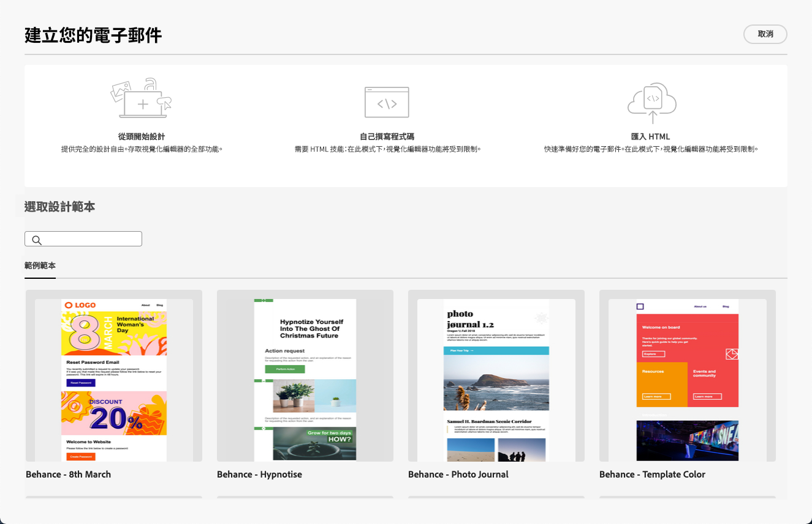

# 開始使用電子郵件設計工具 {#get-started-email-designer}

您可在下列位置匯入現有內容： [!DNL Journey Optimizer] 或運用內容設計功能：

* 使用 [!DNL Campaign] 電子郵件設計功能，可輕鬆建立回應式電子郵件。 [了解更多](create-email-content.md)

* 根據客戶的設定檔屬性建立個人化，以增強客戶體驗。 [了解更多](../personalization/personalize.md)

* 設定條件式內容欄位，以根據收件者的設定檔建立動態個人化。 [了解更多](../personalization/conditions.md)

## 電子郵件設計最佳實務 {#best-practices}

傳送電子郵件時，請務必考慮收件者可能會轉寄電子郵件，這有時會導致電子郵件的轉譯發生問題。 使用電子郵件提供者不支援轉送的CSS類別時，尤其如此，例如，如果您使用「is-desktop-hidden」CSS類別來隱藏行動裝置上的影像。

若要將這些轉譯問題降至最低，建議您儘可能簡化電子郵件設計結構。 請嘗試使用適用於案頭和行動裝置的單一設計，並避免使用複雜的CSS類別或其他設計元素，因為並非所有電子郵件使用者端都完全支援這些元素。 透過遵循這些最佳實務，您可以協助確保您的電子郵件可一致地正確呈現，無論收件者如何檢視或轉寄電子郵件。

## 開始編寫您的內容 {#start-authoring}

從電子郵件傳遞控制面板，前往 [編輯內容](edit-content.md) 畫面以開啟「電子郵件設計工具」首頁。 從那裡，從下列選項中選擇您要如何設計電子郵件：

* **從頭開始設計您的電子郵件** 透過電子郵件設計工具的介面。 瞭解如何在中設計您的電子郵件內容 [本節](create-email-content.md).

* **程式碼或貼上原始HTML** 直接在電子郵件設計工具中建立。 瞭解如何在中編寫您自己的內容 [本節](code-content.md).

* **匯入現有HTML內容** 從檔案或.zip資料夾。 瞭解如何在中匯入電子郵件內容 [本節](existing-content.md).

* **選取現有內容** 內建或自訂範本清單中的。 瞭解如何使用電子郵件範本 [本節](email-templates.md).

   

