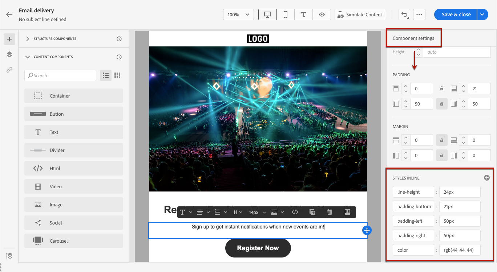
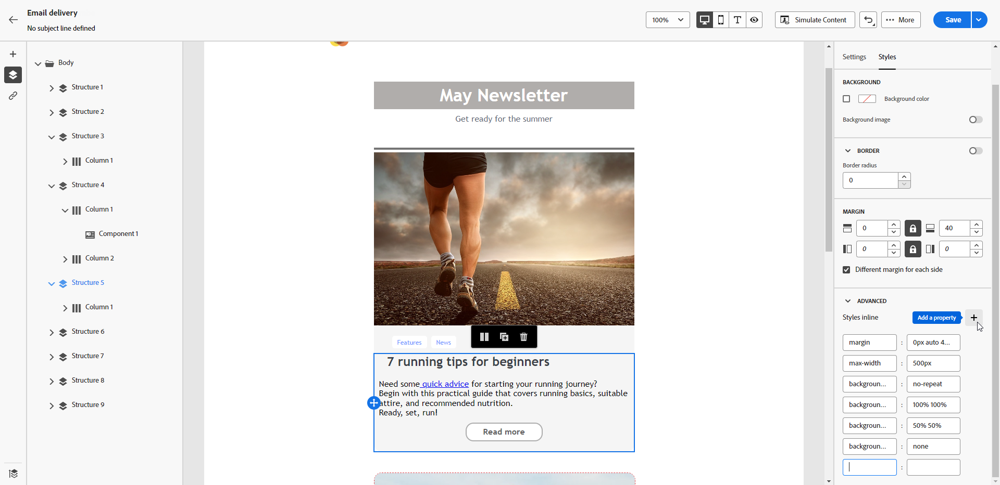

# Add inline styling attributes {#adding-inline-styling-attributes}

In the Email Designer interface, when you select an element and display its settings on the right pane, you can customize the inline attributes and their value for that specific element.

1. Select an component directly in your content or using the **[!UICONTROL Navigation tree]** available in the left pane.

1. From the **[!UICONTROL Component settings]** menu on the right, look for the **[!UICONTROL Styles Inline]** section.

   

1. Modify the values of the existing attributes.

1. You can add new properties using the **+** button. You can add any attribute and value that is CSS-compliant.

   

The styling is applied to the selected element.

>[!NOTE]
>
>If the child elements do not have specific styling attributes defined, the styling of the parent element is inherited.

