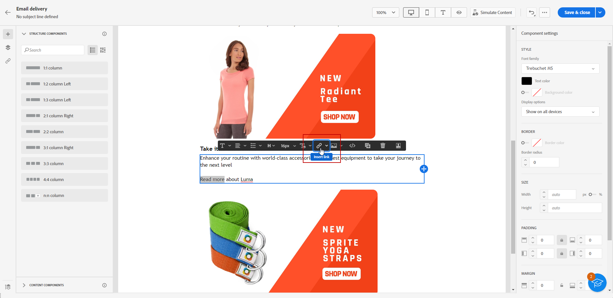
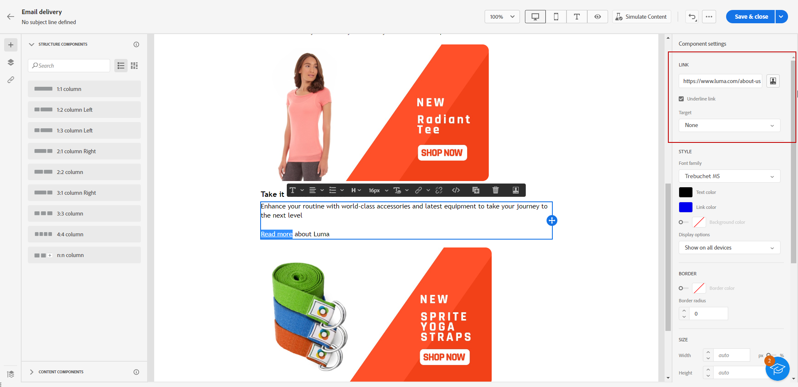
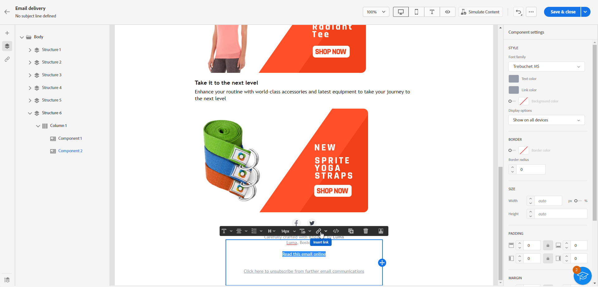
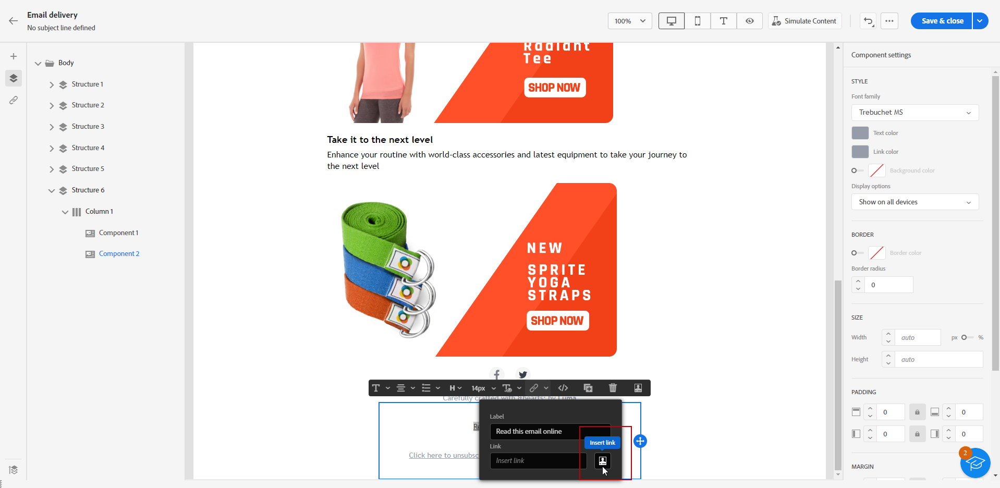
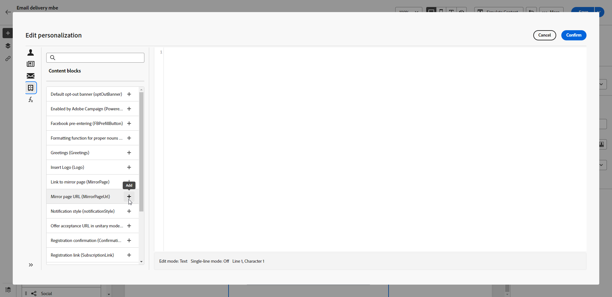
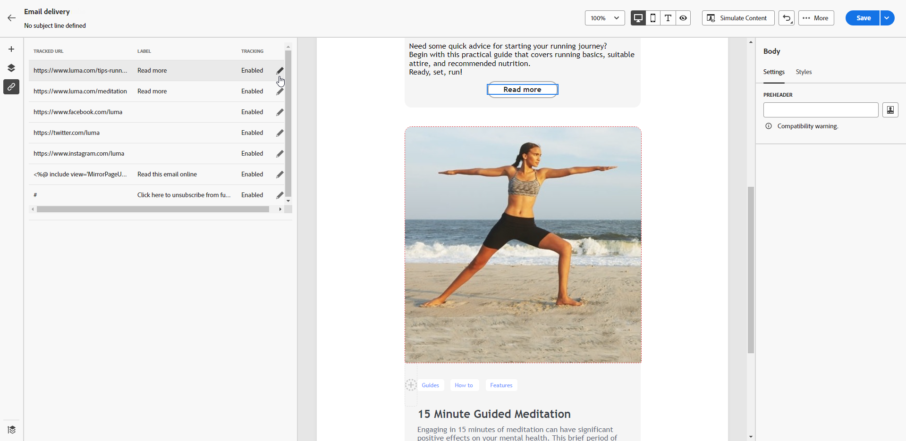
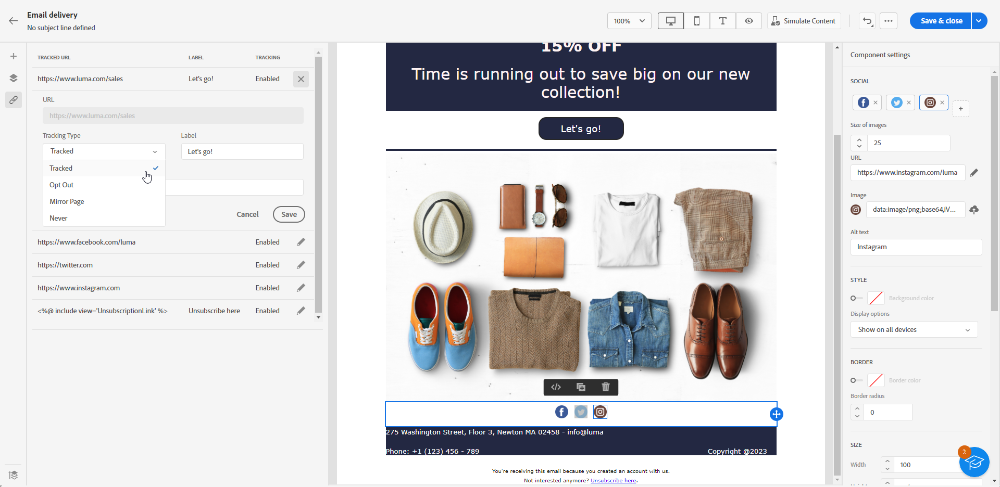
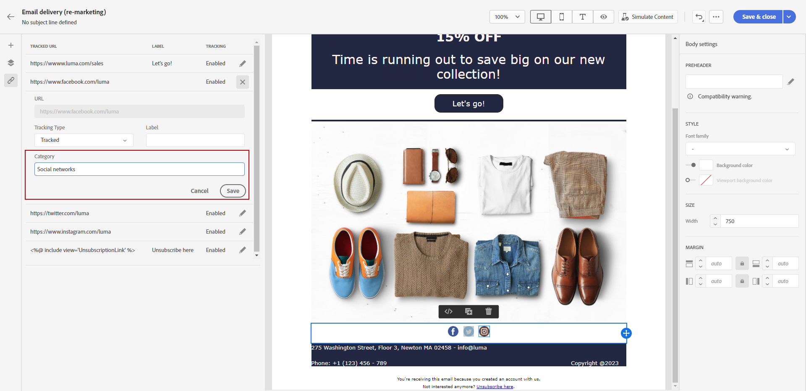

# Add links and track messages {#tracking}

Use the Email designer to add links to your content and track the messages sent in order to monitor the behavior of your recipients.

## Insert links {#insert-links}

When designing a message, you can add links to your content.

>[!NOTE]
>
>When tracking is enabled, all links included in the message content are tracked.

To insert links into your email content, follow the steps below:

1. Select an element and click **[!UICONTROL Insert link]** from the contextual toolbar.

    

1. Add a **[!UICONTROL Label]** and a **[!UICONTROL Link]**.

1. Save your changes.

1. Once the link is created, you can still modify it from the **[!UICONTROL Component settings]** pane on the right. 

    * You can edit the link and change its **[!UICONTROL Target]**.
    * You can choose to underline the link or not by checking the corresponding option.

    

>[!NOTE]
>
>Marketing-type email messages must include an opt-out link, which is not required for transactional messages. The message category (**[!UICONTROL Marketing]** or **[!UICONTROL Transactional]**) is defined at the channel surface (i.e. message preset) level and when creating the message.

## Link to a mirror page {#mirror-page}

The mirror page is an HTML page accessible online via a web browser. Its content is identical to the content of your email.

To add a link to a mirror page in your email:

1. Select an element and click **[!UICONTROL Insert link]** from the contextual toolbar.

    

1. Select the **[!UICONTROL Insert link]** icon to access the personalization menu.

    

1. From the **[!UICONTROL Content block]** menu, select **[!UICONTROL Mirror page URL]** and click **[!UICONTROL Add]**.

    

The mirror page is automatically created.

>[!IMPORTANT]
>
>Mirror pages links are auto-generated and cannot be edited. They contain all the encrypted personalized data that is required to render the original email. As a result, using personalised attributes with large values may generate lengthy mirror pages URLs, which can prevent the link from working in web browsers that have a maximum URLs length.

Once the email is sent, when the recipients click the mirror page link, the content of the email is displayed in their default web browser.

>[!NOTE]
>
>In the test email sent to the test profiles, the link to the mirror page is not active. It is only activated in the final messages.

The retention period for a mirror page is 60 days. After that delay, the mirror page is no longer available.

## Manage tracking {#manage-tracking}

The [Email Designer](create-email-content.md) allows you to manage the tracked URLs, such as editing the tracking type for each link.

1. Click the **[!UICONTROL Links]** icon from the left pane to display the list of all the URLs of your content to be tracked.

    This list enables you to have a centralized view and to locate each URL in the email content.

1. To edit a link, click the corresponding pencil icon.

    

1. You can modify the **[!UICONTROL Tracking Type]** if needed:

   

    For each tracked URL, you can set the tracking mode to one of these values:

    * **[!UICONTROL Tracked]**: Activates tracking on this URL.
    * **[!UICONTROL Opt out]**: Considers this URL as an opt-out or unsubscription URL.
    * **[!UICONTROL Mirror page]**: Considers this URL is a mirror page URL.
    * **[!UICONTROL Never]**: Never activates tracking of this URL. <!--This information is saved: if the URL appears again in a future message, its tracking is automatically deactivated.-->

1. Add a **[!UICONTROL Category]** to your link to group tracked links and click **[!UICONTROL Save]**.

    

1. After sending your delivery, access your delivery report. Under the **[!UICONTROL Tracking]** menu, the **[!UICONTROL URLs and click streams]** report displays which URLs from your delivery are the most visited. [Learn more](../reporting/reports.md)
