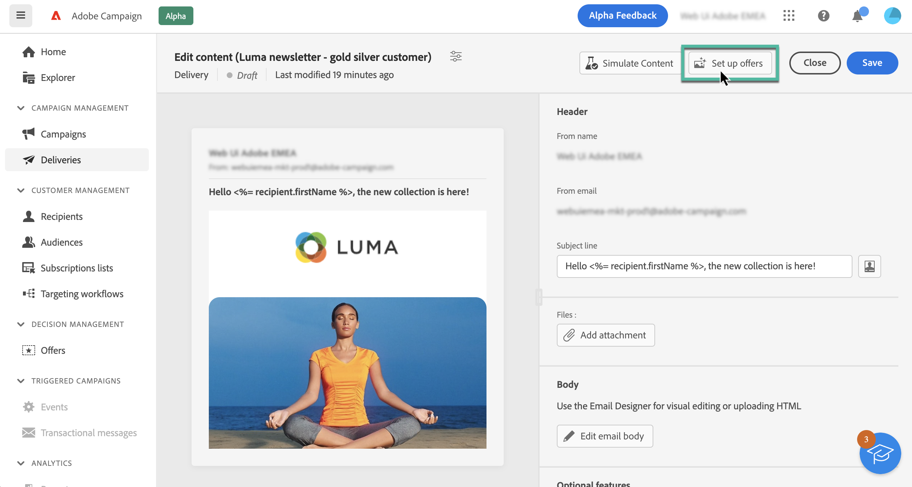
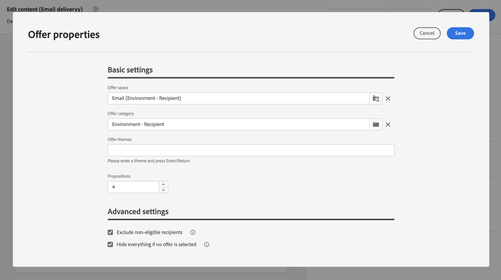
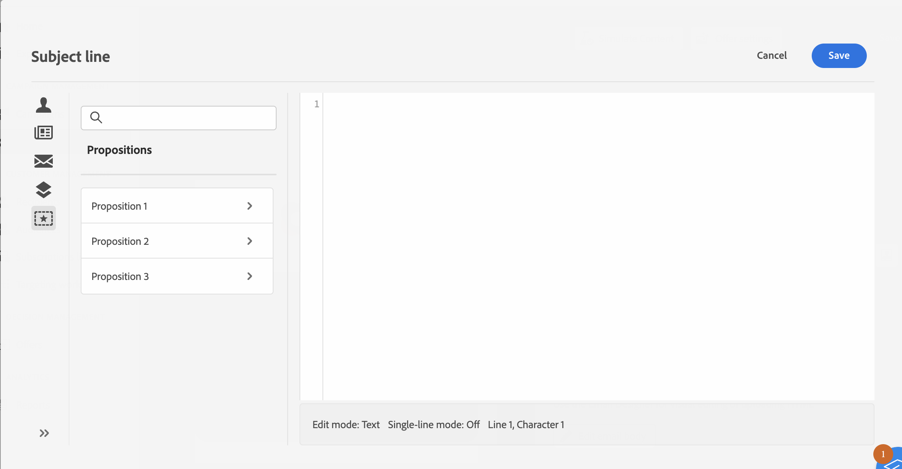
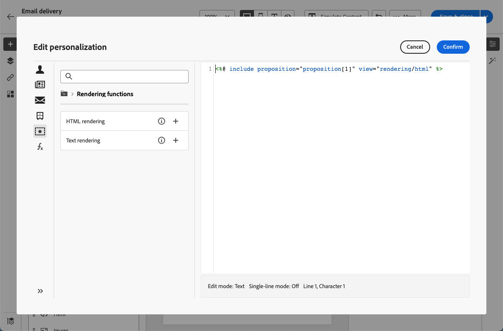

# Send offers {#offers-content}

>[!CONTEXTUALHELP]
>id="acw_deliveries_email_offers_settings"
>title="Offers settings"
>abstract="TBC"

>[!CONTEXTUALHELP]
>id="acw_deliveries_email_offers_advanced_settings"
>title="Offers Advanced Settings"
>abstract="TBC"

Adobe Campaign v8 Web allows you to send with your emails offers that have been created in the console using the **[!UICONTROL Interaction]** module. For more information on Interaction and how to manage an offer catalog in the console, refer to the [Campaign v8 documentation](https://experienceleague.adobe.com/docs/campaign/campaign-v8/offers/interaction.html){target="_blank"}.

The steps to send offers with an email are as follows:

1. [Configure the offers to propose](#configure),
1. [Insert the offers into the email](#insert).

## Configure the offers to propose {#configure}

1. To select the offers to propose in your email, click the **[!UICONTROL Offers]** button from the email content edition screen.

    

1. Configure which offers should be proposed to the recipients. First select the **[!UICONTROL Offer space]** that matches your offer environment.

    

1. To refine the engine's choice of offers, select a specific **[!UICONTROL Offer category]** in which offers are sorted.

    If no category is specified, all the offers contained in the environment are taken into account by the Offer engine, unless an **[!UICONTROL Offer theme]** is selected.

    >[!NOTE]
    >
    >Themes are key words defined upstream in the categories. They act as a filter and let you refine the number of offers to be presented by selecting them in a set of categories. 

1. Use the **[!UICONTROL Propositions]** field to specify the number of offers you want to insert into the email.

1. Select the **[!UICONTROL Exclude non-eligible recipients]** option if necessary.

    This option lets you activate or deactivate the exclusion of recipients for whom there are not enough eligible offers.
    
    * If the option is enabled, recipients who do not have enough propositions are excluded from the delivery.
    * If the option is disabled, these recipients are not excluded but they cannot have the requested number of propositions.

1. If necessary, select the **[!UICONTROL Hide everything if no offer is selected]** option.

    This option lets you choose how the message is processed in case one of the propositions does not exist.
    
    * If the option is enabled, the representation of the missing proposition is not displayed and no content appears in the message for this proposition.
    * If the option is disabled, the message itself is cancelled during sending and recipients can no longer receive any messages.

Once you have configured the offers to propose into your email, you can insert them into the email using the Expression Editor. [Learn how to insert offers into the email](#insert)

## Insert offers into the email {#insert}

Offers can be added into the email using the Expression Editor. They can be inserted either:

* In the email subject line,
* In the email body by allowing personalization in any content component. [Learn how to add content components](content-components.md)

>[!NOTE]
>
>Before inserting an offer, make sure you have [configured which offers to propose with the email](#configure).

To insert an offer using the Expression Editor, follow these steps:

1. Open the Expression Editor, then select the **[!UICONTROL Propositions]** menu.

    Available propositions display in the list. The number of propositions is defined when configuring the offers to propose.

    

1. Add the propositions into the email subject or body using the personalization fields, rendering functions or offer attributes available for each proposition.

    
