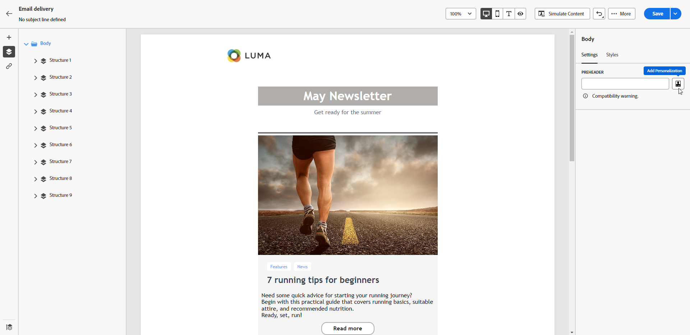

# 新增前置詞 {#preheader}

>[!CONTEXTUALHELP]
>id="ac_edition_preheader"
>title="新增預覽文字"
>abstract="預覽文字指在檢視來自您的電子郵件用戶端的電子郵件時接在主旨行後面的簡短摘要文字。在許多情況下，這段文字會提供電子郵件的簡短摘要，並且長度通常只有一個句子。"

預覽文字指在檢視來自您的電子郵件用戶端的電子郵件時接在主旨行後面的簡短摘要文字。

在許多情況下，這段文字會提供電子郵件的簡短摘要，並且長度通常只有一個句子。

>[!NOTE]
>
>所有電子郵件用戶端均不支援預先標題。 若不支援，則不會顯示預先標題。

若要定義電子郵件預先標題，請遵循下列步驟：

1. 從電子郵件設計工具中，至少新增 **[!UICONTROL 結構元件]** 開始設計電子郵件。

1. 按一下 **[!UICONTROL 導航樹]** 圖示，然後選取 **[!UICONTROL 主體]**.

   

1. 從 **[!UICONTROL 內文設定]** 右窗格，按一下 **[!UICONTROL Preheader]** 欄位來新增內容。

   

1. 新增您的標題。 您可以按一下 **[!UICONTROL 新增個人化]** 表徵圖。

   

1. 從 **[!UICONTROL 編輯個人化]** 視窗中，您可以新增 **[!UICONTROL 內容區塊]**, **[!UICONTROL 動態內容]** 或 **[!UICONTROL 個人化欄位]**.

1. 按一下 **[!UICONTROL 驗證]** 以檢查個人化語法。

1. 按一下 **[!UICONTROL 儲存]**.

您的電子郵件現在已設定前置標題。
