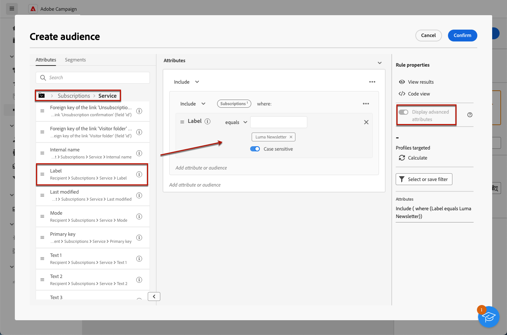

# 傳送訊息給服務的訂閱者

您可以在Adobe Campaign中建立訂閱服務，並傳送訊息給訂閱者。 瞭解如何在中建立訂閱服務 [此頁面](../audience//manage-services.md#create-service).

若要傳送訊息給訂閱者，請建立特定對象來識別訂閱者，然後建立傳送，如下所述。

1. 建立對象. 進一步瞭解中的對象 [此頁面](../audience/create-audience.md).

1. 在 **[!UICONTROL 建立對象]** 活動，顯示進階屬性並選取 **[!UICONTROL 收件者]** > **[!UICONTROL 訂閱]** > **[!UICONTROL 服務]**.

   在此範例中，選取訂閱服務的使用者，該服務具有 **Luma電子報** 標籤。

   

1. 儲存對象。
1. 建立傳遞. 建立傳送的詳細步驟請參閱 [此頁面](../msg/gs-messages.md#create-delivery).
1. 瀏覽至您的傳送設定，將預設目標對應變更為 **訂閱(nms：subscriptions)**.

   

1. 在傳送的主要目標區段中，選取您在上方建立的對象。

   

1. 建立訊息內容、測試並傳送傳遞，如所述 [本節](../preview-test/preview-test.md).

   

您的傳遞只會傳送給該服務的訂閱者。
