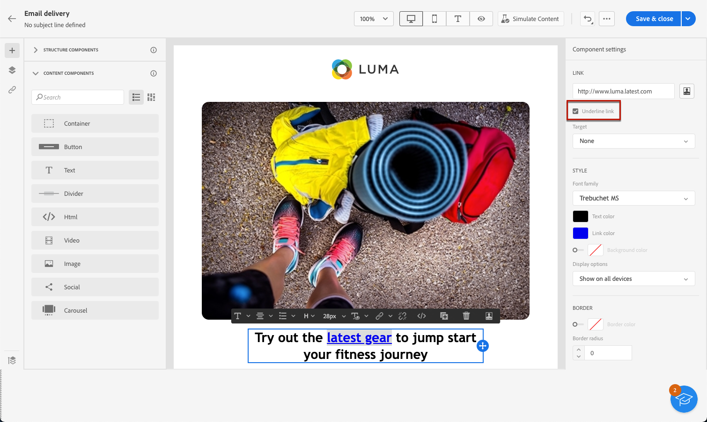
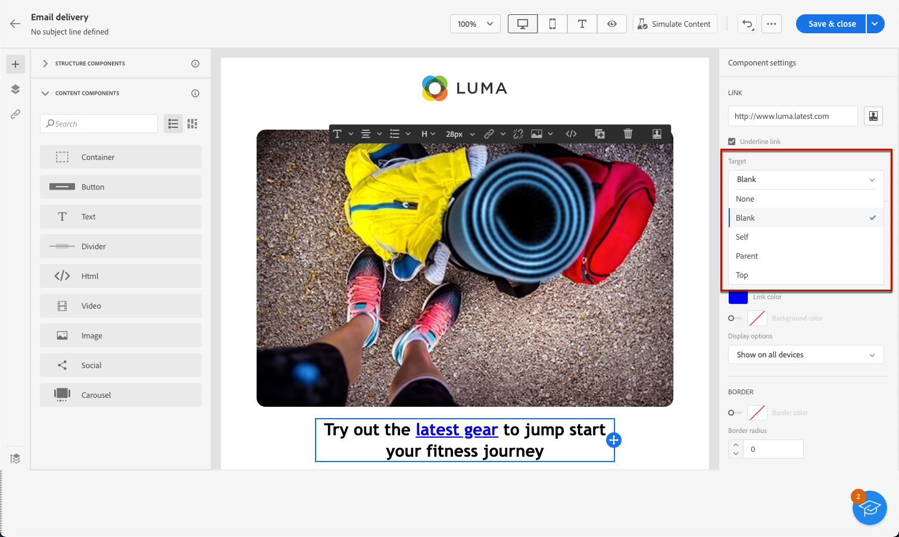
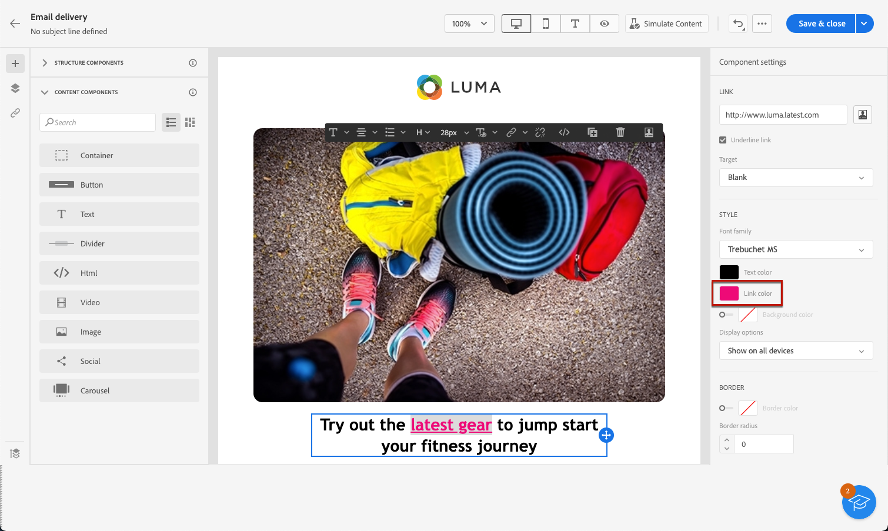

# Define a style for links {#styling-links}

You can underline a link and select its color and target in the Email Designer.

1. In a **[!UICONTROL Text]** component where a link is inserted, select your link.

1. In the **[!UICONTROL Component settings]** menu, check **[!UICONTROL Underline link]** to have the label underlined.

   

1. Choose how your audience is redirected with the **[!UICONTROL Target]** drop-down:

    * **[!UICONTROL None]**: opens the link in the same frame as it was clicked (default).
    * **[!UICONTROL Blank]**: opens the link in a new window or tab.
    * **[!UICONTROL Self]**: opens the link in the same frame as it was clicked.
    * **[!UICONTROL Parent]**: opens the link in the parent frame.
    * **[!UICONTROL Top]**: opens the link in the full body of the window.

   

1. To change the color of your link, click on **[!UICONTROL Link color]** from the right pane.

   

1. Save your changes.
