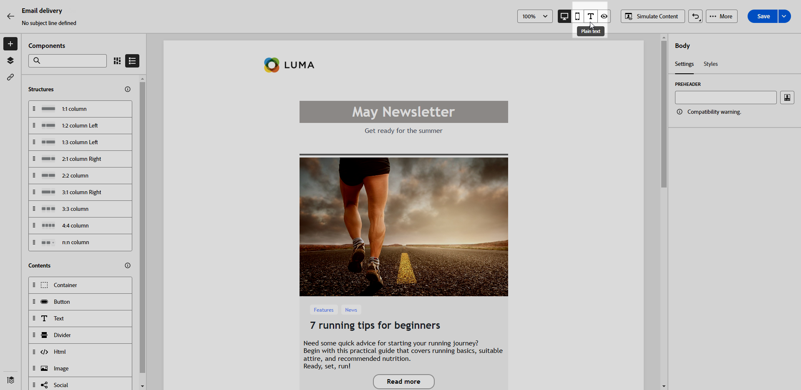

# 建立電子郵件的文字版本 {#text-version-email}

建議您建立電子郵件內文的文字版本，以用於無法顯示HTML內容時。

依預設，電子郵件設計工具會建立 **[!UICONTROL 純文字]** 電子郵件的版本，包括個人化欄位。 此版本會自動產生，並與您的內容的HTML版本同步。

如果您偏好對純文字版本使用不同內容，請遵循下列步驟：

1. 從您的電子郵件中，選取 **[!UICONTROL 純文字]** 標籤。

   

1. 使用 **[!UICONTROL 與HTML同步]** 切換為禁用同步。

   

1. 按一下核取記號以確認您的選擇。

   

1. 然後，您可以視需要編輯純文字版本。

>[!CAUTION]
>
>* 中所做的變更 **[!UICONTROL 純文字]** 檢視不會反映在HTML檢視中。
>
>* 如果您重新啟用 **[!UICONTROL 與HTML同步]** 選項，在更新純文字內容後，您的變更會遺失，並取代為從HTML版本產生的文字內容。

