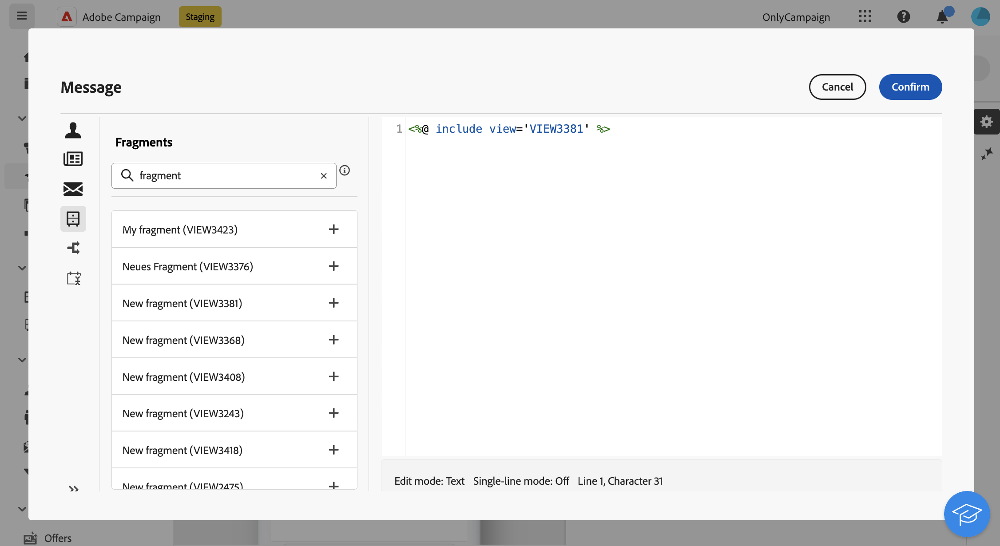

# 在運算式編輯器中新增運算式片段 {#expression}

>[!CONTEXTUALHELP]
>id="acw_fragments_list"
>title="片段"
>abstract="在目前沙箱上建立的所有運算式片段都顯示在此清單中。若要使用片段，請按一下 + 按鈕將片段 ID 新增至編輯器。"

<!-- pas vu dans l'UI-->

運算式片段可在任何可使用運算式編輯器編輯的欄位中使用。 若要將運算式片段新增至您的內容，請遵循下列步驟。

1. 開啟[運算式編輯器](../personalization/gs-personalization.md)並在左窗格中選取&#x200B;**[!UICONTROL 片段]**&#x200B;功能表。

   清單會顯示已在目前沙箱上建立的所有運算式片段。

1. 按一下運算式片段旁的`+`圖示，將其新增至您的內容。

   

1. 片段ID會新增至編輯器中。 如果您開啟對應的運算式片段並從介面進行編輯，則會同步化變更。 它們會自動傳播至包含該片段ID的所有&#x200B;**[!UICONTROL 草稿]**&#x200B;傳遞。
