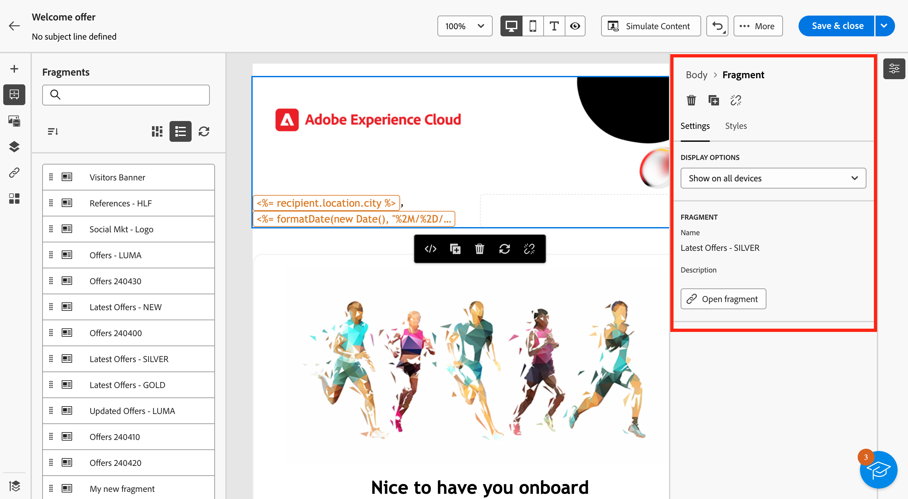
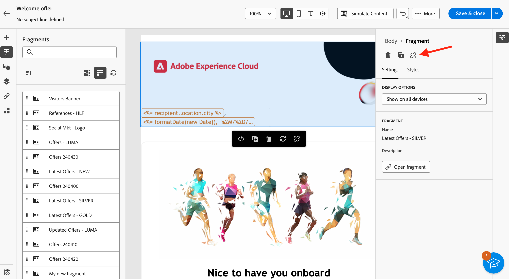

# 在你的電子郵件中新增視覺內容片段 {#use-visual-fragments}

>[!AVAILABILITY]
>
>此功能在有限可用性(LA)中提供。 僅限&#x200B;**從 Adobe Campaign Standard 移轉至 Adobe Campaign v8** 的客戶，且無法部署於任何其他環境。

您可以在[電子郵件傳遞](../email/get-started-email-designer.md)或[內容範本](../email/use-email-templates.md)中使用視覺片段。 步驟詳述如下。 [瞭解如何建立和管理內容片段](fragments.md)。

## 使用視覺片段 {#use-fragment}

>[!CONTEXTUALHELP]
>id="acw_fragments_details"
>title="片段選項"
>abstract="此窗格提供與所選片段相關的選項。它可讓您選擇要顯示片段的裝置，並打開該片段的內容。可使用「**[!UICONTROL 樣式]**」標籤進一步自訂您的片段。您還可以打破與原始視覺片段的繼承。"

<!-- pas vu dans l'UI-->

若要在電子郵件內容中插入視覺效果片段，請遵循下列步驟：

1. 使用[電子郵件Designer](../email/get-started-email-designer.md)開啟任何電子郵件或範本內容。

1. 從左側邊欄選取&#x200B;**[!UICONTROL 片段]**&#x200B;圖示。

   

1. 將會顯示在目前沙箱上建立的所有視覺化片段清單。 您可以：

   * 透過開始輸入其標籤來搜尋特定片段。
   * 以遞增或遞減順序排序片段。
   * 變更片段的顯示方式（卡片或清單檢視）。

   >[!NOTE]
   >
   >片段依建立日期排序：最近新增的片段會先顯示在清單中。

   如果您在編輯內容時修改或新增了某些視覺片段，請按一下&#x200B;**重新整理**&#x200B;圖示，以最新變更更新清單。

1. 從清單拖放任何視覺化片段到您要插入它的區域。 如同任何其他元件，您可以在內容中移動片段。

1. 選取片段以在右窗格中顯示其選項。

   

   從&#x200B;**[!UICONTROL 設定]**&#x200B;索引標籤，您可以：

   * 選擇您要顯示片段的裝置。
   * 按一下&#x200B;**編輯內容**&#x200B;按鈕，開啟此片段的內容。 [了解更多](../content/fragments.md#edit-fragments)

     您可以使用&#x200B;**[!UICONTROL 樣式]**&#x200B;索引標籤進一步自訂您的片段。

1. 如有需要，您可以中斷具有原始視覺化片段的繼承。 [了解更多](#break-inheritance)

   您也可以從內容中刪除或復製片段。 這些動作可以直接從顯示在片段頂端的內容功能表執行。

1. 新增您想要的視覺化片段數，然後&#x200B;**[!UICONTROL 儲存]**&#x200B;您的變更。

## 中斷繼承 {#break-inheritance}

當您編輯視覺片段時，變更會同步。 它們會自動傳播到包含該片段的所有電子郵件傳遞和內容範本。

新增至電子郵件或內容範本時，預設會同步片段。

不過，您可以中斷原始片段的繼承。 在這種情況下，片段的內容會複製到目前的設計中，且變更不再同步。

若要中斷繼承，請遵循下列步驟：

1. 選取視覺片段。

1. 按一下內容工具列中的解鎖圖示。

   

1. 該片段會成為不再連結至原始片段的獨立元素。 編輯它，就像內容中的任何其他內容元件一樣。 [了解更多](../email/content-components.md)
