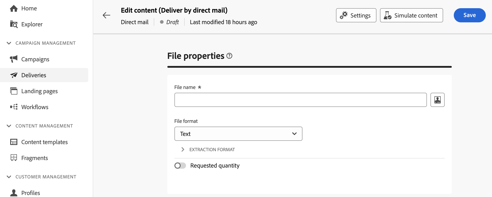
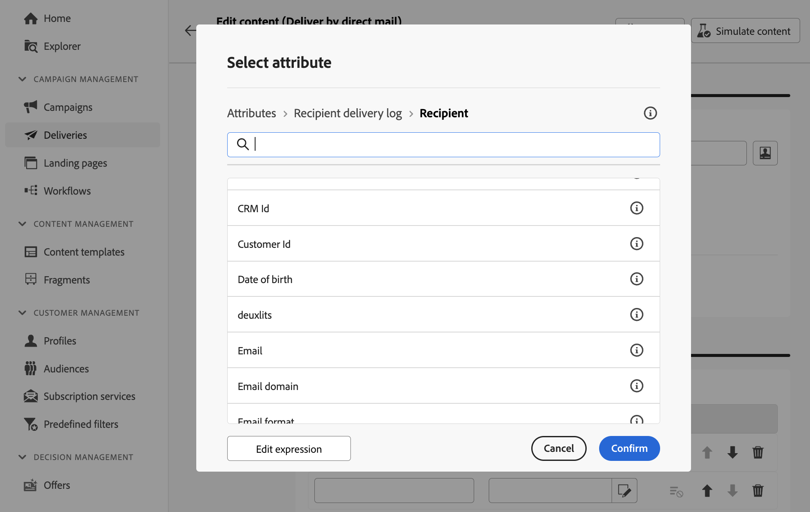
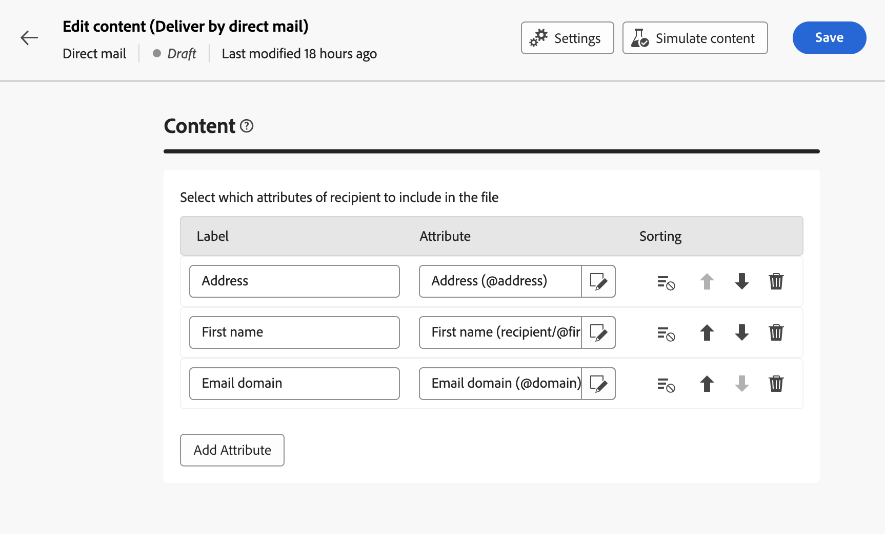

# 設計摘取檔案 {#design-direct-mail}

>[!CONTEXTUALHELP]
>id="acw_directmail_content"
>title="摘取檔案內容"
>abstract="按一下&#x200B;**編輯內容**&#x200B;按鈕開始設計直接郵件提供者要求的摘取檔案。這可讓您定義檔案屬性 (例如標籤和格式)，並指定要包含在檔案中的欄。"

>[!CONTEXTUALHELP]
>id="acw_directmail_properties_file"
>title="檔案屬性"
>abstract="設定摘取檔案的屬性，例如名稱和格式。您可以使用運算式編輯器運用資料庫中的屬性來個人化檔案名稱。"

>[!CONTEXTUALHELP]
>id="acw_directmail_properties_content"
>title="內容"
>abstract="在此區段中，指定要在摘取檔案中顯示的欄。完成後，您可以使用&#x200B;**模擬內容**&#x200B;按鈕來預覽摘取檔案。"

若要設計直接郵件傳遞所產生之擷取檔案的內容，請從傳遞頁面按一下&#x200B;**[!UICONTROL 編輯內容]**&#x200B;按鈕，然後設定檔案屬性和內容。

## 設定擷取檔案屬性 {#properties}

1. 在&#x200B;**[!UICONTROL 檔案名稱]**&#x200B;欄位中，指定解壓縮檔案的所需名稱。 您可以使用資料庫的屬性來個人化檔案名稱。 若要這麼做，請按一下&#x200B;**[!UICONTROL 開啟個人化對話方塊]**&#x200B;圖示以開啟運算式編輯器。 [了解如何個人化您的內容](../personalization/personalize.md)

1. 在&#x200B;**[!UICONTROL 檔案格式]**&#x200B;欄位中，為擷取檔案選擇所要的格式；**文字**、**使用固定式資料行的文字**、**CSV (Excel)**&#x200B;或&#x200B;**XML**。

1. 展開&#x200B;**[!UICONTROL 擷取格式]**&#x200B;區段以存取與擷取檔案格式相關的特定選項。 可用值視選取的格式而定。

+++ 可用的擷取格式選項

   * **[!UICONTROL 使用第一行作為欄標題]** (文字/CSV (Excel)格式)：切換此選項以使用第一欄作為標題。
   * **[!UICONTROL 欄分隔符號]** （文字格式）：指定要在解壓縮檔案中做為欄分隔符號使用的字元。
   * **[!UICONTROL 字串分隔符號]** （文字格式）：指定如何在擷取檔案中分隔字串。
   * **[!UICONTROL 行尾]** （文字格式）：指定解壓縮檔案中行尾的分界方式。
   * **[!UICONTROL 編碼]**：選擇解壓縮檔案的編碼。
   * **[!UICONTROL 日期格式和分隔符號]**：指定在解壓縮檔案中日期應如何格式化。
   * **[!UICONTROL 數字格式]**：指定解壓縮檔案中數字的格式設定。
   * **[!UICONTROL 匯出標籤而非列舉的內部值]**：請開啟此選項，以防您匯出列舉值，而且您想要擷取更容易理解的欄標籤，而不是內部ID。

+++

1. 開啟&#x200B;**[!UICONTROL 要求的數量]**&#x200B;選項，以限制傳遞的收件者數目。

   {zoomable="yes"}

## 設定擷取檔案欄 {#content}

在&#x200B;**[!UICONTROL Content]**&#x200B;區段中，指定要顯示在擷取檔案中的資料行。 要執行此操作，請依照下列步驟執行：

1. 按一下&#x200B;**[!UICONTROL 新增屬性]**&#x200B;按鈕以建立新資料行。
1. 選擇要顯示在欄中的屬性，然後確認。 請注意，您可以按一下&#x200B;**[!UICONTROL 編輯運算式]**&#x200B;按鈕，利用運算式編輯器來選取要使用的屬性。 [瞭解如何選取屬性並將其新增至我的最愛](../get-started/attributes.md)

   

1. 新增欄之後，您可以變更其標籤，並使用編輯圖示修改關聯的屬性。
1. 重複這些步驟，視需要為解壓縮檔案新增任意數目的欄。
1. 若要使用其中一個欄來排序擷取檔案，請按一下&#x200B;**[!UICONTROL 排序]**&#x200B;欄中的圖示，然後選取想要的排序方法。
1. 若要變更欄的位置，請使用向上鍵和向下鍵。

您現在可以預覽解壓縮檔案，並傳送傳遞以產生解壓縮檔案。 [瞭解如何測試和傳送直接郵件訊息](send-direct-mail.md)
