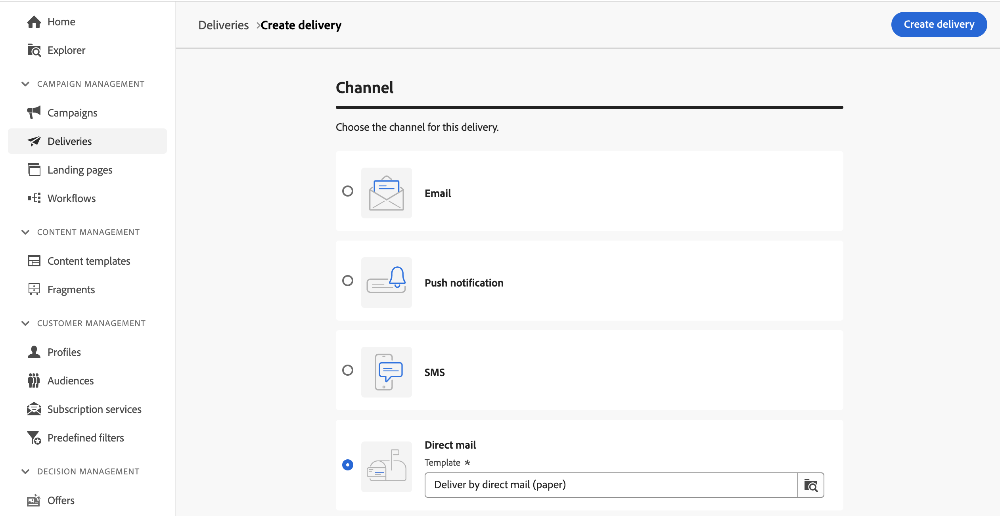
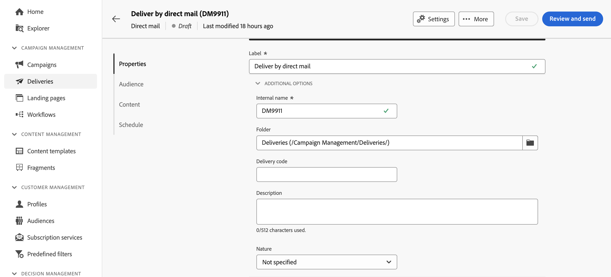
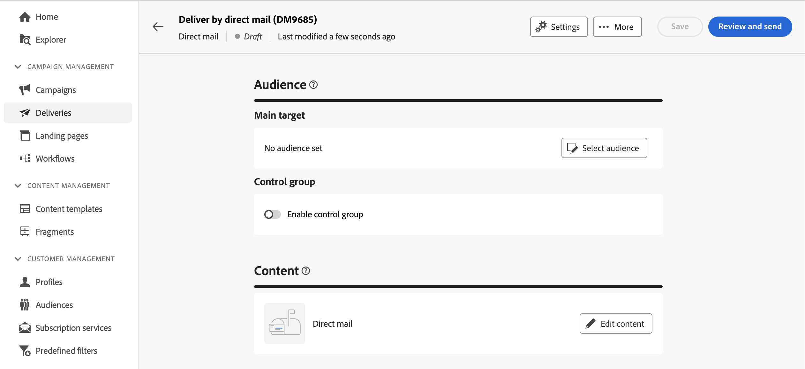
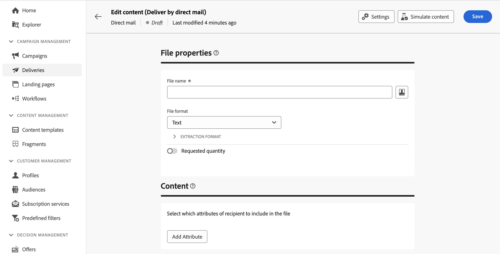
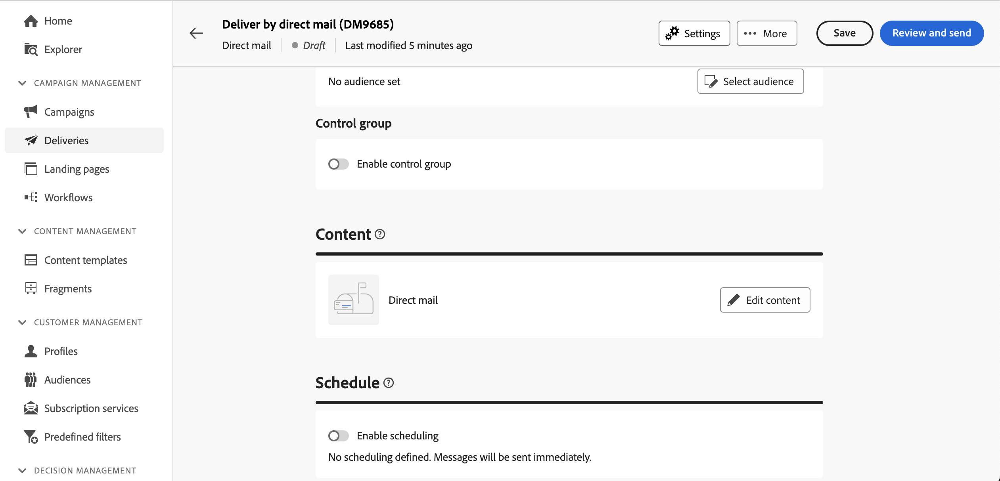

# 建立新的直接郵件傳遞 {#create-direct-mail}

您可以在行銷活動工作流程的內容中，建立獨立直接郵件傳送，或建立直接郵件傳送。 以下步驟詳細說明獨立（一次性）直接郵件傳送的程式。 如果您在行銷活動工作流程的內容中工作，建立步驟的詳細資訊請參閱 [本節](../workflows/activities/channels.md#create-a-delivery-in-a-campaign-workflow).

若要建立新的獨立直接郵件傳送，請遵循下列步驟：

1. 瀏覽至 **[!UICONTROL 傳遞]** 功能表，然後按一下  **[!UICONTROL 建立傳遞]** 按鈕。

1. 在 **[!UICONTROL 頻道]** 區段，選擇 **[!UICONTROL 直接郵件]** 作為管道，並選取範本。 [進一步瞭解範本](../msg/delivery-template.md)

1. 按一下「**[!UICONTROL 建立傳遞]**」按鈕以確認。

   {zoomable="yes"}

1. 輸入 **[!UICONTROL 標籤]** 傳送並存取 **[!UICONTROL 其他選項]** 下拉式清單。 如果您的傳送是以延伸結構描述為基礎，請指定 **自訂選項** 欄位可供使用。

   {zoomable="yes"}

   +++根據您的要求設定下列設定。
   * **[!UICONTROL 內部名稱]**：指派唯一識別碼給傳遞。
   * **[!UICONTROL 資料夾]**：將傳遞儲存在特定資料夾中。
   * **[!UICONTROL 傳遞代碼]**：使用您自己的命名慣例整理您的傳遞。
   * **[!UICONTROL 說明]**：提供傳遞的說明。
   * **[!UICONTROL 性質]**：指定用於分類目的的傳送性質。
+++

1. 按一下 **[!UICONTROL 選取對象]** 按鈕來鎖定現有對象或建立您自己的對象。

   * [瞭解如何選取現有對象](../audience/add-audience.md)
   * [瞭解如何建立新受眾](../audience/one-time-audience.md)

   {zoomable="yes"}

   >[!NOTE]
   >
   >直接郵件收件者必須至少包含其姓名和郵寄地址。 如果名稱、郵遞區號欄位和城鎮/城市欄位並非空白，則會將地址視為完整。 所有位址不完整的收件者都會從直接郵件傳遞中排除。

1. 切換至 **[!UICONTROL 啟用控制組]** 用來設定控制組以測量傳送影響的選項。 訊息不會傳送給該控制組，因此您可以將收到訊息的母體的行為與未收到訊息的連絡人的行為進行比較。 [了解如何使用控制組](../audience/control-group.md)

1. 按一下 **[!UICONTROL 編輯內容]** 定義要匯出至擷取檔案的資訊（欄）。 [了解更多](content-direct-mail.md)

   {zoomable="yes"}

1. 若要將您的傳遞安排在特定的日期和時間，請開啟「**[!UICONTROL 啟用排程]**」選項。在您啟動傳送後，擷取檔案將會在您定義的確切日期和時間自動產生。 [瞭解如何排程傳遞](../msg/gs-deliveries.md#gs-schedule).

   >[!NOTE]
   >
   >在工作流程內容中傳送傳遞時，您必須使用 **排程器** 活動。 在[本頁](../workflows/activities/scheduler.md)中瞭解更多。

1. 按一下 **[!UICONTROL 設定]** 以存取與傳送範本相關的進階選項。 [了解更多](../advanced-settings/delivery-settings.md)

   {zoomable="yes"}

1. 直接郵件傳送就緒後，請按一下 **[!UICONTROL 檢閱並傳送]** 按鈕以驗證並傳送您的傳遞並產生解壓縮檔案。 [瞭解如何預覽和傳送直接郵件傳遞](send-direct-mail.md)
