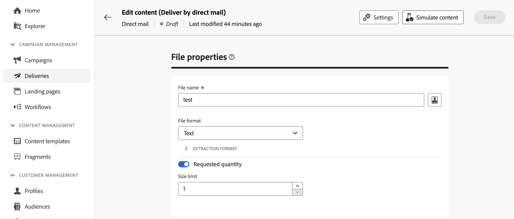
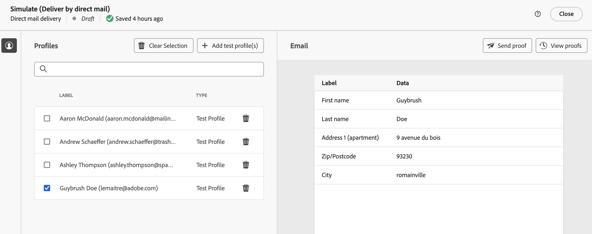
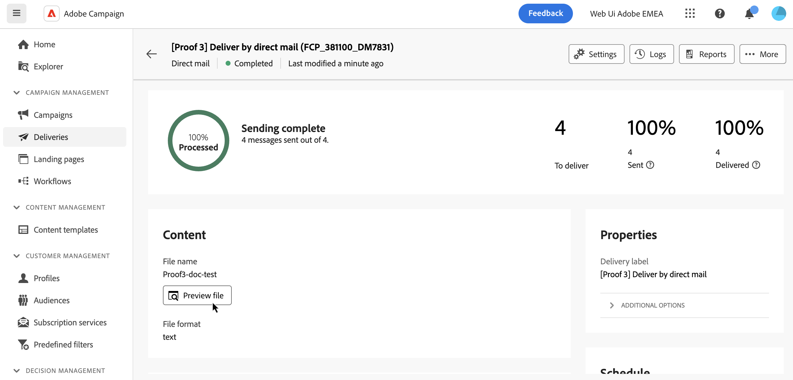
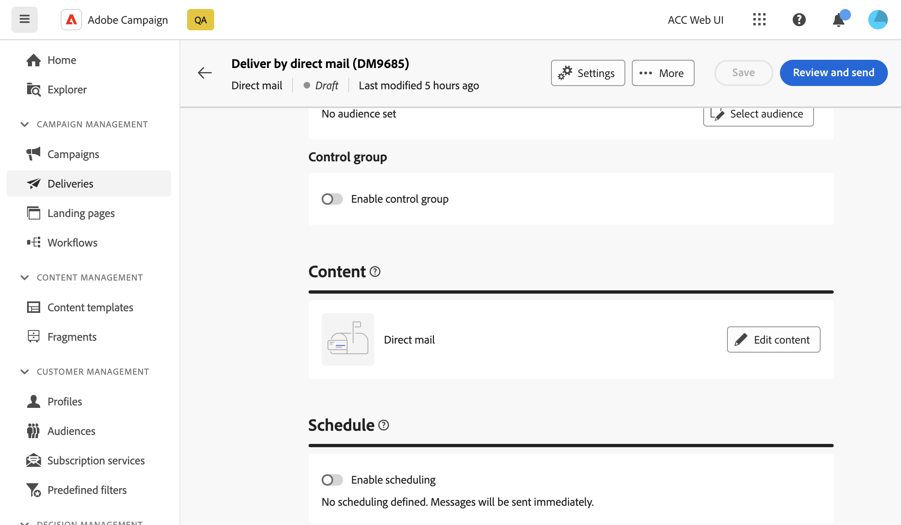
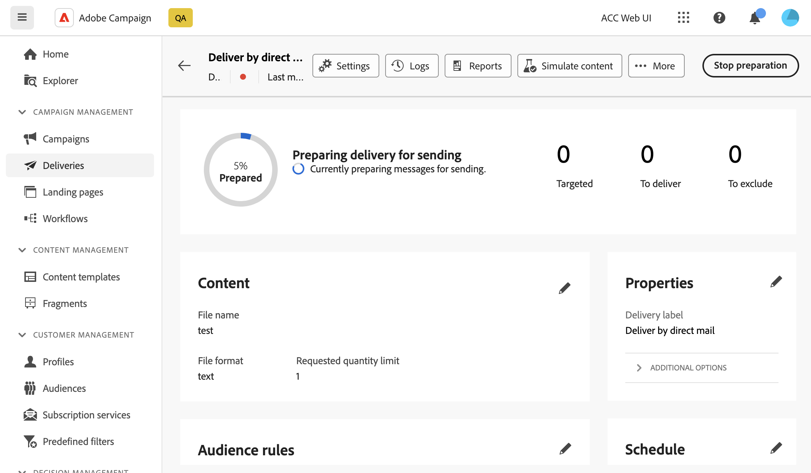

# 預覽和傳送直接郵件傳遞 {#send-direct-mail}

設定直接郵件傳送的擷取檔案後，您就可以使用測試設定檔來預覽。 如果您已包含個人化內容，則可使用測試設定檔資料來檢查此內容在欄中的顯示方式。 這可讓您確保檔案內容正確呈現，且個人化元素正確合併。

當解壓縮檔案準備就緒時，您可以傳送直接郵件傳送，以產生檔案並與直接郵件提供者共用。 [瞭解如何傳送您的直接郵件傳遞](#dm-send)

## 預覽解壓縮檔案 {#preview-dm}

預覽解壓縮檔案的主要步驟如下。 如需如何預覽傳送的詳細資訊，請參閱 [本節](../preview-test/preview-content.md).

1. 從您的傳遞內容頁面，使用 **[!UICONTROL 模擬內容]** 以預覽您的個人化內容。

   {zoomable=&quot;yes&quot;}

1. 按一下 **[!UICONTROL 新增測試設定檔]** 以選取一或多個設定檔，以便在擷取檔案內容中預覽其資料。

1. 在右窗格中，您會找到擷取檔案的預覽，其中個人化元素會以所選設定檔中的資料動態取代。

   {zoomable=&quot;yes&quot;}

## 傳送校樣 {#test-dm}

使用 **Adobe Campaign**，您便能先傳送校樣再傳送給主要對象。 此步驟對於驗證您的傳送並識別任何問題很重要。 測試收件者可檢閱個人化設定等元素，確保最佳效能並偵測任何錯誤。 此程式可協助您在觸及主要受眾之前，調整及最佳化擷取檔案。

對於直接郵件傳遞，傳送校樣會使用所選測試設定檔的資料產生擷取檔案的範例。 若要存取，請依照下列步驟進行：

1. 在模擬內容畫面中，按一下 **[!UICONTROL 傳送證明]** 按鈕並遵循與任何傳送型別相同的步驟來傳送證明。 [瞭解如何傳送校樣](../preview-test/test-deliveries.md)

1. 校樣一經傳送，您便可以從存取 **[!UICONTROL 檢視校樣]** 按鈕或從傳遞清單。 [瞭解如何存取已傳送的校樣](../preview-test/test-deliveries.md#access-test-deliveries)

1. 在證明傳遞儀表板中，按一下 **[!UICONTROL 預覽檔案]** 按鈕以存取擷取檔案的預覽。

   {zoomable=&quot;yes&quot;}

   >[!NOTE]
   >
   >預覽檔案中只會顯示前100行。

## 傳送您的直接郵件傳遞 {#send-dm}

一旦您直接郵件準備好傳送給客戶後，您就可以傳送傳遞，以便在指定的摘取檔案中開始資料擷取。 要執行此操作，請依照下列步驟執行：

1. 設計解壓縮檔案的內容後，請按一下 **[!UICONTROL 檢閱並傳送]** 從您的 **[!UICONTROL 傳遞]** 頁面。

   {zoomable=&quot;yes&quot;}

1. 按一下 **[!UICONTROL 準備]** 並監視提供的進度和統計資料。

   如果發生任何錯誤，請參閱 **[!UICONTROL 記錄檔]** 功能表，以取得有關失敗的詳細資訊。

   {zoomable=&quot;yes&quot;}

1. 按一下以傳送訊息 **[!UICONTROL 傳送]** 以繼續進行最終的傳送程式。

1. 按一下「 」以確認傳送動作 **[!UICONTROL 傳送]**.

   如果直接郵件傳送已排程，請按一下 **[!UICONTROL 依排程傳送]** 按鈕。 進一步瞭解中的傳送排程 [本節](../msg/gs-messages.md#schedule-the-delivery-sending).

傳送傳遞後，解壓縮檔案會自動產生，並匯出至 **[!UICONTROL 路由]** 在傳遞範本中選取的外部帳戶 [進階設定](../advanced-settings/delivery-settings.md).

您可以從傳送頁面追蹤KPI（關鍵績效指標）資料，並從 **[!UICONTROL 記錄檔]** 功能表。

您也可以開始使用內建報告來衡量訊息的影響。 [了解更多](../reporting/direct-mail.md)
